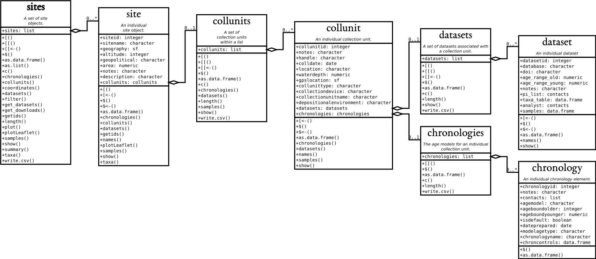

## Introduction

This document is based on [A Simple Workflow](https://open.neotomadb.org/EPD_binder/simple_workflow.html) and [A Not so Simple Workflow](https://open.neotomadb.org/EPD_binder/complex_workflow.html), and is intended to act as a primer for the use of the new Neotoma R package, `neotoma2`.  [The `neotoma2` package](https://github.com/NeotomaDB/neotoma2). `neotoma2` is available from GitHub and can be installed in R using the `devtools` package by using:

```r
devtools::install_github('NeotomaDB/neotoma2')
library(neotoma2)
```

In this tutorial you will learn how to:

* Use the Neotoma API
* Search for sites using site names and geographic parameters
* Filter results using temporal and spatial parameters
* Obtain sample information for the selected datasets
* Perform basic analysis including the use of climate data from rasters

This series of exercises is designed to give you hands-on practice in using APIs and the `neotoma2` R package, both for practical reasons and for insights into how open-data systems work. `neotoma2`’s primary purpose is to pass data from the Neotoma Paleoecology Database (Neotoma DB) into the R environment. Neotoma relies on Application Programming Interfaces ([APIs](https://en.wikipedia.org/wiki/API)) to communicate with the Neotoma Paleoecology Database, so we’ll begin with an introduction to APIs.


### APIs

The Neotoma Paleoecology Database is a relational database, hosted on servers at [Penn State’s Center for Environmental Informatics](https://sites.psu.edu/environmentalinformatics/). For security reasons, direct access to these servers is quite limited, and available only to a few Neotoma and CEI programmers.

__APIs__ offer public access points into Neotoma that anyone can use. Each API is basically a function: you provide the API with a set of operational parameters, and it returns a set of data or metadata. Each API hence is designed to support one particular task or set of tasks; it offers a narrow window into the larger Neotoma DB. [REST-ful APIs](https://en.wikipedia.org/wiki/Representational_state_transfer) follow a particular set of standards that allow them to be read by web browsers (i.e. within the HTTP protocol) and return data objects, typically in HTML, XML, JSON or other human- & machine-readable formats.

The [__Neotoma APIs__](https://api.neotomadb.org/api-docs/) provide a series of functions for retrieving different kinds of data from Neotoma DB. Data objects are returned in [JSON](https://en.wikipedia.org/wiki/JSON) format. For this exercise, we strongly recommend adding an extension to your browser that formats the JSON output to make it easier to read, such as [JSONView](https://addons.mozilla.org/en-US/firefox/addon/jsonview/) for Firefox, and [JSON Formatter](https://chrome.google.com/webstore/detail/json-formatter/bcjindcccaagfpapjjmafapmmgkkhgoa?hl=en) for Chrome.

The APIs for Neotoma can be found here: https://api.neotomadb.org/api-docs/. Look through the lists of different APIs and find the one labled GET /v2.0/data/sites/{siteid}. Then, click on the Try It Out button at right, enter 666 into the site identifier box, and click Execute. Then scroll down. You you should see some example code in curl format (ignore this) and as a URL. If you scroll down further, you’ll see the actual data return, in JSON format. JSON is a structured data format designed to be both human-readable and machine-readable. It looks like a nested series of lists. Let’s also try a V2.0 API. Put this right in the URL box in your browser:

https://api.neotomadb.org/v2.0/data/sites?sitename=%devil%

This should open a new web page in your browser with a returned JSON object. For this search, the JSON object should include 16 or more sites with the name ‘devil’ in them (note the use of % as wildcards), including Devil’s Lake, WI. The opening line "status" = "success" means that the API ran successfully. Note that it is possible for an API to run successfully but return no data! For example, try:

api.neotomadb.org/v2.0/data/sites?sitename=devil

Here, "status" = "success" but data=[], i.e. the API successfully reported back to you that no sites in Neotoma have the exact name of ‘devil’.


### Accessing and Manipulating Data with `neotoma2`

For this workbook we use several packages, including `leaflet`, `sf` and others. We load the packages using the `pacman` package, which will automatically install the packages if they do not currently exist in your set of packages.

```{r setup}
# install.packages("pacman")
# library(pacman)
options(warn = -1)
pacman::p_load(neotoma2, dplyr, ggplot2, sf, geojsonsf, leaflet, raster, DT)
```

Note that R is sensitive to the order in which packages are loaded.  Using `neotoma2::` tells R explicitly that you want to use the `neotoma2` package to run a particular function. So, for a function like `filter()`, which exists in other packages such as `dplyr`, you may see an error that looks like:

```bash
Error in UseMethod("filter") : 
  no applicable method for 'filter' applied to an object of class "sites"
```

In that case it's likely that the wrong package is trying to run `filter()`, and so explicitly adding `dplyr::` or `neotoma2::` in front of the function name (i.e., `neotoma2::filter()`)is good practice.

### Getting Help with Neotoma

Use the Geog523 slack channel for this course. If you’re planning on working with Neotoma more in the future, please join us on [Slack](https://join.slack.com/t/neotomadb/shared_invite/zt-cvsv53ep-wjGeCTkq7IhP6eUNA9NxYQ) where we manage a channel specifically for questions about the R package. You may also wish to join our Google Groups mailing list, please [contact us](mailto:neotoma-contact@googlegroups.com) to be added.

## Site Searches

### `get_sites()`

There are several ways to find sites in `neotoma2`, but we think of `sites` as being spatial objects primarily. They have names, locations, and are found within the context of geopolitical units, but within the API and the package, the site itself does not have associated information about taxa, dataset types or ages.  It is simply the container into which we add that information.  So, when we search for sites we can search by:

  * siteid
  * sitename
  * location
  * altitude (maximum and minimum)
  * geopolitical unit

#### Site names: `sitename="%Devil%"` {.tabset}

We may know exactly what site we're looking for ("Devil's Lake"), or have an approximate guess for the site name (for example, we know it's something like "Devil Pond", or "Devil's Hole", but we're not sure how it was entered specifically).

We use the general format: `get_sites(sitename="XXXXX")` for searching by name.

PostgreSQL (and the API) uses the percent sign as a wildcard. So `"%Devil%"` would pick up "Devils Lake" for us (and would pick up "Devil's Canopy Cave").  Note that the search query is also case insensitive, so you could simply write `"%devil%"`.

##### Code

```{r sitename, eval=FALSE}
devil_sites <- neotoma2::get_sites(sitename = "%Devil%")
plotLeaflet(spo_sites)
```

##### Result

```{r sitenamePlot, echo=FALSE}
devil_sites <- neotoma2::get_sites(sitename = "%Devil%")
plotLeaflet(devil_sites)
```

If we want an individual record we can use the siteid: `r devils_lake <- neotoma2::get_sites(siteid = 666)`.


#### Location: `loc=c()` {.tabset}

The `neotoma` package used a bounding box for locations, structured as a vector of latitude and longitude values: `c(xmin, ymin, xmax, ymax)`.  The `neotoma2` R package supports both this simple bounding box, but also more complex spatial objects, using the [`sf` package](https://r-spatial.github.io/sf/). Using the `sf` package allows us to more easily work with raster and polygon data in R, and to select sites from more complex spatial objects.  The `loc` parameter works with the simple vector, [WKT](https://arthur-e.github.io/Wicket/sandbox-gmaps3.html), [geoJSON](http://geojson.io/#map=2/20.0/0.0) objects and native `sf` objects in R.  **Note however** that the `neotoma2` package is a wrapper for a simple API call using a URL ([api.neotomadb.org](https://api.neotomadb.org)), and URL strings can only be 1028 characters long, so the API cannot accept very long/complex spatial objects.

Looking for sites using a location. We're putting three representations of the Michigan area here as part of a list with three elements, a geoJSON, WKT and bounding box representation.  We've also transformed the `mich$geoJSON` element to an object for the `sf` package.  Any of these four spatial representations work with the `neotoma2` package.

```{r boundingBox, message=FALSE}
mich <- list(geoJSON = '{"type": "Polygon",
        "coordinates": [[
            [-86.95, 41.55],
            [-82.43, 41.55],
            [-82.43, 45.88],
            [-86.95, 45.88],
            [-86.95, 41.55]
            ]]}',
        WKT = 'POLYGON ((-86.95 41.55,
                         -82.43 41.55,
                         -82.43 45.88,
                         -86.95 45.88,
                         -86.95 41.55))',
        bbox = c(-86.95, 41.55, -82.43, 45.88))

mich$sf <- geojsonsf::geojson_sf(mich$geoJSON)[[1]]

mich_sites <- neotoma2::get_sites(loc = mich$geoJSON, all_data = TRUE)
```

You can always simply `plot()` the `sites` objects, but you will lose some of the geographic context. The `plotLeaflet()` function returns a `leaflet()` map, and allows you to further customize it, or add additional spatial data (like our original bounding polygon, `mich$sf`, which works directly with the R `leaflet` package):

##### Code

```{r plotL, eval=FALSE}
neotoma2::plotLeaflet(mich_sites) %>% 
  leaflet::addPolygons(map = ., 
                       data = mich$sf, 
                       color = "green")
```

##### Result

```{r plotLeaf, echo=FALSE}
neotoma2::plotLeaflet(mich_sites) %>% 
  leaflet::addPolygons(map = ., 
                       data = mich$sf, 
                       color = "green")
```

#### Site Helpers {.tabset}



If we look at the [UML diagram](https://en.wikipedia.org/wiki/Unified_Modeling_Language) for the objects in the `neotoma2` R package we can see that there are a set of functions that can operate on `sites`.  As we add to `sites` objects, using `get_datasets()` or `get_downloads()`, we are able to use more of these helper functions. As it is, we can take advantage of sunctions like `summary()` to get a more complete sense of the types of data we have as part of this set of sites.  The following code gives the summary table. We do some R magic here to change the way the data is displayed (turning it into a `datatable()` object), but the main piece is the `summary()` call.

##### Code

```{r summary_sites, eval=FALSE}
neotoma2::summary(mich_sites)
```

##### Result

```{r summarySitesTable, eval=TRUE, echo=FALSE}
neotoma2::summary(mich_sites) %>%
  DT::datatable(data = ., rownames = FALSE, 
                options = list(scrollX = "100%", dom = 't'))
```

We can see that there are no chronologies associated with the `site` objects. This is because, at present, we have not pulled in the `dataset` information we need. All we know from `get_sites()` are the kinds of datasets we have.

### Searching for datasets: {.tabset}

We know that collection units and datasets are contained within sites.  Similarly, a `sites` object contains `collectionunits` which contain `datasets`. From the table above we can see that some of the sites we've looked at contain pollen records. That said, we only have the `sites`, it's just that (for convenience) the `sites` API returns some information about datasets so to make it easier to navigate the records.

With a `sites` object we can directly call `get_datasets()`, to pull in more metadata about the datasets.  At any time we can use `datasets()` to get more information about any datasets that a `sites` object may contain.  Compare the output of `datasets(mich_sites)` to the output of a similar call using the following:

#### Code

```{r datasetsFromSites, eval=FALSE}
mich_datasets <- neotoma2::get_datasets(mich_sites, all_data = TRUE)

datasets(mich_datasets)
```

#### Result

```{r datasetsFromSitesResult, echo=FALSE, message=FALSE}
mich_datasets <- neotoma2::get_datasets(mich_sites, all_data = TRUE)
datasets(mich_datasets) %>% 
  as.data.frame() %>% 
  DT::datatable(data = ., 
                options = list(scrollX = "100%", dom = 't'))
```

### Filter Records {.tabset}
  
If we choose to pull in information about only a single dataset type, or if there is additional filtering we want to do before we download the data, we can use the `filter()` function. For example, if we only want pollen records, and want records with known chronologies, we can filter:

#### Code

```{r downloads, eval=FALSE}
mich_pollen <- mich_datasets %>% 
  neotoma2::filter(datasettype == "pollen" & !is.na(age_range_young))

neotoma2::summary(mich_pollen)
```

#### Result

```{r downloadsCode, echo = FALSE}
mich_pollen <- mich_datasets %>% 
  neotoma2::filter(datasettype == "pollen" & !is.na(age_range_young))

neotoma2::summary(mich_pollen) %>% DT::datatable(data = ., 
                options = list(scrollX = "100%", dom = 't'))
```

Note, that we are filtering on two conditions. Look up the operators being used in the above code: `==`, `&`, and `!` to understand what they accomplish in the code. We can see now that the data table looks different, and there are fewer total sites.

### Pulling in `sample()` data.

Because sample data adds a lot of overhead (each dataset may contain many samples), we try to call `get_downloads()` *after* we've done our preliminary filtering. After `get_datasets()` you have enough information to filter based on location, time bounds and dataset type. When we move to `get_download()` we can do more fine-tuned filtering at the analysis unit or taxon level.

The folloing command may take a short time to run. If it takes too long, we have frozen the object as an RDS data file that you can load directly into R.

```{r taxa}
mich_dl <- mich_pollen %>% get_downloads(all_data = TRUE)
# mich_dl <- readRDS('data/mich_dl.rds')
```

Once we've downloaded, we now have information for each site about all the associated collection units, the datasets, and, for each dataset, all the samples associated with the datasets.  To extract all the samples we can call:

```{r allSamples}
allSamp <- samples(mich_dl)
```

When we've done this, we get a `data.frame` that is `r nrow(allSamp)` rows long and `r ncol(allSamp)` columns wide.  The reason the table is so wide is that we are returning data in a **long** format.  Each row contains all the information you should need to properly interpret it:

```{r colNamesAllSamp, echo = FALSE}
colnames(allSamp)
```

For some dataset types, or analyses some of these columns may not be needed, however, for other dataset types they may be critically important. To allow the `neotoma2` package to be as useful as possible for the community we've included as many as we can.

#### Extracting Taxa {.tabset}

If you want to know what taxa we have in the record you can use the helper function `taxa()` on the sites object. The `taxa()` function gives us, not only the unique taxa, but two additional columns, `sites` and `samples` that tell us how many sites the taxa appear in, and how many samples the taxa appear in, to help us better understand how common individual taxa are.

##### Code

```{r taxa2, eval=FALSE, eval=FALSE}
neotomatx <- neotoma2::taxa(mich_dl)
```

##### Results

```{r taxaprint, echo=FALSE, message=FALSE}
neotomatx <- neotoma2::taxa(mich_dl)

neotoma2::taxa(mich_dl) %>% 
  DT::datatable(data = head(neotomatx, n = 20), rownames = FALSE, 
                options = list(scrollX = "100%", dom = 't'))
```

#### {-}

The `taxonid` values can be linked to the `taxonid` column in the `samples()`. This allows us to build taxon harmonization tables if we choose to. You may also note that the `taxonname` is in the field `variablename`. Individual sample counts are reported in Neotoma as [`variables`](https://open.neotomadb.org/manual/taxonomy-related-tables-1.html#Variables). A "variable" may be either a species, something like laboratory measurements, or a non-organic proxy, like charcoal or XRF measurements, and includes the units of measurement and the value.

#### Simple Harmonization {.tabset}

Lets say we want all samples from which *Pinus* taxa have been reported to be grouped together into one pseudo-taxon called *Pinus*. There are several ways of doing this, either directly by exporting the file and editing each individual cell, or by creating an external "harmonization" table (which we did in the prior `neotoma` package).

Programmatically, we can harmonize taxon by taxon using matching and transformation. We're using `dplyr` type coding here to `mutate()` the column `variablename` so that any time we detect (`str_detect()`) a `variablename` that starts with `Pinus` (the `.*` represents a wildcard for any character [`.`], zero or more times [`*`]) we `replace()` it with the character string `"Pinus"`. Note that this changes *Pinus* in the `allSamp` object, but if we were to call `samples()` again, the taxonomy would return to its original form.

We're going to filter the ecological groups to include only *UPHE* (upleand/heath) and *TRSH* (trees and shrubs). More information about ecological groups is available from the [Neotoma Online Manual](https://open.neotomadb.org/manual). After converting all _Pinus.*_ records to *Pinus* we then sum the counts of the *Pinus records*. 

```{r simpleTaxonChange, message=FALSE}
allSamp <- allSamp %>% 
  dplyr::filter(ecologicalgroup %in% c("UPHE", "TRSH")) %>%
  mutate(variablename = replace(variablename, 
                                stringr::str_detect(variablename, "Pinus.*"), 
                                "Pinus"),
         variablename = replace(variablename, 
                                stringr::str_detect(variablename, "Picea.*"), 
                                "Picea")) %>% 
  group_by(siteid, sitename,
           sampleid, variablename, units, age,
           agetype, depth, datasetid,
           long, lat) %>%
  summarise(value = sum(value), .groups='keep')
```

There were originally `r sum(stringr::str_detect(neotomatx$variablename, 'Pinus.*'))` different taxa identified as being within the genus *Pinus* (including *Pinus*, *Pinus subg. Pinus*, and *Pinus undiff.*). The above code reduces them all to a single taxonomic group *Pinus*. We can check out the unique names by using:

##### Code 

```{r UniqueNames, eval=FALSE}
neotomatx %>%
  ungroup() %>% 
  filter(stringr::str_detect(variablename, "Pinus")) %>% 
  summarise(pinus_spp = unique(variablename))

# I actually like Base here for the one-liner:
# unique(grep("Pinus", neotomatx$variablename, value = TRUE))
```

##### Result

```{r UniqueNamesTab, echo=FALSE, message=FALSE}
neotomatx %>%
  ungroup() %>% 
  filter(stringr::str_detect(variablename, "Pinus")) %>% 
  summarise(pinus_spp = unique(variablename)) %>%
  DT::datatable(data = ., 
                options = list(scrollX = "100%", dom = 't'))
```

#### {- .tabset}

If we want to have an artifact of our choices, we can use an external table.  For example, a table of pairs (what we want changed, and the name we want it replaced with) can be generated, and it can include regular expressions (if we choose):

| original | replacement |
| -------- | ----------- |
| Abies.*  | Abies |
| Vaccinium.* | Ericaceae |
| Typha.* | Aquatic |
| Nymphaea  | Aquatic |
| ... | ... |

We can get the list of original names directly from the `taxa()` call, applied to a `sites` object, and then export it using `write.csv()`. We can also do some exploratory plots of the data:

##### Code 

```{r countbySitesSamples, eval=FALSE}
taxaplots <- taxa(mich_dl)
# Save the taxon list to file so we can edit it subsequently.
readr::write_csv(taxaplots, "data/mytaxontable.csv")
```

##### Result

```{r PlotTaxonCounts, echo=FALSE, fig.cap="**Figure**. A plot of the number of sites a taxon appears in, against the number of samples a taxon appears in.", message=FALSE}
taxaplots <- taxa(mich_dl)
ggplot(data = taxaplots, aes(x = sites, y = samples)) +
  geom_point() +
  stat_smooth(method = 'glm', 
              method.args = list(family = 'poisson')) +
  xlab("Number of Sites") +
  ylab("Number of Samples") +
  theme_bw()
```

#### {-}

The plot is mostly for illustration, but we can see, as a sanity check, that the relationship is as we'd expect.

## Simple Analytics

### Stratigraphic Plotting

We can use packages like `rioja` to do stratigraphic plotting for a single record. We're going to take a few key species at a single site and plot them in a stratigraphic diagram.

```{r stratiplot, message = FALSE, include=FALSE, eval=FALSE}
# Get a particular site, select only taxa identified from pollen (and only trees/shrubs)
plottingSite <- mich_dl[[25]]

plottingTaxa <- taxa(plottingSite) %>%
  filter(ecologicalgroup %in% c("TRSH"),
         elementtype == "pollen") %>%
  arrange(desc(samples))

# Clean up. Select only pollen measured using NISP.
# We repeat the filters for pollen & ecological group on the samples
shortSamples <- samples(plottingSite) %>% 
  filter(variablename %in% plottingTaxa$variablename,
         ecologicalgroup %in% c("TRSH"),
         elementtype == "pollen",
         units == "NISP") 

shortSamples <- shortSamples %>% 
  mutate(variablename = replace(variablename, 
                                stringr::str_detect(variablename, "Pinus.*"), 
                                "Pinus"))  %>% 
  group_by(siteid, sitename,
           sampleid, variablename, units, age,
           agetype, depth, datasetid,
           long, lat) %>%
  summarise(value = sum(value), .groups='keep')

# Transform to proportion values.
onesite <- shortSamples %>%
  group_by(age) %>%
  mutate(pollencount = sum(value, na.rm = TRUE)) %>%
  group_by(variablename) %>% 
  mutate(prop = value / pollencount) %>% 
  arrange(desc(age))

# Spread the data to a "wide" table, with taxa as column headings.
widetable <- onesite %>%
  dplyr::select(age, variablename, prop) %>% 
  mutate(prop = as.numeric(prop))  %>% 
  filter(variablename %in% c("Pinus", "Betula", "Quercus",
                             "Tsuga", "Ulmus", "Picea"))

counts <- tidyr::pivot_wider(widetable,
                             id_cols = age,
                             names_from = variablename,
                             values_from = prop,
                             values_fill = 0)
```


```{r stratiplot2, message = FALSE, result=FALSE}
# Get a particular site, select only taxa identified from pollen (and only trees/shrubs)
# Transform to proportion values.
devils_samples <- get_sites(siteid = 666) %>%
  get_downloads() %>% 
  samples()

devils_samples <- devils_samples %>%
  mutate(variablename = replace(variablename, 
                                stringr::str_detect(variablename, "Pinus.*"), 
                                "Pinus")) %>% 
  group_by(siteid, sitename,
           sampleid, variablename, units, age,
           agetype, depth, datasetid,
           long, lat) %>%
  summarise(value = sum(value), .groups='keep')


onesite <- devils_samples %>% 
  group_by(age) %>%
  mutate(pollencount = sum(value, na.rm = TRUE)) %>%
  group_by(variablename) %>% 
  mutate(prop = value / pollencount) %>% 
  arrange(desc(age))

# Spread the data to a "wide" table, with taxa as column headings.
widetable <- onesite %>%
  dplyr::select(age, variablename, prop) %>% 
  mutate(prop = as.numeric(prop))  %>% 
  filter(variablename %in% c("Pinus", "Betula", "Quercus",
                             "Tsuga", "Ulmus", "Picea"))

counts <- tidyr::pivot_wider(widetable,
                             id_cols = age,
                             names_from = variablename,
                             values_from = prop,
                             values_fill = 0)
```

This appears to be a fairly long set of commands, but the code is pretty straightforward, and it provides you with significant control over the taxa, units and other elements of your data before you get them into the wide matrix (`depth` by `taxon`) that most statistical tools such as the `vegan` package or `rioja` use. To plot we can use `rioja`'s `strat.plot()`, sorting the taxa using weighted averaging scores (`wa.order`). I've also added a CONISS plot to the edge of the the plot, to show how the new *wide* data frame works with distance metric funcitons.

```{r plotStrigraph, message=FALSE, warning=FALSE}
clust <- rioja::chclust(dist(sqrt(counts)),
                        method = "coniss")

plot <- rioja::strat.plot(counts[,-1] * 100, yvar = counts$age,
                  title = devils_samples$sitename[1],
                  ylabel = "Calibrated Years BP",
                  xlabel = "Pollen (%)",
                  y.rev = TRUE,
                  clust = clust,
                  wa.order = "topleft", scale.percent = TRUE)

rioja::addClustZone(plot, clust, 4, col = "red")
```

### Change in Time Across Sites

We now have site information across Michigan, with samples, and with taxon names. Let's say we are interested in looking at the distributions of the selected taxa across time, their presence/absence:

```{r summarizeByTime, message = FALSE}
taxabyage <- allSamp %>%
  filter(variablename %in% c("Pinus", "Betula", "Quercus",
                             "Tsuga", "Ulmus", "Picea"),
                             age < 11000) %>%
  group_by(variablename, "age" = round(age * 2, -3) / 2) %>% 
  summarise(n = length(unique(siteid)), .groups = 'keep')

samplesbyage <- allSamp %>%
  filter(variablename %in% c("Pinus", "Betula", "Quercus",
                             "Tsuga", "Ulmus", "Picea")) %>%
  group_by("age" = round(age * 2, -3) / 2) %>% 
  summarise(samples = length(unique(siteid)), .groups = 'keep')

groupbyage <- taxabyage %>%
  inner_join(samplesbyage, by = "age") %>% 
  mutate(proportion = n / samples)

ggplot(groupbyage, aes(x = age, y = proportion)) +
  geom_point() +
  geom_smooth(method = 'gam', 
              method.args = list(family = 'binomial')) +
  facet_wrap(~variablename) +
  #coord_cartesian(xlim = c(22500, 0), ylim = c(0, 1)) +
  scale_x_reverse() +
  xlab("Proportion of Sites with Taxon") +
  theme_bw()

```

We can see clear patterns of change, and the smooths are modeled using Generalized Additive Models (GAMs) in R, so we can have more or less control over the actual modeling using the `gam` or `mgcv` packages.  Depending on how we divide the data we can also look at shifts in altitude, latitude or longitude to better understand how species distributions and abundances changed over time in this region.

### Distributions in Climate (July max temperature) from Rasters

We are often interested in the interaction between taxa and climate, assuming that time is a proxy for changing environments. The development of large-scale global datasets for climate has made it relatively straightforward to access data from the cloud in raster format.  R provides a number of tools (in the `sf` and `raster` packages) for managing spatial data, and providing support for spatial analysis of data.

The first step is taking our sample data and turning it into a spatial object using the `sf` package in R:

```{r makeSamplesSpatial}
modern <- allSamp %>%
  filter(variablename %in% c("Pinus", "Betula", "Quercus",
                             "Tsuga", "Ulmus", "Picea"),
         age < 50)

spatial <- sf::st_as_sf(modern, 
                        coords = c("long", "lat"),
                        crs = "+proj=longlat +datum=WGS84")
```

The data is effectively the same, `sf` makes an object called `spatial` that is a `data.frame` with all the information from `samples()`, and a column (`geometry`) that contains the spatial data.

We can use the [`getData()` function](https://www.rdocumentation.org/packages/raster/versions/3.5-15/topics/getData) in the `raster` package to get climate data from WorldClim. The operations that follow here can be applied to any sort of raster data, provided it is loaded into R as a `raster` object.

Here we pull in the raster data, at a 10 minute resolution for the $T_{max}$ variable, maximum monthly temperature.  The raster itself has 12 layers, one for each month.  With the `extract()` function we just get information for the seventh month, July.  

```{r worldTmax}
worldTmax <- raster::getData('worldclim', var = 'tmax', res = 10)
spatial$tmax7 <- raster::extract(worldTmax, spatial)[,7]
```

This adds a column to the `data.frame` `spatial`, that contains the maximum July temperature for each taxon at each site (all taxa at a site will share the same value).  We've already filtered to all UPHE taxa, but that still leaves us with r length(length(unique(spatial$variablename))) distinct names for the taxa.  We're going to use `dplyr`'s `mutate()` function to extract just the genus:

```{r toGenus}
spatial <- spatial %>%
  mutate(variablename = stringr::str_replace(variablename, "[[:punct:]]", " ")) %>% 
  mutate(variablename = stringr::word(variablename, 1)) %>% 
  group_by(variablename, siteid) %>% 
  summarise(tmax7 = max(tmax7), .groups = "keep") %>%
  group_by(variablename) %>% 
  filter(n() > 3)
```

#### Setting the Background

We want to get the background distribution of July temperatures in Michigan, to plot our taxon distributions against by taking the maximum value of the temperature, however, since all values at the site are the same (because we used a spatial overlay) the maximum is the same as the actual July temperature at the site.

```{r topten}
maxsamp <- spatial %>% 
  dplyr::group_by(siteid) %>% 
  dplyr::summarise(tmax7 = max(tmax7), .groups = 'keep')
```

Now we're going to plot it out, using `facet_wrap()` to plot each taxon in its own panel:

```{r ggplot}
ggplot() +
  geom_density(data = spatial,
               aes(x = round(tmax7 / 10, 0)), col = 2) +
  facet_wrap(~variablename) +
  geom_density(data = maxsamp, aes(x = tmax7 / 10)) +
  xlab("Maximum July Temperature") +
  ylab("Kernel Density")
```

## Conclusion

So, we've done a lot in this example.  We've (1) searched for sites using site names and geographic parameters, (2) filtered results using temporal and spatial parameters, (3) obtained sample information for the selected datasets and (4) performed basic analysis including the use of climate data from rasters.  Hopefully you can use these examples as templates for your own future work, or as a building block for something new and cool!