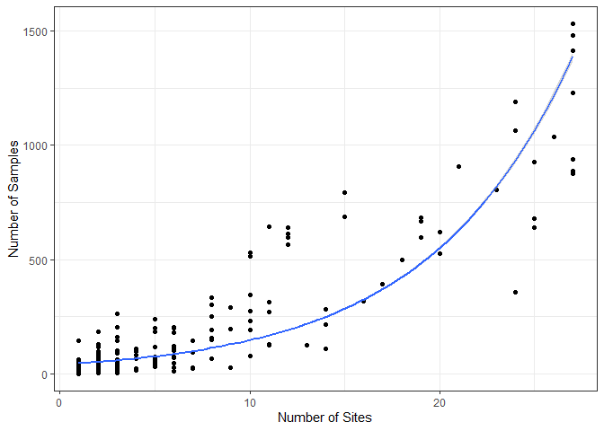
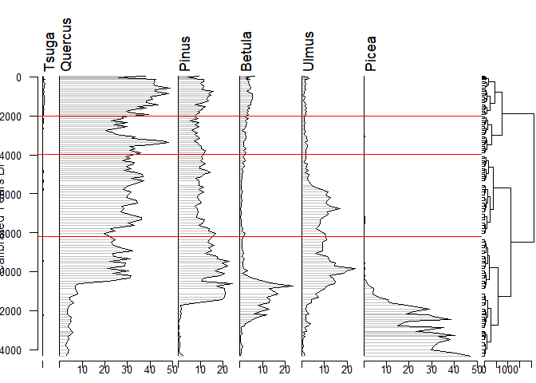
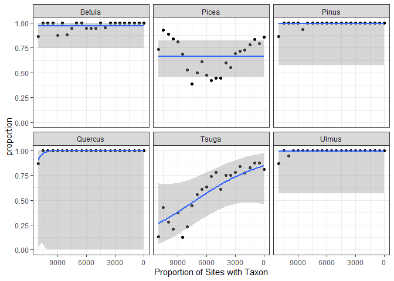
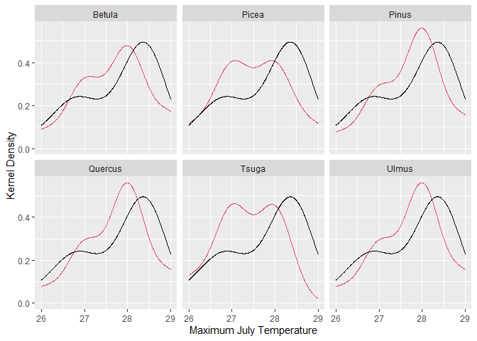

# Introduction

This series of exercises is designed to give you hands-on practice in using APIs and the `neotoma2` R package, both for practical reasons and for insights into how open-data systems work. `neotoma2`’s primary purpose is to pass data from the Neotoma Paleoecology Database (Neotoma DB) into the R environment. Neotoma relies on Application Programming Interfaces ([APIs](https://en.wikipedia.org/wiki/API)) to communicate with the Neotoma Paleoecology Database, so we’ll begin with an introduction to APIs.

This document is intended to act as a primer for the use of the new Neotoma R package, `neotoma2`.  [The `neotoma2` package](https://github.com/NeotomaDB/neotoma2) is available from GitHub and can be installed in R using the `devtools` package by using:

```r
# install.packages("devtools")
devtools::install_github('NeotomaDB/neotoma2')
library(neotoma2)
```

In this tutorial you will learn how to:

* Search for sites using site names and geographic parameters
* Filter results using temporal and spatial parameters
* Obtain sample information for the selected datasets
* Perform basic analysis including the use of climate data from rasters

## Accessing and Manipulating Data with `neotoma2`

For this workbook we use several packages, including `leaflet`, `sf` and others. We load the packages using the `pacman` package, which will automatically install the packages if they do not currently exist in your set of packages.


```r
options(warn = -1)
# install.packages("pacman")
library(pacman)
pacman::p_load(neotoma2, dplyr, ggplot2, sf, geojsonsf, leaflet, raster, DT)
```

Note that R is sensitive to the order in which packages are loaded.  Using `neotoma2::` tells R explicitly that you want to use the `neotoma2` package to run a particular function. So, for a function like `filter()`, which exists in other packages such as `dplyr`, you may see an error that looks like:

```bash
Error in UseMethod("filter") : 
  no applicable method for 'filter' applied to an object of class "sites"
```

In that case it's likely that the wrong package is trying to run `filter()`, and so explicitly adding `dplyr::` or `neotoma2::` in front of the function name (i.e., `neotoma2::filter()`)is good practice.

## Getting Help with Neotoma

Use the Geog523 slack channel for this course. If you're planning on working with Neotoma more in the future, please join us on [Slack](https://join.slack.com/t/neotomadb/shared_invite/zt-cvsv53ep-wjGeCTkq7IhP6eUNA9NxYQ) where we manage a channel specifically for questions about the R package. You may also wish to join our Google Groups mailing list, please [contact us](mailto:neotoma-contact@googlegroups.com) to be added.

# Site Searches

## `get_sites()`

There are several ways to find sites in `neotoma2`, but we think of `sites` as being spatial objects primarily. They have names, locations, and are found within the context of geopolitical units, but within the API and the package, the site itself does not have associated information about taxa, dataset types or ages.  It is simply the container into which we add that information.  So, when we search for sites we can search by:

  * siteid
  * sitename
  * location
  * altitude (maximum and minimum)
  * geopolitical unit

### Site names: `sitename="%Lait%"` {.tabset}

We may know exactly what site we're looking for ("Lac Mouton"), or have an approximate guess for the site name (for example, we know it's something like "Lait Lake", or "Lac du Lait", but we're not sure how it was entered specifically).

We use the general format: `get_sites(sitename="XXXXX")` for searching by name.

PostgreSQL (and the API) uses the percent sign as a wildcard.  So `"%Lait%"` would pick up ["Lac du Lait"](https://data.neotomadb.org/4180) for us (and would pick up "Lake Lait" and "This Old **Lait**y Hei-dee-ho Bog" if they existed).  Note that the search query is also case insensitive, so you could simply write `"%lait%"`.

#### Code


```r
spo_sites <- neotoma2::get_sites(sitename = "%Lait%")
plotLeaflet(spo_sites)
```

#### Result


```{=html}
<div id="htmlwidget-682bc573abc817aa3496" style="width:672px;height:480px;" class="leaflet html-widget"></div>
<script type="application/json" data-for="htmlwidget-682bc573abc817aa3496">{"x":{"options":{"crs":{"crsClass":"L.CRS.EPSG3857","code":null,"proj4def":null,"projectedBounds":null,"options":{}}},"calls":[{"method":"addProviderTiles","args":["Stamen.TerrainBackground",null,null,{"errorTileUrl":"","noWrap":false,"detectRetina":false}]},{"method":"addTiles","args":["https://{s}.tile.openstreetmap.org/{z}/{x}/{y}.png",null,null,{"minZoom":0,"maxZoom":18,"tileSize":256,"subdomains":"abc","errorTileUrl":"","tms":false,"noWrap":false,"zoomOffset":0,"zoomReverse":false,"opacity":1,"zIndex":1,"detectRetina":false,"attribution":"&copy; <a href=\"https://openstreetmap.org\">OpenStreetMap<\/a> contributors, <a href=\"https://creativecommons.org/licenses/by-sa/2.0/\">CC-BY-SA<\/a>"}]},{"method":"addCircleMarkers","args":[45.31417,6.81528,10,null,null,{"interactive":true,"draggable":false,"keyboard":true,"title":"","alt":"","zIndexOffset":0,"opacity":1,"riseOnHover":true,"riseOffset":250,"stroke":true,"color":"#03F","weight":5,"opacity.1":0.5,"fill":true,"fillColor":"#03F","fillOpacity":0.2},{"showCoverageOnHover":true,"zoomToBoundsOnClick":true,"spiderfyOnMaxZoom":true,"removeOutsideVisibleBounds":true,"spiderLegPolylineOptions":{"weight":1.5,"color":"#222","opacity":0.5},"freezeAtZoom":false},null,"<b>Lac du Lait<\/b><br><b>Description:<\/b> Lake almost filled. Physiography: depression in mountain. Surrouding vegetation: pasture with rare uncinata.<br><a href=http://apps.neotomadb.org/explorer/?siteids=3220>Explorer Link<\/a>",null,null,{"interactive":false,"permanent":false,"direction":"auto","opacity":1,"offset":[0,0],"textsize":"10px","textOnly":false,"className":"","sticky":true},null]}],"limits":{"lat":[45.31417,45.31417],"lng":[6.81528,6.81528]}},"evals":[],"jsHooks":[]}</script>
```

#### Ecercise

1. Find all sites beginning with "Devil"

2. Plot them on a leaflet map

### Location: `loc=c()` {.tabset}

The `neotoma` package used a bounding box for locations, structured as a vector of latitude and longitude values: `c(xmin, ymin, xmax, ymax)`.  The `neotoma2` R package supports both this simple bounding box, but also more complex spatial objects, using the [`sf` package](https://r-spatial.github.io/sf/). Using the `sf` package allows us to more easily work with raster and polygon data in R, and to select sites from more complex spatial objects.  The `loc` parameter works with the simple vector, [WKT](https://arthur-e.github.io/Wicket/sandbox-gmaps3.html), [geoJSON](http://geojson.io/#map=2/20.0/0.0) objects and native `sf` objects in R.  **Note however** that the `neotoma2` package is a wrapper for a simple API call using a URL ([api.neotomadb.org](https://api.neotomadb.org)), and URL strings can only be 1028 characters long, so the API cannot accept very long/complex spatial objects.

Looking for sites using a location. We're putting three representations of the Czech Republic here as part of a list with three elements, a geoJSON, WKT and bounding box representation.  We've also transformed the `cz$geoJSON` element to an object for the `sf` package.  Any of these four spatial representations work with the `neotoma2` package.

#### Code

```r
cz <- list(geoJSON = '{"type": "Polygon",
        "coordinates": [[
            [12.40, 50.14],
            [14.10, 48.64],
            [16.95, 48.66],
            [18.91, 49.61],
            [15.24, 50.99],
            [12.40, 50.14]]]}',
        WKT = 'POLYGON ((12.4 50.14, 
                         14.1 48.64, 
                         16.95 48.66, 
                         18.91 49.61,
                         15.24 50.99,
                         12.4 50.14))',
        bbox = c(12.4, 48.64, 18.91, 50.99))

cz$sf <- geojsonsf::geojson_sf(cz$geoJSON)[[1]]

cz_sites <- neotoma2::get_sites(loc = cz$geoJSON, all_data = TRUE)
```

#### Exercise

1. Create a bounding box object for the Michigan area
    
    - Hint: you only need the bounding box vector, not the list of three types in the example
    
    - Hack: [make life easier](http://bboxfinder.com/#0.000000,0.000000,0.000000,0.000000)

2. Use the `get_sites()` function on your bounding box object to return metadata on the sites in the region


### {.tabset .unlisted .unnumbered}

You can always simply `plot()` the `sites` objects, but you will lose some of the geographic context.  The `plotLeaflet()` function returns a `leaflet()` map, and allows you to further customize it, or add additional spatial data (like our original bounding polygon, `cz$sf`, which works directly with the R `leaflet` package):

#### Code


```r
neotoma2::plotLeaflet(cz_sites) %>% 
  leaflet::addPolygons(map = ., 
                       data = cz$sf, 
                       color = "green")
```

#### Result


```{=html}
<div id="htmlwidget-30ef11d53ed41b9efc2c" style="width:672px;height:480px;" class="leaflet html-widget"></div>
<script type="application/json" data-for="htmlwidget-30ef11d53ed41b9efc2c">{"x":{"options":{"crs":{"crsClass":"L.CRS.EPSG3857","code":null,"proj4def":null,"projectedBounds":null,"options":{}}},"calls":[{"method":"addProviderTiles","args":["Stamen.TerrainBackground",null,null,{"errorTileUrl":"","noWrap":false,"detectRetina":false}]},{"method":"addTiles","args":["https://{s}.tile.openstreetmap.org/{z}/{x}/{y}.png",null,null,{"minZoom":0,"maxZoom":18,"tileSize":256,"subdomains":"abc","errorTileUrl":"","tms":false,"noWrap":false,"zoomOffset":0,"zoomReverse":false,"opacity":1,"zIndex":1,"detectRetina":false,"attribution":"&copy; <a href=\"https://openstreetmap.org\">OpenStreetMap<\/a> contributors, <a href=\"https://creativecommons.org/licenses/by-sa/2.0/\">CC-BY-SA<\/a>"}]},{"method":"addCircleMarkers","args":[[49.726332,49.04174,49.76853,48.776394,49.75811,48.985354,48.77444,48.86363,49.232262,48.955424,48.942402,49.143988,50.601566,49.324306,49.69159,49.001672,49.02481,48.988224,49.68134,49.22716,49.250916,48.943358,50.604486,48.981118,48.977644],[15.970602,15.19097,15.372874,16.4207,15.35538,14.708586,14.927156,14.79583,14.621568,14.804076,14.807094,14.703396,14.609992,15.532934,15.45905,14.777506,14.76891,16.392582,15.47796,15.372418,14.087762,17.068908,16.213004,16.663514,17.199456],10,null,null,{"interactive":true,"draggable":false,"keyboard":true,"title":"","alt":"","zIndexOffset":0,"opacity":1,"riseOnHover":true,"riseOffset":250,"stroke":true,"color":"#03F","weight":5,"opacity.1":0.5,"fill":true,"fillColor":"#03F","fillOpacity":0.2},{"showCoverageOnHover":true,"zoomToBoundsOnClick":true,"spiderfyOnMaxZoom":true,"removeOutsideVisibleBounds":true,"spiderLegPolylineOptions":{"weight":1.5,"color":"#222","opacity":0.5},"freezeAtZoom":false},null,["<b>Kameničky<\/b><br><b>Description:<\/b> Drained sloping spring mire. Physiography: Kameničská kotlina Basin at its N margin. Surrounding vegetation: Alder carr.<br><a href=http://apps.neotomadb.org/explorer/?siteids=1399>Explorer Link<\/a>","<b>Bláto<\/b><br><b>Description:<\/b> After deep drainage quite mineral peat. Physiography: broad flat closure of a brook valley. Surrounding vegetation: present: secondary spruce plantations.<br><a href=http://apps.neotomadb.org/explorer/?siteids=3021>Explorer Link<\/a>","<b>Chraňbož<\/b><br><b>Description:<\/b> Small mire. Surrounding vegetation: fagion, Luzulo-Fagion.<br><a href=http://apps.neotomadb.org/explorer/?siteids=3052>Explorer Link<\/a>","<b>Dvůr Anšov<\/b><br><b>Description:<\/b> Fen. Physiography: dyje river alluvium. Surrounding vegetation: carpinion.<br><a href=http://apps.neotomadb.org/explorer/?siteids=3090>Explorer Link<\/a>","<b>Hroznotín<\/b><br><b>Description:<\/b> Small mire. Surrounding vegetation: fagion, Luzulo-Fagion.<br><a href=http://apps.neotomadb.org/explorer/?siteids=3152>Explorer Link<\/a>","<b>Spolí<\/b><br><b>Description:<\/b> NA<br><a href=http://apps.neotomadb.org/explorer/?siteids=3168>Explorer Link<\/a>","<b>Velanská cesta<\/b><br><b>Description:<\/b> NA<br><a href=http://apps.neotomadb.org/explorer/?siteids=3169>Explorer Link<\/a>","<b>Červené blato<\/b><br><b>Description:<\/b> NA<br><a href=http://apps.neotomadb.org/explorer/?siteids=3170>Explorer Link<\/a>","<b>Borkovická blata<\/b><br><b>Description:<\/b> Peat sediment complex undergoing peat excavation.<br><a href=http://apps.neotomadb.org/explorer/?siteids=3171>Explorer Link<\/a>","<b>Branná<\/b><br><b>Description:<\/b> NA<br><a href=http://apps.neotomadb.org/explorer/?siteids=3172>Explorer Link<\/a>","<b>Barbora<\/b><br><b>Description:<\/b> NA<br><a href=http://apps.neotomadb.org/explorer/?siteids=3173>Explorer Link<\/a>","<b>Švarcenberk<\/b><br><b>Description:<\/b> Lakes area. Physiography: Basin in plain. Surrounding vegetation: Cultivated fields and forest.<br><a href=http://apps.neotomadb.org/explorer/?siteids=3174>Explorer Link<\/a>","<b>Jestřebské blato<\/b><br><b>Description:<\/b> Vast swamps. Surrounding vegetation: pino-Quercetum.<br><a href=http://apps.neotomadb.org/explorer/?siteids=3175>Explorer Link<\/a>","<b>Loučky<\/b><br><b>Description:<\/b> Sloping spring fen. Physiography: a closure of broad flat brook valley. Surrounding vegetation: pine and spruce plantations.<br><a href=http://apps.neotomadb.org/explorer/?siteids=3254>Explorer Link<\/a>","<b>Malčín<\/b><br><b>Description:<\/b> Broad alluvium of a stream. Surrounding vegetation: quercion robori-petraeae.<br><a href=http://apps.neotomadb.org/explorer/?siteids=3269>Explorer Link<\/a>","<b>Mokré louky (South)<\/b><br><b>Description:<\/b> Cultural meadow. Surrounding vegetation: quercion robori-petraeae.<br><a href=http://apps.neotomadb.org/explorer/?siteids=3289>Explorer Link<\/a>","<b>Mokré louky (North)<\/b><br><b>Description:<\/b> NA<br><a href=http://apps.neotomadb.org/explorer/?siteids=3290>Explorer Link<\/a>","<b>Olbramovice<\/b><br><b>Description:<\/b> Spring peat bog. Surrounding vegetation: alnenion glutinoso-incanae.<br><a href=http://apps.neotomadb.org/explorer/?siteids=3327>Explorer Link<\/a>","<b>Palašiny<\/b><br><b>Description:<\/b> Broad alluvium of a stream. Surrounding vegetation: quercion robori-petraeae.<br><a href=http://apps.neotomadb.org/explorer/?siteids=3341>Explorer Link<\/a>","<b>Řásná<\/b><br><b>Description:<\/b> Artificial lake with neighbouring fen. Physiography: valley mire. Surrounding vegetation: spruce plantation.<br><a href=http://apps.neotomadb.org/explorer/?siteids=3371>Explorer Link<\/a>","<b>Řežabinec<\/b><br><b>Description:<\/b> Artificial fish pond with marginal fen. Physiography: slightly undulated landscape. Surrounding vegetation: meadows, fields, alder carr.<br><a href=http://apps.neotomadb.org/explorer/?siteids=3377>Explorer Link<\/a>","<b>Svatobořice-Mistřín<\/b><br><b>Description:<\/b> Peat bog. Surrounding vegetation: quercetea robori-petraeae.<br><a href=http://apps.neotomadb.org/explorer/?siteids=3452>Explorer Link<\/a>","<b>Vernéřovice<\/b><br><b>Description:<\/b> Flat valley. Physiography: valley fen, slightly sloping. Surrounding vegetation: cultivated fields, meadow, spruce.<br><a href=http://apps.neotomadb.org/explorer/?siteids=3492>Explorer Link<\/a>","<b>Velké Němčice<\/b><br><b>Description:<\/b> Svratka river bank. Surrounding vegetation: carpinion.<br><a href=http://apps.neotomadb.org/explorer/?siteids=3497>Explorer Link<\/a>","<b>Vracov<\/b><br><b>Description:<\/b> Artificial lake after peat exploitation. Physiography: flat valley. Surrounding vegetation: pine plantations and fields.<br><a href=http://apps.neotomadb.org/explorer/?siteids=3502>Explorer Link<\/a>"],null,null,{"interactive":false,"permanent":false,"direction":"auto","opacity":1,"offset":[0,0],"textsize":"10px","textOnly":false,"className":"","sticky":true},null]},{"method":"addPolygons","args":[[[[{"lng":[12.4,14.1,16.95,18.91,15.24,12.4],"lat":[50.14,48.64,48.66,49.61,50.99,50.14]}]]],null,null,{"interactive":true,"className":"","stroke":true,"color":"green","weight":5,"opacity":0.5,"fill":true,"fillColor":"green","fillOpacity":0.2,"smoothFactor":1,"noClip":false},null,null,null,{"interactive":false,"permanent":false,"direction":"auto","opacity":1,"offset":[0,0],"textsize":"10px","textOnly":false,"className":"","sticky":true},null]}],"limits":{"lat":[48.64,50.99],"lng":[12.4,18.91]}},"evals":[],"jsHooks":[]}</script>
```

#### Exercise

1. Plot your site object using `plotLeaflet()`

Plotting the sites is a handy quick way to see if you have the sites you expected.


### Site Helpers {.tabset}


If we look at the [UML diagram](https://en.wikipedia.org/wiki/Unified_Modeling_Language) for the objects in the `neotoma2` R package we can see that there are a set of functions that can operate on `sites`.  As we add to `sites` objects, using `get_datasets()` or `get_downloads()`, we are able to use more of these helper functions. As it is, we can take advantage of sunctions like `summary()` to get a more complete sense of the types of data we have as part of this set of sites.  The following code gives the summary table. We do some R magic here to change the way the data is displayed (turning it into a `datatable()` object), but the main piece is the `summary()` call.

#### Code


```r
neotoma2::summary(cz_sites)
```

#### Result


```{=html}
<div id="htmlwidget-238652b15d4193d95148" style="width:100%;height:auto;" class="datatables html-widget"></div>
<script type="application/json" data-for="htmlwidget-238652b15d4193d95148">{"x":{"filter":"none","vertical":false,"data":[[1399,3021,3021,3052,3052,3090,3152,3168,3169,3170,3170,3170,3171,3171,3171,3172,3173,3174,3174,3174,3175,3254,3269,3289,3290,3327,3341,3341,3371,3377,3452,3492,3497,3502,3502,3502],["Kameničky","Bláto","Bláto","Chraňbož","Chraňbož","Dvůr Anšov","Hroznotín","Spolí","Velanská cesta","Červené blato","Červené blato","Červené blato","Borkovická blata","Borkovická blata","Borkovická blata","Branná","Barbora","Švarcenberk","Švarcenberk","Švarcenberk","Jestřebské blato","Loučky","Malčín","Mokré louky (South)","Mokré louky (North)","Olbramovice","Palašiny","Palašiny","Řásná","Řežabinec","Svatobořice-Mistřín","Vernéřovice","Velké Němčice","Vracov","Vracov","Vracov"],["KAMEN","BLATO1","BLATO2","CHB1","CHB2","DVURANSO","HROZNOTI","JC-13-A","JC-2-A","JC-3-A","JC-3-AA","JC-3-B","JC-5-A","JC-5-C","JC-5-D","JC-6-A","JC-6-B","JC-7-B","SVARCEN3","SVARCENB","JESTREB","LOUCKY","MALCIN","MLOUKY","MLOUKY-B","OLBRAM","PALAS_A","PALASINY","RASNA","REZABIN","SVATOBOR","VERNER","VNEMCICE","VRACOV","VRACOV","VRACOV1"],[0,0,0,0,0,0,0,0,0,0,0,0,0,0,0,0,0,0,0,0,0,0,0,0,0,0,0,0,0,0,0,0,0,0,0,0],[1,1,1,1,1,1,1,1,1,1,1,1,1,1,1,1,1,1,1,1,1,1,1,1,1,1,1,1,1,1,1,1,1,1,1,1],["pollen","pollen","pollen","pollen","pollen","pollen","pollen","pollen","pollen","pollen","pollen","pollen","pollen","pollen","pollen","pollen","pollen","pollen","pollen","pollen","pollen","pollen","pollen","pollen","pollen","pollen","pollen","pollen","pollen","pollen","pollen","pollen","pollen","pollen","plant macrofossil","pollen"]],"container":"<table class=\"display\">\n  <thead>\n    <tr>\n      <th>siteid<\/th>\n      <th>sitename<\/th>\n      <th>collectionunit<\/th>\n      <th>chronolgies<\/th>\n      <th>datasets<\/th>\n      <th>types<\/th>\n    <\/tr>\n  <\/thead>\n<\/table>","options":{"scrollX":"100%","dom":"t","columnDefs":[{"className":"dt-right","targets":[0,3,4]}],"order":[],"autoWidth":false,"orderClasses":false}},"evals":[],"jsHooks":[]}</script>
```

#### Exercise

1. Call `summary()` on your data and see what it contains.

We can see that there are no chronologies associated with the `site` objects. This is because, at present, we have not pulled in the `dataset` information we need. All we know from `get_sites()` are the kinds of datasets we have.

## Searching for datasets: {.tabset}

We know that collection units and datasets are contained within sites. Similarly, a `sites` object contains `collectionunits` which contain `datasets`. From the table above we can see that some of the sites we've looked at contain pollen records. That said, we only have the `sites`, it's just that (for convenience) the `sites` API returns some information about datasets so to make it easier to navigate the records.

With a `sites` object we can directly call `get_datasets()`, to pull in more metadata about the datasets.  At any time we can use `datasets()` to get more information about any datasets that a `sites` object may contain.  Compare the output of `datasets(cz_sites)` to the output of a similar call using the following:

### Code


```r
cz_datasets <- neotoma2::get_datasets(cz_sites, all_data = TRUE)

datasets(cz_datasets)
```

### Result


```{=html}
<div id="htmlwidget-df20cf42f420e2f38e22" style="width:100%;height:auto;" class="datatables html-widget"></div>
<script type="application/json" data-for="htmlwidget-df20cf42f420e2f38e22">{"x":{"filter":"none","vertical":false,"data":[["1","2","3","4","5","6","7","8","9","10","11","12","13","14","15","16","17","18","19","20","21","22","23","24","25","26","27","28","29","30","31","32","33","34","35","36"],[1435,4025,4100,4121,4122,4128,4129,4131,4222,4246,4269,4270,4319,4371,4378,4469,4517,4522,3935,3936,3981,3982,4123,4124,4125,4126,4127,24256,4130,24084,24086,4336,4337,41482,4527,24097],["European Pollen Database","European Pollen Database","European Pollen Database","European Pollen Database","European Pollen Database","European Pollen Database","European Pollen Database","European Pollen Database","European Pollen Database","European Pollen Database","European Pollen Database","European Pollen Database","European Pollen Database","European Pollen Database","European Pollen Database","European Pollen Database","European Pollen Database","European Pollen Database","European Pollen Database","European Pollen Database","European Pollen Database","European Pollen Database","European Pollen Database","European Pollen Database","European Pollen Database","European Pollen Database","European Pollen Database","European Pollen Database","European Pollen Database","European Pollen Database","European Pollen Database","European Pollen Database","European Pollen Database","European Pollen Database","European Pollen Database","European Pollen Database"],["pollen","pollen","pollen","pollen","pollen","pollen","pollen","pollen","pollen","pollen","pollen","pollen","pollen","pollen","pollen","pollen","pollen","pollen","pollen","pollen","pollen","pollen","pollen","pollen","pollen","pollen","pollen","pollen","pollen","pollen","pollen","pollen","pollen","plant macrofossil","pollen","pollen"],[13680,11954,null,null,null,7091,9019,null,14178,null,11192,null,4407,11537,12323,9191,13656,null,13835,null,null,null,17284,null,null,null,16014,13503,null,15319,13791,null,11712,null,17361,14740],[-107,718,null,null,null,0,0,null,-524,null,155,null,460,-36,-68,-46,-49,null,-56,null,null,null,-348,null,null,null,9400,-22,null,5203,1364,null,-486,null,66,85],["Data contributed by Rybnícková Eliska.","Data contributed by Svobodová Helena.","Data contributed by Jankovská Vlasta.","Data contributed by Jankovská Vlasta.","Data contributed by Jankovská Vlasta.","Data contributed by Jankovská Vlasta.","Data contributed by Jankovská Vlasta.","Data contributed by Jankovská Vlasta.","Data contributed by Rybníčková Eliška.","Data contributed by Svobodová Helena.","Data contributed by Svobodová Helena.","Data contributed by Jankovská Vlasta.","Data contributed by Svobodová Helena.","Data contributed by Rybníčková Eliška.","Data contributed by Rybnícková Eliska.","Data contributed by Svobodová Helena.","Data contributed by Rybnícková Eliska.","Data contributed by Svobodová Helena.","Data contributed by Rybníčková Eliška.","Data contributed by Rybnícková Eliska.","Data contributed by Jankovská Vlasta.","Data contributed by Jankovská Vlasta.","Data contributed by Jankovská Vlasta.","Data contributed by Jankovská Vlasta.","Data contributed by Jankovská Vlasta.","Data contributed by Jankovská Vlasta.","Data contributed by Jankovská Vlasta.","Data contributed by Jankovská Vlasta.","Data contributed by Jankovská Vlasta.","Data contributed by PALYCZ via Kunes Petr.","Data contributed by PALYCZ via Kunes Petr.","Data contributed by Svobodová Helena.","Data contributed by Jankovská Vlasta.",null,"Data contributed by Svobodová Helena.","Data contributed by Rybnícková Eliska."]],"container":"<table class=\"display\">\n  <thead>\n    <tr>\n      <th> <\/th>\n      <th>datasetid<\/th>\n      <th>database<\/th>\n      <th>datasettype<\/th>\n      <th>age_range_old<\/th>\n      <th>age_range_young<\/th>\n      <th>notes<\/th>\n    <\/tr>\n  <\/thead>\n<\/table>","options":{"scrollX":"100%","dom":"t","columnDefs":[{"className":"dt-right","targets":[1,4,5]},{"orderable":false,"targets":0}],"order":[],"autoWidth":false,"orderClasses":false}},"evals":[],"jsHooks":[]}</script>
```

### Ecercise

1. **Create a new object** using the `get_datasets()` function

    - You can copy the example code and rename the objects. But be careful, copy-paste errors are common!

## Filter Records {.tabset}
  
If we choose to pull in information about only a single dataset type, or if there is additional filtering we want to do before we download the data, we can use the `filter()` function.  For example, if we only want pollen records, and want records with known chronologies, we can filter:

### Code


```r
# Note that we are filtering data on two conditions:
# pollen datasets and dataset with chronologies
cz_pollen <- cz_datasets %>% 
  neotoma2::filter(datasettype == "pollen" & !is.na(age_range_young))

neotoma2::summary(cz_pollen)
```

### Result


```{=html}
<div id="htmlwidget-8429b64fc22031b7eb03" style="width:100%;height:auto;" class="datatables html-widget"></div>
<script type="application/json" data-for="htmlwidget-8429b64fc22031b7eb03">{"x":{"filter":"none","vertical":false,"data":[["1","2","3","4","5","6","7","8","9","10","11","12","13","14","15","16","17","18","19","20"],[1399,3090,3172,3173,3254,3289,3327,3371,3377,3452,3492,3021,3170,3171,3171,3174,3174,3341,3502,3502],["Kameničky","Dvůr Anšov","Branná","Barbora","Loučky","Mokré louky (South)","Olbramovice","Řásná","Řežabinec","Svatobořice-Mistřín","Vernéřovice","Bláto","Červené blato","Borkovická blata","Borkovická blata","Švarcenberk","Švarcenberk","Palašiny","Vracov","Vracov"],["KAMEN","DVURANSO","JC-6-A","JC-6-B","LOUCKY","MLOUKY","OLBRAM","RASNA","REZABIN","SVATOBOR","VERNER","BLATO1","JC-3-A","JC-5-D","JC-5-A","SVARCENB","SVARCEN3","PALASINY","VRACOV","VRACOV1"],[0,0,0,0,0,0,0,0,0,0,0,0,0,0,0,0,0,0,0,0],[1,1,1,1,1,1,1,1,1,1,1,1,1,1,1,1,1,1,1,1],["pollen","pollen","pollen","pollen","pollen","pollen","pollen","pollen","pollen","pollen","pollen","pollen","pollen","pollen","pollen","pollen","pollen","pollen","pollen","pollen"]],"container":"<table class=\"display\">\n  <thead>\n    <tr>\n      <th> <\/th>\n      <th>siteid<\/th>\n      <th>sitename<\/th>\n      <th>collectionunit<\/th>\n      <th>chronolgies<\/th>\n      <th>datasets<\/th>\n      <th>types<\/th>\n    <\/tr>\n  <\/thead>\n<\/table>","options":{"scrollX":"100%","dom":"t","columnDefs":[{"className":"dt-right","targets":[1,4,5]},{"orderable":false,"targets":0}],"order":[],"autoWidth":false,"orderClasses":false}},"evals":[],"jsHooks":[]}</script>
```

### Exercise

1. Look up the operators being used in the above code: `==`, `&`, and `!` to understand what they accomplish in the code

2. Once you understand how the filter works, do the same on your data

We can see now that the data table looks different, and there are fewer total sites.

## Pulling in `sample()` data.

Because sample data adds a lot of overhead (for the Czech pollen data, the object that includes the dataset with samples is 20 times larger than the `dataset` alone), we try to call `get_downloads()` after we've done our preliminary filtering. After `get_datasets()` you have enough information to filter based on location, time bounds and dataset type.  When we move to `get_download()` we can do more fine-tuned filtering at the analysis unit or taxon level.

The following call can take some time, but we've frozen the object as an RDS data file. You can run this command on your own, and let it run for a bit, or you can just load the object in.


```r
## This line is commented out because we've already run it for you.
cz_dl <- cz_pollen %>% get_downloads(all_data = TRUE)
```

```
## ....................
```

```r
# cz_dl <- readRDS('data/czDownload.RDS')
```

Once we've downloaded, we now have information for each site about all the associated collection units, the datasets, and, for each dataset, all the samples associated with the datasets.  To extract all the samples we can call:


```r
allSamp <- samples(cz_dl)
```

When we've done this, we get a `data.frame` that is 39250 rows long and 37 columns wide.  The reason the table is so wide is that we are returning data in a **long** format.  Each row contains all the information you should need to properly interpret it:


```
##  [1] "age"             "agetype"         "ageolder"        "ageyounger"     
##  [5] "chronologyid"    "chronologyname"  "units"           "value"          
##  [9] "context"         "element"         "taxonid"         "symmetry"       
## [13] "taxongroup"      "elementtype"     "variablename"    "ecologicalgroup"
## [17] "analysisunitid"  "sampleanalyst"   "sampleid"        "depth"          
## [21] "thickness"       "samplename"      "datasetid"       "siteid"         
## [25] "sitename"        "lat"             "long"            "area"           
## [29] "sitenotes"       "description"     "elev"            "collunitid"     
## [33] "database"        "datasettype"     "age_range_old"   "age_range_young"
## [37] "datasetnotes"
```

For some dataset types, or analyses some of these columns may not be needed, however, for other dataset types they may be critically important.  To allow the `neotoma2` package to be as useful as possible for the community we've included as many as we can.

### Extracting Taxa {.tabset}

If you want to know what taxa we have in the record you can use the helper function `taxa()` on the sites object. The `taxa()` function gives us, not only the unique taxa, but two additional columns, `sites` and `samples` that tell us how many sites the taxa appear in, and how many samples the taxa appear in, to help us better understand how common individual taxa are.

#### Code


```r
neotomatx <- neotoma2::taxa(cz_dl)
```

#### Results


```{=html}
<div id="htmlwidget-b6ecfdc52bc41492fb46" style="width:100%;height:auto;" class="datatables html-widget"></div>
<script type="application/json" data-for="htmlwidget-b6ecfdc52bc41492fb46">{"x":{"filter":"none","vertical":false,"data":[["NISP","NISP","NISP","NISP","NISP","NISP","NISP","NISP","NISP","NISP","NISP","NISP","NISP","NISP","NISP","NISP","NISP","NISP","NISP","NISP"],["anachronic",null,null,null,null,null,null,null,null,null,null,null,null,null,null,null,null,null,null,null],["pollen/spore","ascospore","ascospore","ascospore","ascospore","ascospore","ascospore","ascospore","ascospore","cell","cell","cell","colony","colony","colony","colony","colony","colony","colony","colony"],[2644,2193,3698,5129,5413,5414,5415,27614,38489,5126,5412,5423,202,326,685,689,690,1212,2818,5045],[null,null,null,null,null,null,null,null,null,null,null,null,null,null,null,null,null,null,null,null],["Unidentified palynomorphs","Fungi","Fungi","Fungi","Fungi","Fungi","Fungi","Fungi","Fungi","Algae","Algae","Algae","Algae","Algae","Algae","Algae","Algae","Algae","Algae","Algae"],["pollen/spore","ascospore","ascospore","ascospore","ascospore","ascospore","ascospore","ascospore","ascospore","cell","cell","cell","colony","colony","colony","colony","colony","colony","colony","colony"],["Unknown (Tertiary)","Gelasinospora","Microthyrium","Gelasinospora reticulispora","Anthostomella fuegiana","Gaeumannomyces cf. G. caricis","Diporotheca","Ustulina deusta","Tetraploa scheueri","Staurastrum","Penium","Closterium undiff.","Pediastrum","Botryococcus","Pediastrum angulosum","Pediastrum braunii","Pediastrum duplex","Pediastrum undiff.","Botryococcus braunii","Pediastrum duplex var. rugulosum"],["ANAC","FUNG","FUNG","FUNG","FUNG","FUNG","FUNG","FUNG","FUNG","ALGA","ALGA","ALGA","ALGA","ALGA","ALGA","ALGA","ALGA","ALGA","ALGA","ALGA"],[1,2,11,1,1,3,2,1,1,4,1,1,2,8,2,1,7,1,3,2],[108,2,123,5,1,60,33,2,2,36,2,2,3,368,25,4,133,20,27,174]],"container":"<table class=\"c(&quot;NISP&quot;, &quot;NISP&quot;, &quot;NISP&quot;, &quot;NISP&quot;, &quot;NISP&quot;, &quot;NISP&quot;, &quot;NISP&quot;, &quot;NISP&quot;, &quot;NISP&quot;, &quot;NISP&quot;, &quot;NISP&quot;, &quot;NISP&quot;, &quot;NISP&quot;, &quot;NISP&quot;, &quot;NISP&quot;, &quot;NISP&quot;, &quot;NISP&quot;, &quot;NISP&quot;, &quot;NISP&quot;, &quot;NISP&quot;, &quot;NISP&quot;, &quot;NISP&quot;, &quot;NISP&quot;, &quot;NISP&quot;, &quot;NISP&quot;, &quot;NISP&quot;, &quot;NISP&quot;, &quot;NISP&quot;, &quot;NISP&quot;, &quot;NISP&quot;, &quot;NISP&quot;, &quot;NISP&quot;, &quot;NISP&quot;, &quot;NISP&quot;, &quot;NISP&quot;, &quot;NISP&quot;, &quot;NISP&quot;, &quot;NISP&quot;, &quot;NISP&quot;, &quot;NISP&quot;, &quot;NISP&quot;, &quot;NISP&quot;, &quot;NISP&quot;, &quot;NISP&quot;, &quot;NISP&quot;, &quot;NISP&quot;, &quot;NISP&quot;, &quot;NISP&quot;, &quot;NISP&quot;, &quot;NISP&quot;, &quot;NISP&quot;, &quot;NISP&quot;, &quot;NISP&quot;, &quot;NISP&quot;, &quot;NISP&quot;, &quot;NISP&quot;, &quot;NISP&quot;, &quot;NISP&quot;, &quot;NISP&quot;, &quot;NISP&quot;, &quot;NISP&quot;, &quot;NISP&quot;, &quot;NISP&quot;, &#10;&quot;NISP&quot;, &quot;NISP&quot;, &quot;NISP&quot;, &quot;NISP&quot;, &quot;NISP&quot;, &quot;NISP&quot;, &quot;NISP&quot;, &quot;NISP&quot;, &quot;NISP&quot;, &quot;NISP&quot;, &quot;NISP&quot;, &quot;NISP&quot;, &quot;NISP&quot;, &quot;NISP&quot;, &quot;NISP&quot;, &quot;NISP&quot;, &quot;NISP&quot;, &quot;NISP&quot;, &quot;NISP&quot;, &quot;NISP&quot;, &quot;NISP&quot;, &quot;NISP&quot;, &quot;NISP&quot;, &quot;NISP&quot;, &quot;NISP&quot;, &quot;NISP&quot;, &quot;NISP&quot;, &quot;NISP&quot;, &quot;NISP&quot;, &quot;NISP&quot;, &quot;NISP&quot;, &quot;NISP&quot;, &quot;NISP&quot;, &quot;NISP&quot;, &quot;NISP&quot;, &quot;NISP&quot;, &quot;NISP&quot;, &quot;NISP&quot;, &quot;NISP&quot;, &quot;NISP&quot;, &quot;NISP&quot;, &quot;NISP&quot;, &quot;NISP&quot;, &quot;NISP&quot;, &quot;NISP&quot;, &quot;NISP&quot;, &quot;NISP&quot;, &quot;NISP&quot;, &quot;NISP&quot;, &quot;NISP&quot;, &quot;NISP&quot;, &quot;NISP&quot;, &quot;NISP&quot;, &quot;NISP&quot;, &quot;NISP&quot;, &quot;NISP&quot;, &quot;NISP&quot;, &quot;NISP&quot;, &quot;NISP&quot;, &quot;NISP&quot;, &quot;NISP&quot;, &quot;NISP&quot;, &quot;NISP&quot;, &#10;&quot;NISP&quot;, &quot;NISP&quot;, &quot;NISP&quot;, &quot;NISP&quot;, &quot;NISP&quot;, &quot;NISP&quot;, &quot;NISP&quot;, &quot;NISP&quot;, &quot;NISP&quot;, &quot;NISP&quot;, &quot;NISP&quot;, &quot;NISP&quot;, &quot;NISP&quot;, &quot;NISP&quot;, &quot;NISP&quot;, &quot;NISP&quot;, &quot;NISP&quot;, &quot;NISP&quot;, &quot;NISP&quot;, &quot;NISP&quot;, &quot;NISP&quot;, &quot;NISP&quot;, &quot;NISP&quot;, &quot;NISP&quot;, &quot;NISP&quot;, &quot;NISP&quot;, &quot;NISP&quot;, &quot;NISP&quot;, &quot;NISP&quot;, &quot;NISP&quot;, &quot;NISP&quot;, &quot;NISP&quot;, &quot;NISP&quot;, &quot;NISP&quot;, &quot;NISP&quot;, &quot;NISP&quot;, &quot;NISP&quot;, &quot;NISP&quot;, &quot;NISP&quot;, &quot;NISP&quot;, &quot;NISP&quot;, &quot;NISP&quot;, &quot;NISP&quot;, &quot;NISP&quot;, &quot;NISP&quot;, &quot;NISP&quot;, &quot;NISP&quot;, &quot;NISP&quot;, &quot;NISP&quot;, &quot;NISP&quot;, &quot;NISP&quot;, &quot;NISP&quot;, &quot;NISP&quot;, &quot;NISP&quot;, &quot;NISP&quot;, &quot;NISP&quot;, &quot;NISP&quot;, &quot;NISP&quot;, &quot;NISP&quot;, &quot;NISP&quot;, &quot;NISP&quot;, &quot;NISP&quot;, &quot;NISP&quot;, &#10;&quot;NISP&quot;, &quot;NISP&quot;, &quot;NISP&quot;, &quot;NISP&quot;, &quot;NISP&quot;, &quot;NISP&quot;, &quot;NISP&quot;, &quot;NISP&quot;, &quot;NISP&quot;, &quot;NISP&quot;, &quot;NISP&quot;, &quot;NISP&quot;, &quot;NISP&quot;, &quot;NISP&quot;, &quot;NISP&quot;, &quot;NISP&quot;, &quot;NISP&quot;, &quot;NISP&quot;, &quot;NISP&quot;, &quot;NISP&quot;, &quot;NISP&quot;, &quot;NISP&quot;, &quot;NISP&quot;, &quot;NISP&quot;, &quot;NISP&quot;, &quot;NISP&quot;, &quot;NISP&quot;, &quot;NISP&quot;, &quot;NISP&quot;, &quot;NISP&quot;, &quot;NISP&quot;, &quot;NISP&quot;, &quot;NISP&quot;, &quot;NISP&quot;, &quot;NISP&quot;, &quot;NISP&quot;, &quot;NISP&quot;, &quot;NISP&quot;, &quot;NISP&quot;, &quot;NISP&quot;, &quot;NISP&quot;, &quot;NISP&quot;, &quot;NISP&quot;, &quot;NISP&quot;, &quot;NISP&quot;, &quot;NISP&quot;, &quot;NISP&quot;, &quot;NISP&quot;, &quot;NISP&quot;, &quot;NISP&quot;, &quot;NISP&quot;, &quot;NISP&quot;, &quot;NISP&quot;, &quot;NISP&quot;, &quot;NISP&quot;, &quot;NISP&quot;, &quot;NISP&quot;, &quot;NISP&quot;, &quot;NISP&quot;, &quot;NISP&quot;, &quot;NISP&quot;, &quot;NISP&quot;, &quot;NISP&quot;, &#10;&quot;NISP&quot;, &quot;NISP&quot;, &quot;NISP&quot;, &quot;NISP&quot;, &quot;NISP&quot;, &quot;NISP&quot;, &quot;NISP&quot;, &quot;NISP&quot;, &quot;NISP&quot;, &quot;NISP&quot;, &quot;NISP&quot;, &quot;NISP&quot;, &quot;NISP&quot;, &quot;NISP&quot;, &quot;NISP&quot;, &quot;NISP&quot;, &quot;NISP&quot;, &quot;NISP&quot;, &quot;NISP&quot;, &quot;NISP&quot;, &quot;NISP&quot;, &quot;NISP&quot;, &quot;NISP&quot;, &quot;NISP&quot;, &quot;NISP&quot;, &quot;NISP&quot;, &quot;NISP&quot;, &quot;NISP&quot;, &quot;NISP&quot;, &quot;NISP&quot;, &quot;NISP&quot;, &quot;NISP&quot;, &quot;NISP&quot;, &quot;NISP&quot;, &quot;NISP&quot;, &quot;NISP&quot;, &quot;NISP&quot;, &quot;NISP&quot;, &quot;NISP&quot;, &quot;NISP&quot;, &quot;NISP&quot;, &quot;NISP&quot;, &quot;NISP&quot;, &quot;NISP&quot;, &quot;NISP&quot;, &quot;NISP&quot;, &quot;NISP&quot;, &quot;NISP&quot;, &quot;NISP&quot;, &quot;NISP&quot;, &quot;NISP&quot;, &quot;NISP&quot;, &quot;NISP&quot;, &quot;NISP&quot;, &quot;NISP&quot;, &quot;NISP&quot;, &quot;NISP&quot;, &quot;NISP&quot;, &quot;NISP&quot;, &quot;NISP&quot;, &quot;NISP&quot;, &quot;NISP&quot;, &quot;NISP&quot;, &#10;&quot;NISP&quot;, &quot;NISP&quot;, &quot;NISP&quot;, &quot;NISP&quot;, &quot;NISP&quot;, &quot;NISP&quot;, &quot;NISP&quot;, &quot;NISP&quot;, &quot;NISP&quot;, &quot;NISP&quot;, &quot;NISP&quot;, &quot;NISP&quot;, &quot;NISP&quot;, &quot;NISP&quot;, &quot;NISP&quot;, &quot;NISP&quot;, &quot;NISP&quot;, &quot;NISP&quot;, &quot;NISP&quot;, &quot;NISP&quot;, &quot;NISP&quot;, &quot;NISP&quot;, &quot;NISP&quot;, &quot;NISP&quot;, &quot;NISP&quot;, &quot;NISP&quot;, &quot;NISP&quot;, &quot;NISP&quot;, &quot;NISP&quot;, &quot;NISP&quot;, &quot;NISP&quot;, &quot;NISP&quot;, &quot;NISP&quot;, &quot;NISP&quot;, &quot;NISP&quot;, &quot;NISP&quot;, &quot;NISP&quot;, &quot;NISP&quot;, &quot;NISP&quot;, &quot;NISP&quot;, &quot;NISP&quot;, &quot;NISP&quot;, &quot;NISP&quot;, &quot;NISP&quot;, &quot;NISP&quot;, &quot;NISP&quot;, &quot;NISP&quot;, &quot;NISP&quot;, &quot;NISP&quot;, &quot;NISP&quot;, &quot;NISP&quot;, &quot;NISP&quot;, &quot;NISP&quot;, &quot;NISP&quot;, &quot;NISP&quot;, &quot;NISP&quot;, &quot;NISP&quot;, &quot;NISP&quot;, &quot;NISP&quot;, &quot;NISP&quot;, &quot;NISP&quot;, &quot;NISP&quot;, &quot;NISP&quot;, &#10;&quot;NISP&quot;, &quot;NISP&quot;, &quot;NISP&quot;, &quot;NISP&quot;, &quot;NISP&quot;, &quot;NISP&quot;, &quot;NISP&quot;, &quot;NISP&quot;, &quot;NISP&quot;, &quot;NISP&quot;, &quot;NISP&quot;, &quot;NISP&quot;, &quot;NISP&quot;, &quot;NISP&quot;, &quot;NISP&quot;, &quot;NISP&quot;, &quot;NISP&quot;, &quot;NISP&quot;, &quot;NISP&quot;, &quot;NISP&quot;, &quot;NISP&quot;, &quot;NISP&quot;, &quot;NISP&quot;, &quot;NISP&quot;, &quot;NISP&quot;, &quot;NISP&quot;, &quot;NISP&quot;, &quot;NISP&quot;, &quot;NISP&quot;, &quot;NISP&quot;, &quot;NISP&quot;, &quot;NISP&quot;, &quot;NISP&quot;, &quot;NISP&quot;, &quot;NISP&quot;, &quot;NISP&quot;, &quot;NISP&quot;, &quot;NISP&quot;, &quot;NISP&quot;, &quot;NISP&quot;, &quot;NISP&quot;, &quot;NISP&quot;, &quot;NISP&quot;, &quot;NISP&quot;, &quot;NISP&quot;, &quot;NISP&quot;, &quot;NISP&quot;, &quot;NISP&quot;, &quot;NISP&quot;, &quot;NISP&quot;, &quot;NISP&quot;, &quot;NISP&quot;, &quot;NISP&quot;, &quot;NISP&quot;, &quot;NISP&quot;, &quot;NISP&quot;, &quot;NISP&quot;, &quot;NISP&quot;, &quot;NISP&quot;, &quot;NISP&quot;, &quot;NISP&quot;, &quot;NISP&quot;, &quot;NISP&quot;, &#10;&quot;NISP&quot;, &quot;NISP&quot;, &quot;NISP&quot;, &quot;NISP&quot;, &quot;NISP&quot;, &quot;NISP&quot;, &quot;NISP&quot;, &quot;NISP&quot;, &quot;NISP&quot;, &quot;NISP&quot;, &quot;NISP&quot;, &quot;NISP&quot;, &quot;NISP&quot;, &quot;NISP&quot;, &quot;NISP&quot;, &quot;NISP&quot;, &quot;NISP&quot;, &quot;NISP&quot;, &quot;NISP&quot;, &quot;NISP&quot;, &quot;NISP&quot;, &quot;NISP&quot;, &quot;NISP&quot;, &quot;NISP&quot;, &quot;NISP&quot;, &quot;NISP&quot;, &quot;NISP&quot;, &quot;NISP&quot;, &quot;NISP&quot;, &quot;NISP&quot;, &quot;NISP&quot;, &quot;NISP&quot;, &quot;NISP&quot;, &quot;NISP&quot;, &quot;NISP&quot;, &quot;NISP&quot;, &quot;NISP&quot;, &quot;NISP&quot;, &quot;NISP&quot;, &quot;NISP&quot;, &quot;NISP&quot;, &quot;NISP&quot;, &quot;NISP&quot;, &quot;NISP&quot;, &quot;NISP&quot;, &quot;NISP&quot;, &quot;NISP&quot;, &quot;NISP&quot;, &quot;NISP&quot;, &quot;NISP&quot;, &quot;NISP&quot;, &quot;number&quot;, &quot;number×1000&quot;) c(&quot;anachronic&quot;, NA, NA, NA, NA, NA, NA, NA, NA, NA, NA, NA, NA, NA, NA, NA, NA, NA, NA, NA, NA, NA, NA, NA, NA, NA, NA, NA, NA, NA, NA, NA, NA, NA, NA, NA, NA, NA, NA, NA, NA, NA, NA, NA, NA, NA, NA, NA, NA, NA, NA, NA, NA, NA, NA, NA, NA, NA, NA, NA, NA, NA, NA, NA, NA, NA, NA, NA, NA, NA, NA, NA, NA, NA, NA, NA, NA, NA, NA, NA, NA, NA, NA, NA, NA, NA, NA, NA, NA, NA, NA, NA, NA, NA, NA, NA, NA, NA, NA, NA, NA, NA, NA, NA, NA, NA, NA, NA, NA, NA, NA, NA, NA, NA, NA, NA, NA, NA, NA, NA, NA, NA, NA, &#10;NA, NA, NA, NA, NA, NA, NA, NA, NA, NA, NA, NA, NA, NA, NA, NA, NA, NA, NA, NA, NA, NA, NA, NA, NA, NA, NA, NA, NA, NA, NA, NA, NA, NA, NA, NA, NA, NA, NA, NA, NA, NA, NA, NA, NA, NA, NA, NA, NA, NA, NA, NA, NA, NA, NA, NA, NA, NA, NA, NA, NA, NA, NA, NA, NA, NA, NA, NA, NA, NA, NA, NA, NA, NA, NA, NA, NA, NA, NA, NA, NA, NA, NA, NA, NA, NA, NA, NA, NA, NA, NA, NA, NA, NA, NA, NA, NA, NA, NA, NA, NA, NA, NA, NA, NA, NA, NA, NA, NA, NA, NA, NA, NA, NA, NA, NA, NA, NA, NA, NA, NA, NA, NA, NA, NA, NA, &#10;NA, NA, NA, NA, NA, NA, NA, NA, NA, NA, NA, NA, NA, NA, NA, NA, NA, NA, NA, NA, NA, NA, NA, NA, NA, NA, NA, NA, NA, NA, NA, NA, NA, NA, NA, NA, NA, NA, NA, NA, NA, NA, NA, NA, NA, NA, NA, NA, NA, NA, NA, NA, NA, NA, NA, NA, NA, NA, NA, NA, NA, NA, NA, NA, NA, NA, NA, NA, NA, NA, NA, NA, NA, NA, NA, NA, NA, NA, NA, NA, NA, NA, NA, NA, NA, NA, NA, NA, NA, NA, NA, NA, NA, NA, NA, NA, NA, NA, NA, NA, NA, NA, NA, NA, NA, NA, NA, NA, NA, NA, NA, NA, NA, NA, NA, NA, NA, NA, NA, NA, NA, NA, NA, NA, NA, NA, &#10;NA, NA, NA, NA, NA, NA, NA, NA, NA, NA, NA, NA, NA, NA, NA, NA, NA, NA, NA, NA, NA, NA, NA, NA, NA, NA, NA, NA, NA, NA, NA, NA, NA, NA, NA, NA, NA, NA, NA, NA, NA, NA, NA, NA, NA, NA, NA, NA, NA, NA, NA, NA, NA, NA, NA, NA, NA, NA, NA, NA, NA, NA, NA, NA, NA, NA, NA, NA, NA, NA, NA, NA, NA, NA, NA, NA, NA, NA, NA, NA, NA, NA, NA, NA, NA, NA, NA, NA, NA, NA, NA, NA, NA, NA, NA, NA, NA, NA, NA, NA, NA, NA, NA, NA, NA, NA, NA, NA, NA, NA, NA, NA, NA, NA, NA, NA, NA, NA, NA) c(&quot;pollen/spore&quot;, &quot;ascospore&quot;, &quot;ascospore&quot;, &quot;ascospore&quot;, &quot;ascospore&quot;, &quot;ascospore&quot;, &quot;ascospore&quot;, &quot;ascospore&quot;, &quot;ascospore&quot;, &quot;cell&quot;, &quot;cell&quot;, &quot;cell&quot;, &quot;colony&quot;, &quot;colony&quot;, &quot;colony&quot;, &quot;colony&quot;, &quot;colony&quot;, &quot;colony&quot;, &quot;colony&quot;, &quot;colony&quot;, &quot;colony&quot;, &quot;colony&quot;, &quot;colony&quot;, &quot;colony&quot;, &quot;colony&quot;, &quot;colony&quot;, &quot;colony&quot;, &quot;colony&quot;, &quot;colony&quot;, &quot;colony&quot;, &quot;colony&quot;, &quot;colony&quot;, &quot;colony&quot;, &quot;colony&quot;, &quot;colony&quot;, &quot;colony&quot;, &quot;cyst&quot;, &quot;leaf spine&quot;, &quot;lorica&quot;, &quot;lorica&quot;, &quot;mandible/claw&quot;, &quot;oocyte&quot;, &quot;oocyte&quot;, &quot;palynomorph&quot;, &quot;palynomorph&quot;, &quot;palynomorph&quot;, &#10;&quot;palynomorph&quot;, &quot;palynomorph&quot;, &quot;palynomorph&quot;, &quot;palynomorph&quot;, &quot;palynomorph&quot;, &quot;palynomorph&quot;, &quot;palynomorph&quot;, &quot;palynomorph&quot;, &quot;palynomorph&quot;, &quot;palynomorph&quot;, &quot;palynomorph&quot;, &quot;palynomorph&quot;, &quot;pollen&quot;, &quot;pollen&quot;, &quot;pollen&quot;, &quot;pollen&quot;, &quot;pollen&quot;, &quot;pollen&quot;, &quot;pollen&quot;, &quot;pollen&quot;, &quot;pollen&quot;, &quot;pollen&quot;, &quot;pollen&quot;, &quot;pollen&quot;, &quot;pollen&quot;, &quot;pollen&quot;, &quot;pollen&quot;, &quot;pollen&quot;, &quot;pollen&quot;, &quot;pollen&quot;, &quot;pollen&quot;, &quot;pollen&quot;, &quot;pollen&quot;, &quot;pollen&quot;, &quot;pollen&quot;, &quot;pollen&quot;, &quot;pollen&quot;, &quot;pollen&quot;, &quot;pollen&quot;, &quot;pollen&quot;, &quot;pollen&quot;, &quot;pollen&quot;, &quot;pollen&quot;, &quot;pollen&quot;, &quot;pollen&quot;, &#10;&quot;pollen&quot;, &quot;pollen&quot;, &quot;pollen&quot;, &quot;pollen&quot;, &quot;pollen&quot;, &quot;pollen&quot;, &quot;pollen&quot;, &quot;pollen&quot;, &quot;pollen&quot;, &quot;pollen&quot;, &quot;pollen&quot;, &quot;pollen&quot;, &quot;pollen&quot;, &quot;pollen&quot;, &quot;pollen&quot;, &quot;pollen&quot;, &quot;pollen&quot;, &quot;pollen&quot;, &quot;pollen&quot;, &quot;pollen&quot;, &quot;pollen&quot;, &quot;pollen&quot;, &quot;pollen&quot;, &quot;pollen&quot;, &quot;pollen&quot;, &quot;pollen&quot;, &quot;pollen&quot;, &quot;pollen&quot;, &quot;pollen&quot;, &quot;pollen&quot;, &quot;pollen&quot;, &quot;pollen&quot;, &quot;pollen&quot;, &quot;pollen&quot;, &quot;pollen&quot;, &quot;pollen&quot;, &quot;pollen&quot;, &quot;pollen&quot;, &quot;pollen&quot;, &quot;pollen&quot;, &quot;pollen&quot;, &quot;pollen&quot;, &quot;pollen&quot;, &quot;pollen&quot;, &quot;pollen&quot;, &quot;pollen&quot;, &quot;pollen&quot;, &quot;pollen&quot;, &quot;pollen&quot;, &quot;pollen&quot;, &quot;pollen&quot;, &#10;&quot;pollen&quot;, &quot;pollen&quot;, &quot;pollen&quot;, &quot;pollen&quot;, &quot;pollen&quot;, &quot;pollen&quot;, &quot;pollen&quot;, &quot;pollen&quot;, &quot;pollen&quot;, &quot;pollen&quot;, &quot;pollen&quot;, &quot;pollen&quot;, &quot;pollen&quot;, &quot;pollen&quot;, &quot;pollen&quot;, &quot;pollen&quot;, &quot;pollen&quot;, &quot;pollen&quot;, &quot;pollen&quot;, &quot;pollen&quot;, &quot;pollen&quot;, &quot;pollen&quot;, &quot;pollen&quot;, &quot;pollen&quot;, &quot;pollen&quot;, &quot;pollen&quot;, &quot;pollen&quot;, &quot;pollen&quot;, &quot;pollen&quot;, &quot;pollen&quot;, &quot;pollen&quot;, &quot;pollen&quot;, &quot;pollen&quot;, &quot;pollen&quot;, &quot;pollen&quot;, &quot;pollen&quot;, &quot;pollen&quot;, &quot;pollen&quot;, &quot;pollen&quot;, &quot;pollen&quot;, &quot;pollen&quot;, &quot;pollen&quot;, &quot;pollen&quot;, &quot;pollen&quot;, &quot;pollen&quot;, &quot;pollen&quot;, &quot;pollen&quot;, &quot;pollen&quot;, &quot;pollen&quot;, &quot;pollen&quot;, &quot;pollen&quot;, &#10;&quot;pollen&quot;, &quot;pollen&quot;, &quot;pollen&quot;, &quot;pollen&quot;, &quot;pollen&quot;, &quot;pollen&quot;, &quot;pollen&quot;, &quot;pollen&quot;, &quot;pollen&quot;, &quot;pollen&quot;, &quot;pollen&quot;, &quot;pollen&quot;, &quot;pollen&quot;, &quot;pollen&quot;, &quot;pollen&quot;, &quot;pollen&quot;, &quot;pollen&quot;, &quot;pollen&quot;, &quot;pollen&quot;, &quot;pollen&quot;, &quot;pollen&quot;, &quot;pollen&quot;, &quot;pollen&quot;, &quot;pollen&quot;, &quot;pollen&quot;, &quot;pollen&quot;, &quot;pollen&quot;, &quot;pollen&quot;, &quot;pollen&quot;, &quot;pollen&quot;, &quot;pollen&quot;, &quot;pollen&quot;, &quot;pollen&quot;, &quot;pollen&quot;, &quot;pollen&quot;, &quot;pollen&quot;, &quot;pollen&quot;, &quot;pollen&quot;, &quot;pollen&quot;, &quot;pollen&quot;, &quot;pollen&quot;, &quot;pollen&quot;, &quot;pollen&quot;, &quot;pollen&quot;, &quot;pollen&quot;, &quot;pollen&quot;, &quot;pollen&quot;, &quot;pollen&quot;, &quot;pollen&quot;, &quot;pollen&quot;, &quot;pollen&quot;, &#10;&quot;pollen&quot;, &quot;pollen&quot;, &quot;pollen&quot;, &quot;pollen&quot;, &quot;pollen&quot;, &quot;pollen&quot;, &quot;pollen&quot;, &quot;pollen&quot;, &quot;pollen&quot;, &quot;pollen&quot;, &quot;pollen&quot;, &quot;pollen&quot;, &quot;pollen&quot;, &quot;pollen&quot;, &quot;pollen&quot;, &quot;pollen&quot;, &quot;pollen&quot;, &quot;pollen&quot;, &quot;pollen&quot;, &quot;pollen&quot;, &quot;pollen&quot;, &quot;pollen&quot;, &quot;pollen&quot;, &quot;pollen&quot;, &quot;pollen&quot;, &quot;pollen&quot;, &quot;pollen&quot;, &quot;pollen&quot;, &quot;pollen&quot;, &quot;pollen&quot;, &quot;pollen&quot;, &quot;pollen&quot;, &quot;pollen&quot;, &quot;pollen&quot;, &quot;pollen&quot;, &quot;pollen&quot;, &quot;pollen&quot;, &quot;pollen&quot;, &quot;pollen&quot;, &quot;pollen&quot;, &quot;pollen&quot;, &quot;pollen&quot;, &quot;pollen&quot;, &quot;pollen&quot;, &quot;pollen&quot;, &quot;pollen&quot;, &quot;pollen&quot;, &quot;pollen&quot;, &quot;pollen&quot;, &quot;pollen&quot;, &quot;pollen&quot;, &#10;&quot;pollen&quot;, &quot;pollen&quot;, &quot;pollen&quot;, &quot;pollen&quot;, &quot;pollen&quot;, &quot;pollen&quot;, &quot;pollen&quot;, &quot;pollen&quot;, &quot;pollen&quot;, &quot;pollen&quot;, &quot;pollen&quot;, &quot;pollen&quot;, &quot;pollen&quot;, &quot;pollen&quot;, &quot;pollen&quot;, &quot;pollen&quot;, &quot;pollen&quot;, &quot;pollen&quot;, &quot;pollen&quot;, &quot;pollen&quot;, &quot;pollen&quot;, &quot;pollen&quot;, &quot;pollen&quot;, &quot;pollen&quot;, &quot;pollen&quot;, &quot;pollen&quot;, &quot;pollen&quot;, &quot;pollen&quot;, &quot;pollen&quot;, &quot;pollen&quot;, &quot;pollen&quot;, &quot;pollen&quot;, &quot;pollen&quot;, &quot;pollen&quot;, &quot;pollen&quot;, &quot;pollen&quot;, &quot;pollen&quot;, &quot;pollen&quot;, &quot;pollen&quot;, &quot;pollen&quot;, &quot;pollen&quot;, &quot;pollen&quot;, &quot;pollen&quot;, &quot;pollen&quot;, &quot;pollen&quot;, &quot;pollen&quot;, &quot;pollen&quot;, &quot;pollen&quot;, &quot;pollen&quot;, &quot;pollen&quot;, &quot;pollen&quot;, &#10;&quot;pollen&quot;, &quot;pollen&quot;, &quot;pollen&quot;, &quot;pollen&quot;, &quot;pollen&quot;, &quot;pollen&quot;, &quot;pollen&quot;, &quot;pollen&quot;, &quot;pollen&quot;, &quot;pollen&quot;, &quot;pollen&quot;, &quot;pollen&quot;, &quot;pollen&quot;, &quot;pollen&quot;, &quot;pollen&quot;, &quot;pollen&quot;, &quot;pollen&quot;, &quot;pollen&quot;, &quot;pollen&quot;, &quot;pollen&quot;, &quot;pollen&quot;, &quot;pollen&quot;, &quot;pollen&quot;, &quot;pollen&quot;, &quot;pollen&quot;, &quot;pollen&quot;, &quot;pollen&quot;, &quot;pollen&quot;, &quot;pollen&quot;, &quot;pollen&quot;, &quot;pollen&quot;, &quot;pollen&quot;, &quot;pollen&quot;, &quot;pollen&quot;, &quot;pollen&quot;, &quot;pollen&quot;, &quot;pollen&quot;, &quot;pollen&quot;, &quot;pollen&quot;, &quot;pollen&quot;, &quot;pollen&quot;, &quot;pollen&quot;, &quot;pollen&quot;, &quot;pollen&quot;, &quot;pollen&quot;, &quot;pollen&quot;, &quot;pollen&quot;, &quot;pollen&quot;, &quot;pollen&quot;, &quot;pollen&quot;, &quot;pollen&quot;, &#10;&quot;pollen&quot;, &quot;pollen&quot;, &quot;pollen&quot;, &quot;pollen&quot;, &quot;pollen&quot;, &quot;pollen&quot;, &quot;pollen&quot;, &quot;pollen&quot;, &quot;pollen&quot;, &quot;pollen&quot;, &quot;pollen&quot;, &quot;pollen&quot;, &quot;pollen&quot;, &quot;pollen&quot;, &quot;pollen&quot;, &quot;pollen&quot;, &quot;pollen&quot;, &quot;pollen&quot;, &quot;pollen&quot;, &quot;pollen&quot;, &quot;pollen&quot;, &quot;pollen&quot;, &quot;pollen&quot;, &quot;pollen&quot;, &quot;pollen&quot;, &quot;pollen&quot;, &quot;pollen&quot;, &quot;pollen&quot;, &quot;pollen&quot;, &quot;pollen&quot;, &quot;pollen&quot;, &quot;pollen&quot;, &quot;pollen&quot;, &quot;pollen&quot;, &quot;pollen&quot;, &quot;pollen&quot;, &quot;pollen&quot;, &quot;pollen&quot;, &quot;pollen&quot;, &quot;pollen&quot;, &quot;pollen&quot;, &quot;pollen&quot;, &quot;pollen&quot;, &quot;pollen/spore&quot;, &quot;pollen/spore&quot;, &quot;pollen/spore&quot;, &quot;spore&quot;, &quot;spore&quot;, &quot;spore&quot;, &#10;&quot;spore&quot;, &quot;spore&quot;, &quot;spore&quot;, &quot;spore&quot;, &quot;spore&quot;, &quot;spore&quot;, &quot;spore&quot;, &quot;spore&quot;, &quot;spore&quot;, &quot;spore&quot;, &quot;spore&quot;, &quot;spore&quot;, &quot;spore&quot;, &quot;spore&quot;, &quot;spore&quot;, &quot;spore&quot;, &quot;spore&quot;, &quot;spore&quot;, &quot;spore&quot;, &quot;spore&quot;, &quot;spore&quot;, &quot;spore&quot;, &quot;spore&quot;, &quot;spore&quot;, &quot;spore&quot;, &quot;spore&quot;, &quot;spore&quot;, &quot;spore&quot;, &quot;spore&quot;, &quot;spore&quot;, &quot;spore&quot;, &quot;spore&quot;, &quot;spore&quot;, &quot;sporocarp&quot;, &quot;stomate&quot;, &quot;test&quot;, &quot;test&quot;, &quot;test&quot;, &quot;test&quot;, &quot;test&quot;, &quot;test&quot;, &quot;test&quot;, &quot;test&quot;, &quot;trichoblast&quot;, &quot;valve&quot;, &quot;valve&quot;, &quot;counted&quot;, &quot;fragment&quot;) c(2644, 2193, 3698, 5129, 5413, 5414, 5415, 27614, 38489, 5126, 5412, 5423, 202, 326, 685, 689, 690, 1212, 2818, 5045, 5059, 5060, 32495, 33383, 33384, 33386, 33387, 33391, 33392, 33393, 33394, 33395, 33398, 33400, 33421, 33423, 778, 894, 1198, 31741, 5417, 27726, 27732, 1488, 1704, 1761, 3091, 5123, 5124, 5137, 5138, 5140, 5142, 5387, 5411, 5418, 5424, 29123, 1, 12, 24, 25, 29, 31, 32, 40, 44, 45, 67, 73, 74, 81, 86, 90, 92, 103, 104, 106, 107, 116, 119, 120, 121, 129, 132, 136, 153, 155, 160, 164, &#10;176, 180, 182, 190, 192, 193, 210, 219, 220, 221, 230, 231, 242, 244, 245, 251, 252, 262, 267, 268, 270, 271, 275, 282, 283, 284, 285, 293, 300, 302, 306, 307, 309, 310, 311, 316, 317, 318, 319, 320, 330, 332, 336, 338, 341, 346, 349, 350, 353, 361, 369, 372, 385, 389, 391, 397, 414, 417, 418, 420, 425, 427, 448, 460, 470, 473, 476, 483, 488, 491, 496, 497, 498, 513, 514, 515, 517, 539, 557, 585, 586, 592, 654, 655, 656, 667, 684, 698, 699, 703, 714, 715, 733, 736, 752, 762, 767, 785, 798, 806, 808, &#10;810, 813, 815, 820, 821, 838, 841, 842, 843, 884, 908, 909, 936, 947, 967, 969, 983, 988, 989, 994, 996, 997, 1012, 1026, 1050, 1069, 1072, 1073, 1086, 1087, 1094, 1143, 1161, 1163, 1172, 1173, 1184, 1222, 1253, 1260, 1267, 1268, 1288, 1301, 1306, 1308, 1310, 1311, 1316, 1319, 1320, 1321, 1325, 1326, 1334, 1335, 1336, 1341, 1392, 1416, 1428, 1429, 1434, 1435, 1517, 1532, 1580, 1710, 1915, 1932, 1947, 2127, 2129, 2131, 2160, 2196, 2210, 2224, 2311, 2322, 2460, 2483, 2536, 2537, 2549, 2561, 2566, 2572, &#10;2590, 2667, 2677, 2684, 2685, 2690, 2795, 2828, 2897, 2901, 2905, 2908, 2910, 2911, 2915, 2918, 2919, 2925, 2930, 2932, 2938, 2948, 3172, 3180, 3208, 3421, 3422, 3423, 3426, 3432, 3434, 3438, 3439, 3440, 3441, 3446, 3449, 3450, 3455, 3472, 3473, 3566, 3567, 3570, 3572, 3578, 3579, 3583, 3591, 3597, 3600, 3641, 3644, 3645, 3689, 3690, 3691, 3693, 3696, 3697, 3699, 3700, 3701, 3702, 3703, 3704, 3705, 3770, 3792, 3801, 3803, 3815, 3897, 3926, 3950, 3970, 4001, 4047, 4053, 4059, 4071, 4076, 4093, 4094, &#10;4130, 4133, 4136, 4162, 4178, 4221, 4226, 4270, 4330, 4358, 4359, 4367, 4409, 4412, 4416, 4421, 4431, 4448, 4455, 4488, 4489, 4492, 4494, 4502, 4506, 4530, 4536, 4570, 4588, 4600, 4608, 4635, 4663, 4666, 4704, 4782, 4783, 4784, 4786, 4789, 4790, 4836, 4877, 4906, 4922, 4923, 4956, 4959, 4961, 4976, 5066, 5073, 5090, 5146, 5151, 5192, 5225, 5233, 5342, 5357, 5360, 5621, 9530, 9722, 14859, 14919, 27457, 27573, 27587, 27589, 27596, 27948, 31266, 31500, 32003, 33823, 38081, 312, 313, 3713, 33, 83, 91, &#10;115, 168, 170, 172, 184, 234, 294, 305, 348, 508, 573, 720, 750, 807, 835, 1109, 1164, 1168, 1180, 1344, 1345, 1370, 1801, 1890, 2301, 5004, 5011, 5030, 5173, 5393, 15671, 30936, 34413, 9995, 385, 559, 561, 570, 619, 1189, 1223, 5389, 28043, 673, 5397, 27180, 932, 1062) c(NA, NA, NA, NA, NA, NA, NA, NA, NA, NA, NA, NA, NA, NA, NA, NA, NA, NA, NA, NA, NA, NA, NA, NA, NA, NA, NA, NA, NA, NA, NA, NA, NA, NA, NA, NA, NA, NA, NA, NA, NA, NA, NA, NA, NA, NA, NA, NA, NA, NA, NA, NA, NA, NA, NA, NA, NA, NA, NA, NA, NA, NA, NA, NA, NA, NA, NA, NA, NA, NA, NA, NA, NA, NA, NA, NA, NA, NA, NA, NA, NA, NA, NA, NA, NA, NA, NA, NA, NA, NA, NA, NA, NA, NA, NA, NA, NA, NA, NA, NA, NA, NA, NA, NA, NA, NA, NA, NA, NA, NA, NA, NA, NA, NA, NA, NA, NA, NA, NA, NA, NA, NA, NA, NA, NA, &#10;NA, NA, NA, NA, NA, NA, NA, NA, NA, NA, NA, NA, NA, NA, NA, NA, NA, NA, NA, NA, NA, NA, NA, NA, NA, NA, NA, NA, NA, NA, NA, NA, NA, NA, NA, NA, NA, NA, NA, NA, NA, NA, NA, NA, NA, NA, NA, NA, NA, NA, NA, NA, NA, NA, NA, NA, NA, NA, NA, NA, NA, NA, NA, NA, NA, NA, NA, NA, NA, NA, NA, NA, NA, NA, NA, NA, NA, NA, NA, NA, NA, NA, NA, NA, NA, NA, NA, NA, NA, NA, NA, NA, NA, NA, NA, NA, NA, NA, NA, NA, NA, NA, NA, NA, NA, NA, NA, NA, NA, NA, NA, NA, NA, NA, NA, NA, NA, NA, NA, NA, NA, NA, NA, NA, NA, NA, &#10;NA, NA, NA, NA, NA, NA, NA, NA, NA, NA, NA, NA, NA, NA, NA, NA, NA, NA, NA, NA, NA, NA, NA, NA, NA, NA, NA, NA, NA, NA, NA, NA, NA, NA, NA, NA, NA, NA, NA, NA, NA, NA, NA, NA, NA, NA, NA, NA, NA, NA, NA, NA, NA, NA, NA, NA, NA, NA, NA, NA, NA, NA, NA, NA, NA, NA, NA, NA, NA, NA, NA, NA, NA, NA, NA, NA, NA, NA, NA, NA, NA, NA, NA, NA, NA, NA, NA, NA, NA, NA, NA, NA, NA, NA, NA, NA, NA, NA, NA, NA, NA, NA, NA, NA, NA, NA, NA, NA, NA, NA, NA, NA, NA, NA, NA, NA, NA, NA, NA, NA, NA, NA, NA, NA, NA, NA, &#10;NA, NA, NA, NA, NA, NA, NA, NA, NA, NA, NA, NA, NA, NA, NA, NA, NA, NA, NA, NA, NA, NA, NA, NA, NA, NA, NA, NA, NA, NA, NA, NA, NA, NA, NA, NA, NA, NA, NA, NA, NA, NA, NA, NA, NA, NA, NA, NA, NA, NA, NA, NA, NA, NA, NA, NA, NA, NA, NA, NA, NA, NA, NA, NA, NA, NA, NA, NA, NA, NA, NA, NA, NA, NA, NA, NA, NA, NA, NA, NA, NA, NA, NA, NA, NA, NA, NA, NA, NA, NA, NA, NA, NA, NA, NA, NA, NA, NA, NA, NA, NA, NA, NA, NA, NA, NA, NA, NA, NA, NA, NA, NA, NA, NA, NA, NA, NA) c(&quot;Unidentified palynomorphs&quot;, &quot;Fungi&quot;, &quot;Fungi&quot;, &quot;Fungi&quot;, &quot;Fungi&quot;, &quot;Fungi&quot;, &quot;Fungi&quot;, &quot;Fungi&quot;, &quot;Fungi&quot;, &quot;Algae&quot;, &quot;Algae&quot;, &quot;Algae&quot;, &quot;Algae&quot;, &quot;Algae&quot;, &quot;Algae&quot;, &quot;Algae&quot;, &quot;Algae&quot;, &quot;Algae&quot;, &quot;Algae&quot;, &quot;Algae&quot;, &quot;Algae&quot;, &quot;Algae&quot;, &quot;Algae&quot;, &quot;Algae&quot;, &quot;Algae&quot;, &quot;Algae&quot;, &quot;Algae&quot;, &quot;Algae&quot;, &quot;Algae&quot;, &quot;Algae&quot;, &quot;Algae&quot;, &quot;Algae&quot;, &quot;Algae&quot;, &quot;Algae&quot;, &quot;Algae&quot;, &quot;Algae&quot;, &quot;Dinoflagellates&quot;, &quot;Vascular plants&quot;, &quot;Rotifers&quot;, &quot;Rotifers&quot;, &quot;Crustaceans undiff.&quot;, &quot;Flatworms&quot;, &quot;Flatworms&quot;, &quot;Algae&quot;, &quot;Algae&quot;, &quot;Algae&quot;, &quot;Algae&quot;, &quot;Algae&quot;, &#10;&quot;Algae&quot;, &quot;Algae&quot;, &quot;Algae&quot;, &quot;Algae&quot;, &quot;Algae&quot;, &quot;Algae&quot;, &quot;Algae&quot;, &quot;Flatworms&quot;, &quot;Algae&quot;, &quot;Algae&quot;, &quot;Vascular plants&quot;, &quot;Vascular plants&quot;, &quot;Vascular plants&quot;, &quot;Vascular plants&quot;, &quot;Vascular plants&quot;, &quot;Vascular plants&quot;, &quot;Vascular plants&quot;, &quot;Vascular plants&quot;, &quot;Vascular plants&quot;, &quot;Vascular plants&quot;, &quot;Vascular plants&quot;, &quot;Vascular plants&quot;, &quot;Vascular plants&quot;, &quot;Vascular plants&quot;, &quot;Vascular plants&quot;, &quot;Vascular plants&quot;, &quot;Vascular plants&quot;, &quot;Vascular plants&quot;, &quot;Vascular plants&quot;, &quot;Vascular plants&quot;, &quot;Vascular plants&quot;, &quot;Vascular plants&quot;, &#10;&quot;Vascular plants&quot;, &quot;Vascular plants&quot;, &quot;Vascular plants&quot;, &quot;Vascular plants&quot;, &quot;Vascular plants&quot;, &quot;Vascular plants&quot;, &quot;Vascular plants&quot;, &quot;Vascular plants&quot;, &quot;Vascular plants&quot;, &quot;Vascular plants&quot;, &quot;Vascular plants&quot;, &quot;Vascular plants&quot;, &quot;Vascular plants&quot;, &quot;Vascular plants&quot;, &quot;Vascular plants&quot;, &quot;Vascular plants&quot;, &quot;Vascular plants&quot;, &quot;Vascular plants&quot;, &quot;Vascular plants&quot;, &quot;Vascular plants&quot;, &quot;Vascular plants&quot;, &quot;Vascular plants&quot;, &quot;Vascular plants&quot;, &quot;Vascular plants&quot;, &quot;Vascular plants&quot;, &quot;Vascular plants&quot;, &quot;Vascular plants&quot;, &#10;&quot;Vascular plants&quot;, &quot;Vascular plants&quot;, &quot;Vascular plants&quot;, &quot;Vascular plants&quot;, &quot;Vascular plants&quot;, &quot;Vascular plants&quot;, &quot;Vascular plants&quot;, &quot;Vascular plants&quot;, &quot;Vascular plants&quot;, &quot;Vascular plants&quot;, &quot;Vascular plants&quot;, &quot;Vascular plants&quot;, &quot;Vascular plants&quot;, &quot;Vascular plants&quot;, &quot;Vascular plants&quot;, &quot;Vascular plants&quot;, &quot;Vascular plants&quot;, &quot;Vascular plants&quot;, &quot;Vascular plants&quot;, &quot;Vascular plants&quot;, &quot;Vascular plants&quot;, &quot;Vascular plants&quot;, &quot;Vascular plants&quot;, &quot;Vascular plants&quot;, &quot;Vascular plants&quot;, &quot;Vascular plants&quot;, &quot;Vascular plants&quot;, &#10;&quot;Vascular plants&quot;, &quot;Vascular plants&quot;, &quot;Vascular plants&quot;, &quot;Vascular plants&quot;, &quot;Vascular plants&quot;, &quot;Vascular plants&quot;, &quot;Vascular plants&quot;, &quot;Vascular plants&quot;, &quot;Vascular plants&quot;, &quot;Vascular plants&quot;, &quot;Vascular plants&quot;, &quot;Vascular plants&quot;, &quot;Vascular plants&quot;, &quot;Vascular plants&quot;, &quot;Vascular plants&quot;, &quot;Vascular plants&quot;, &quot;Vascular plants&quot;, &quot;Vascular plants&quot;, &quot;Vascular plants&quot;, &quot;Vascular plants&quot;, &quot;Vascular plants&quot;, &quot;Vascular plants&quot;, &quot;Vascular plants&quot;, &quot;Vascular plants&quot;, &quot;Vascular plants&quot;, &quot;Vascular plants&quot;, &quot;Vascular plants&quot;, &#10;&quot;Vascular plants&quot;, &quot;Vascular plants&quot;, &quot;Vascular plants&quot;, &quot;Vascular plants&quot;, &quot;Vascular plants&quot;, &quot;Vascular plants&quot;, &quot;Vascular plants&quot;, &quot;Vascular plants&quot;, &quot;Vascular plants&quot;, &quot;Vascular plants&quot;, &quot;Vascular plants&quot;, &quot;Vascular plants&quot;, &quot;Vascular plants&quot;, &quot;Vascular plants&quot;, &quot;Vascular plants&quot;, &quot;Vascular plants&quot;, &quot;Vascular plants&quot;, &quot;Vascular plants&quot;, &quot;Vascular plants&quot;, &quot;Vascular plants&quot;, &quot;Vascular plants&quot;, &quot;Vascular plants&quot;, &quot;Vascular plants&quot;, &quot;Vascular plants&quot;, &quot;Vascular plants&quot;, &quot;Vascular plants&quot;, &quot;Vascular plants&quot;, &#10;&quot;Vascular plants&quot;, &quot;Vascular plants&quot;, &quot;Vascular plants&quot;, &quot;Vascular plants&quot;, &quot;Vascular plants&quot;, &quot;Vascular plants&quot;, &quot;Vascular plants&quot;, &quot;Vascular plants&quot;, &quot;Vascular plants&quot;, &quot;Vascular plants&quot;, &quot;Vascular plants&quot;, &quot;Vascular plants&quot;, &quot;Vascular plants&quot;, &quot;Vascular plants&quot;, &quot;Vascular plants&quot;, &quot;Vascular plants&quot;, &quot;Vascular plants&quot;, &quot;Vascular plants&quot;, &quot;Vascular plants&quot;, &quot;Vascular plants&quot;, &quot;Vascular plants&quot;, &quot;Vascular plants&quot;, &quot;Vascular plants&quot;, &quot;Vascular plants&quot;, &quot;Vascular plants&quot;, &quot;Vascular plants&quot;, &quot;Vascular plants&quot;, &#10;&quot;Vascular plants&quot;, &quot;Vascular plants&quot;, &quot;Vascular plants&quot;, &quot;Vascular plants&quot;, &quot;Vascular plants&quot;, &quot;Vascular plants&quot;, &quot;Vascular plants&quot;, &quot;Vascular plants&quot;, &quot;Vascular plants&quot;, &quot;Vascular plants&quot;, &quot;Vascular plants&quot;, &quot;Vascular plants&quot;, &quot;Vascular plants&quot;, &quot;Vascular plants&quot;, &quot;Vascular plants&quot;, &quot;Vascular plants&quot;, &quot;Vascular plants&quot;, &quot;Vascular plants&quot;, &quot;Vascular plants&quot;, &quot;Vascular plants&quot;, &quot;Vascular plants&quot;, &quot;Vascular plants&quot;, &quot;Vascular plants&quot;, &quot;Vascular plants&quot;, &quot;Vascular plants&quot;, &quot;Vascular plants&quot;, &quot;Vascular plants&quot;, &#10;&quot;Vascular plants&quot;, &quot;Vascular plants&quot;, &quot;Vascular plants&quot;, &quot;Vascular plants&quot;, &quot;Vascular plants&quot;, &quot;Vascular plants&quot;, &quot;Vascular plants&quot;, &quot;Vascular plants&quot;, &quot;Vascular plants&quot;, &quot;Vascular plants&quot;, &quot;Vascular plants&quot;, &quot;Vascular plants&quot;, &quot;Vascular plants&quot;, &quot;Vascular plants&quot;, &quot;Vascular plants&quot;, &quot;Vascular plants&quot;, &quot;Vascular plants&quot;, &quot;Vascular plants&quot;, &quot;Vascular plants&quot;, &quot;Vascular plants&quot;, &quot;Vascular plants&quot;, &quot;Vascular plants&quot;, &quot;Vascular plants&quot;, &quot;Vascular plants&quot;, &quot;Vascular plants&quot;, &quot;Vascular plants&quot;, &quot;Vascular plants&quot;, &#10;&quot;Vascular plants&quot;, &quot;Vascular plants&quot;, &quot;Vascular plants&quot;, &quot;Vascular plants&quot;, &quot;Vascular plants&quot;, &quot;Vascular plants&quot;, &quot;Vascular plants&quot;, &quot;Vascular plants&quot;, &quot;Vascular plants&quot;, &quot;Vascular plants&quot;, &quot;Vascular plants&quot;, &quot;Vascular plants&quot;, &quot;Vascular plants&quot;, &quot;Vascular plants&quot;, &quot;Vascular plants&quot;, &quot;Vascular plants&quot;, &quot;Vascular plants&quot;, &quot;Vascular plants&quot;, &quot;Vascular plants&quot;, &quot;Vascular plants&quot;, &quot;Vascular plants&quot;, &quot;Vascular plants&quot;, &quot;Vascular plants&quot;, &quot;Vascular plants&quot;, &quot;Vascular plants&quot;, &quot;Vascular plants&quot;, &quot;Vascular plants&quot;, &#10;&quot;Vascular plants&quot;, &quot;Vascular plants&quot;, &quot;Vascular plants&quot;, &quot;Vascular plants&quot;, &quot;Vascular plants&quot;, &quot;Vascular plants&quot;, &quot;Vascular plants&quot;, &quot;Vascular plants&quot;, &quot;Vascular plants&quot;, &quot;Vascular plants&quot;, &quot;Vascular plants&quot;, &quot;Vascular plants&quot;, &quot;Vascular plants&quot;, &quot;Vascular plants&quot;, &quot;Vascular plants&quot;, &quot;Vascular plants&quot;, &quot;Vascular plants&quot;, &quot;Vascular plants&quot;, &quot;Vascular plants&quot;, &quot;Vascular plants&quot;, &quot;Vascular plants&quot;, &quot;Vascular plants&quot;, &quot;Vascular plants&quot;, &quot;Vascular plants&quot;, &quot;Vascular plants&quot;, &quot;Vascular plants&quot;, &quot;Vascular plants&quot;, &#10;&quot;Vascular plants&quot;, &quot;Vascular plants&quot;, &quot;Vascular plants&quot;, &quot;Vascular plants&quot;, &quot;Vascular plants&quot;, &quot;Vascular plants&quot;, &quot;Vascular plants&quot;, &quot;Vascular plants&quot;, &quot;Vascular plants&quot;, &quot;Vascular plants&quot;, &quot;Vascular plants&quot;, &quot;Vascular plants&quot;, &quot;Vascular plants&quot;, &quot;Vascular plants&quot;, &quot;Vascular plants&quot;, &quot;Vascular plants&quot;, &quot;Vascular plants&quot;, &quot;Vascular plants&quot;, &quot;Vascular plants&quot;, &quot;Vascular plants&quot;, &quot;Vascular plants&quot;, &quot;Vascular plants&quot;, &quot;Vascular plants&quot;, &quot;Vascular plants&quot;, &quot;Vascular plants&quot;, &quot;Vascular plants&quot;, &quot;Vascular plants&quot;, &#10;&quot;Vascular plants&quot;, &quot;Vascular plants&quot;, &quot;Vascular plants&quot;, &quot;Vascular plants&quot;, &quot;Vascular plants&quot;, &quot;Vascular plants&quot;, &quot;Vascular plants&quot;, &quot;Vascular plants&quot;, &quot;Vascular plants&quot;, &quot;Vascular plants&quot;, &quot;Vascular plants&quot;, &quot;Vascular plants&quot;, &quot;Vascular plants&quot;, &quot;Vascular plants&quot;, &quot;Vascular plants&quot;, &quot;Vascular plants&quot;, &quot;Vascular plants&quot;, &quot;Vascular plants&quot;, &quot;Vascular plants&quot;, &quot;Vascular plants&quot;, &quot;Vascular plants&quot;, &quot;Vascular plants&quot;, &quot;Vascular plants&quot;, &quot;Vascular plants&quot;, &quot;Vascular plants&quot;, &quot;Vascular plants&quot;, &quot;Vascular plants&quot;, &#10;&quot;Vascular plants&quot;, &quot;Vascular plants&quot;, &quot;Vascular plants&quot;, &quot;Vascular plants&quot;, &quot;Vascular plants&quot;, &quot;Vascular plants&quot;, &quot;Vascular plants&quot;, &quot;Vascular plants&quot;, &quot;Vascular plants&quot;, &quot;Vascular plants&quot;, &quot;Vascular plants&quot;, &quot;Vascular plants&quot;, &quot;Vascular plants&quot;, &quot;Vascular plants&quot;, &quot;Vascular plants&quot;, &quot;Vascular plants&quot;, &quot;Vascular plants&quot;, &quot;Vascular plants&quot;, &quot;Vascular plants&quot;, &quot;Vascular plants&quot;, &quot;Vascular plants&quot;, &quot;Vascular plants&quot;, &quot;Vascular plants&quot;, &quot;Vascular plants&quot;, &quot;Vascular plants&quot;, &quot;Vascular plants&quot;, &quot;Vascular plants&quot;, &#10;&quot;Vascular plants&quot;, &quot;Vascular plants&quot;, &quot;Vascular plants&quot;, &quot;Vascular plants&quot;, &quot;Vascular plants&quot;, &quot;Vascular plants&quot;, &quot;Vascular plants&quot;, &quot;Vascular plants&quot;, &quot;Vascular plants&quot;, &quot;Vascular plants&quot;, &quot;Vascular plants&quot;, &quot;Vascular plants&quot;, &quot;Vascular plants&quot;, &quot;Vascular plants&quot;, &quot;Vascular plants&quot;, &quot;Vascular plants&quot;, &quot;Vascular plants&quot;, &quot;Vascular plants&quot;, &quot;Vascular plants&quot;, &quot;Vascular plants&quot;, &quot;Vascular plants&quot;, &quot;Vascular plants&quot;, &quot;Vascular plants&quot;, &quot;Vascular plants&quot;, &quot;Vascular plants&quot;, &quot;Vascular plants&quot;, &quot;Vascular plants&quot;, &#10;&quot;Vascular plants&quot;, &quot;Vascular plants&quot;, &quot;Vascular plants&quot;, &quot;Vascular plants&quot;, &quot;Vascular plants&quot;, &quot;Vascular plants&quot;, &quot;Vascular plants&quot;, &quot;Vascular plants&quot;, &quot;Vascular plants&quot;, &quot;Unidentified palynomorphs&quot;, &quot;Unidentified palynomorphs&quot;, &quot;Unidentified palynomorphs&quot;, &quot;Vascular plants&quot;, &quot;Vascular plants&quot;, &quot;Vascular plants&quot;, &quot;Fungi&quot;, &quot;Vascular plants&quot;, &quot;Vascular plants&quot;, &quot;Vascular plants&quot;, &quot;Unidentified palynomorphs&quot;, &quot;Vascular plants&quot;, &quot;Bryophytes&quot;, &quot;Unidentified palynomorphs&quot;, &quot;Unidentified palynomorphs&quot;, &#10;&quot;Vascular plants&quot;, &quot;Vascular plants&quot;, &quot;Vascular plants&quot;, &quot;Vascular plants&quot;, &quot;Vascular plants&quot;, &quot;Vascular plants&quot;, &quot;Fungi&quot;, &quot;Bryophytes&quot;, &quot;Bryophytes&quot;, &quot;Vascular plants&quot;, &quot;Bryophytes&quot;, &quot;Vascular plants&quot;, &quot;Vascular plants&quot;, &quot;Bryophytes&quot;, &quot;Vascular plants&quot;, &quot;Vascular plants&quot;, &quot;Vascular plants&quot;, &quot;Vascular plants&quot;, &quot;Vascular plants&quot;, &quot;Bryophytes&quot;, &quot;Fungi&quot;, &quot;Unidentified palynomorphs&quot;, &quot;Vascular plants&quot;, &quot;Bryophytes&quot;, &quot;Fungi&quot;, &quot;Vascular plants&quot;, &quot;Testate amoebae&quot;, &quot;Testate amoebae&quot;, &quot;Testate amoebae&quot;, &#10;&quot;Testate amoebae&quot;, &quot;Testate amoebae&quot;, &quot;Testate amoebae&quot;, &quot;Testate amoebae&quot;, &quot;Testate amoebae&quot;, &quot;Vascular plants&quot;, &quot;Diatoms&quot;, &quot;Diatoms&quot;, &quot;Laboratory analyses&quot;, &quot;Charcoal&quot;) c(&quot;pollen/spore&quot;, &quot;ascospore&quot;, &quot;ascospore&quot;, &quot;ascospore&quot;, &quot;ascospore&quot;, &quot;ascospore&quot;, &quot;ascospore&quot;, &quot;ascospore&quot;, &quot;ascospore&quot;, &quot;cell&quot;, &quot;cell&quot;, &quot;cell&quot;, &quot;colony&quot;, &quot;colony&quot;, &quot;colony&quot;, &quot;colony&quot;, &quot;colony&quot;, &quot;colony&quot;, &quot;colony&quot;, &quot;colony&quot;, &quot;colony&quot;, &quot;colony&quot;, &quot;colony&quot;, &quot;colony&quot;, &quot;colony&quot;, &quot;colony&quot;, &quot;colony&quot;, &quot;colony&quot;, &quot;colony&quot;, &quot;colony&quot;, &quot;colony&quot;, &quot;colony&quot;, &quot;colony&quot;, &quot;colony&quot;, &quot;colony&quot;, &quot;colony&quot;, &quot;cyst&quot;, &quot;leaf spine&quot;, &quot;lorica&quot;, &quot;lorica&quot;, &quot;mandible/claw&quot;, &quot;oocyte&quot;, &quot;oocyte&quot;, &quot;palynomorph&quot;, &quot;palynomorph&quot;, &quot;palynomorph&quot;, &#10;&quot;palynomorph&quot;, &quot;palynomorph&quot;, &quot;palynomorph&quot;, &quot;palynomorph&quot;, &quot;palynomorph&quot;, &quot;palynomorph&quot;, &quot;palynomorph&quot;, &quot;palynomorph&quot;, &quot;palynomorph&quot;, &quot;palynomorph&quot;, &quot;palynomorph&quot;, &quot;palynomorph&quot;, &quot;pollen&quot;, &quot;pollen&quot;, &quot;pollen&quot;, &quot;pollen&quot;, &quot;pollen&quot;, &quot;pollen&quot;, &quot;pollen&quot;, &quot;pollen&quot;, &quot;pollen&quot;, &quot;pollen&quot;, &quot;pollen&quot;, &quot;pollen&quot;, &quot;pollen&quot;, &quot;pollen&quot;, &quot;pollen&quot;, &quot;pollen&quot;, &quot;pollen&quot;, &quot;pollen&quot;, &quot;pollen&quot;, &quot;pollen&quot;, &quot;pollen&quot;, &quot;pollen&quot;, &quot;pollen&quot;, &quot;pollen&quot;, &quot;pollen&quot;, &quot;pollen&quot;, &quot;pollen&quot;, &quot;pollen&quot;, &quot;pollen&quot;, &quot;pollen&quot;, &quot;pollen&quot;, &quot;pollen&quot;, &quot;pollen&quot;, &#10;&quot;pollen&quot;, &quot;pollen&quot;, &quot;pollen&quot;, &quot;pollen&quot;, &quot;pollen&quot;, &quot;pollen&quot;, &quot;pollen&quot;, &quot;pollen&quot;, &quot;pollen&quot;, &quot;pollen&quot;, &quot;pollen&quot;, &quot;pollen&quot;, &quot;pollen&quot;, &quot;pollen&quot;, &quot;pollen&quot;, &quot;pollen&quot;, &quot;pollen&quot;, &quot;pollen&quot;, &quot;pollen&quot;, &quot;pollen&quot;, &quot;pollen&quot;, &quot;pollen&quot;, &quot;pollen&quot;, &quot;pollen&quot;, &quot;pollen&quot;, &quot;pollen&quot;, &quot;pollen&quot;, &quot;pollen&quot;, &quot;pollen&quot;, &quot;pollen&quot;, &quot;pollen&quot;, &quot;pollen&quot;, &quot;pollen&quot;, &quot;pollen&quot;, &quot;pollen&quot;, &quot;pollen&quot;, &quot;pollen&quot;, &quot;pollen&quot;, &quot;pollen&quot;, &quot;pollen&quot;, &quot;pollen&quot;, &quot;pollen&quot;, &quot;pollen&quot;, &quot;pollen&quot;, &quot;pollen&quot;, &quot;pollen&quot;, &quot;pollen&quot;, &quot;pollen&quot;, &quot;pollen&quot;, &quot;pollen&quot;, &quot;pollen&quot;, &#10;&quot;pollen&quot;, &quot;pollen&quot;, &quot;pollen&quot;, &quot;pollen&quot;, &quot;pollen&quot;, &quot;pollen&quot;, &quot;pollen&quot;, &quot;pollen&quot;, &quot;pollen&quot;, &quot;pollen&quot;, &quot;pollen&quot;, &quot;pollen&quot;, &quot;pollen&quot;, &quot;pollen&quot;, &quot;pollen&quot;, &quot;pollen&quot;, &quot;pollen&quot;, &quot;pollen&quot;, &quot;pollen&quot;, &quot;pollen&quot;, &quot;pollen&quot;, &quot;pollen&quot;, &quot;pollen&quot;, &quot;pollen&quot;, &quot;pollen&quot;, &quot;pollen&quot;, &quot;pollen&quot;, &quot;pollen&quot;, &quot;pollen&quot;, &quot;pollen&quot;, &quot;pollen&quot;, &quot;pollen&quot;, &quot;pollen&quot;, &quot;pollen&quot;, &quot;pollen&quot;, &quot;pollen&quot;, &quot;pollen&quot;, &quot;pollen&quot;, &quot;pollen&quot;, &quot;pollen&quot;, &quot;pollen&quot;, &quot;pollen&quot;, &quot;pollen&quot;, &quot;pollen&quot;, &quot;pollen&quot;, &quot;pollen&quot;, &quot;pollen&quot;, &quot;pollen&quot;, &quot;pollen&quot;, &quot;pollen&quot;, &quot;pollen&quot;, &#10;&quot;pollen&quot;, &quot;pollen&quot;, &quot;pollen&quot;, &quot;pollen&quot;, &quot;pollen&quot;, &quot;pollen&quot;, &quot;pollen&quot;, &quot;pollen&quot;, &quot;pollen&quot;, &quot;pollen&quot;, &quot;pollen&quot;, &quot;pollen&quot;, &quot;pollen&quot;, &quot;pollen&quot;, &quot;pollen&quot;, &quot;pollen&quot;, &quot;pollen&quot;, &quot;pollen&quot;, &quot;pollen&quot;, &quot;pollen&quot;, &quot;pollen&quot;, &quot;pollen&quot;, &quot;pollen&quot;, &quot;pollen&quot;, &quot;pollen&quot;, &quot;pollen&quot;, &quot;pollen&quot;, &quot;pollen&quot;, &quot;pollen&quot;, &quot;pollen&quot;, &quot;pollen&quot;, &quot;pollen&quot;, &quot;pollen&quot;, &quot;pollen&quot;, &quot;pollen&quot;, &quot;pollen&quot;, &quot;pollen&quot;, &quot;pollen&quot;, &quot;pollen&quot;, &quot;pollen&quot;, &quot;pollen&quot;, &quot;pollen&quot;, &quot;pollen&quot;, &quot;pollen&quot;, &quot;pollen&quot;, &quot;pollen&quot;, &quot;pollen&quot;, &quot;pollen&quot;, &quot;pollen&quot;, &quot;pollen&quot;, &quot;pollen&quot;, &#10;&quot;pollen&quot;, &quot;pollen&quot;, &quot;pollen&quot;, &quot;pollen&quot;, &quot;pollen&quot;, &quot;pollen&quot;, &quot;pollen&quot;, &quot;pollen&quot;, &quot;pollen&quot;, &quot;pollen&quot;, &quot;pollen&quot;, &quot;pollen&quot;, &quot;pollen&quot;, &quot;pollen&quot;, &quot;pollen&quot;, &quot;pollen&quot;, &quot;pollen&quot;, &quot;pollen&quot;, &quot;pollen&quot;, &quot;pollen&quot;, &quot;pollen&quot;, &quot;pollen&quot;, &quot;pollen&quot;, &quot;pollen&quot;, &quot;pollen&quot;, &quot;pollen&quot;, &quot;pollen&quot;, &quot;pollen&quot;, &quot;pollen&quot;, &quot;pollen&quot;, &quot;pollen&quot;, &quot;pollen&quot;, &quot;pollen&quot;, &quot;pollen&quot;, &quot;pollen&quot;, &quot;pollen&quot;, &quot;pollen&quot;, &quot;pollen&quot;, &quot;pollen&quot;, &quot;pollen&quot;, &quot;pollen&quot;, &quot;pollen&quot;, &quot;pollen&quot;, &quot;pollen&quot;, &quot;pollen&quot;, &quot;pollen&quot;, &quot;pollen&quot;, &quot;pollen&quot;, &quot;pollen&quot;, &quot;pollen&quot;, &quot;pollen&quot;, &#10;&quot;pollen&quot;, &quot;pollen&quot;, &quot;pollen&quot;, &quot;pollen&quot;, &quot;pollen&quot;, &quot;pollen&quot;, &quot;pollen&quot;, &quot;pollen&quot;, &quot;pollen&quot;, &quot;pollen&quot;, &quot;pollen&quot;, &quot;pollen&quot;, &quot;pollen&quot;, &quot;pollen&quot;, &quot;pollen&quot;, &quot;pollen&quot;, &quot;pollen&quot;, &quot;pollen&quot;, &quot;pollen&quot;, &quot;pollen&quot;, &quot;pollen&quot;, &quot;pollen&quot;, &quot;pollen&quot;, &quot;pollen&quot;, &quot;pollen&quot;, &quot;pollen&quot;, &quot;pollen&quot;, &quot;pollen&quot;, &quot;pollen&quot;, &quot;pollen&quot;, &quot;pollen&quot;, &quot;pollen&quot;, &quot;pollen&quot;, &quot;pollen&quot;, &quot;pollen&quot;, &quot;pollen&quot;, &quot;pollen&quot;, &quot;pollen&quot;, &quot;pollen&quot;, &quot;pollen&quot;, &quot;pollen&quot;, &quot;pollen&quot;, &quot;pollen&quot;, &quot;pollen&quot;, &quot;pollen&quot;, &quot;pollen&quot;, &quot;pollen&quot;, &quot;pollen&quot;, &quot;pollen&quot;, &quot;pollen&quot;, &quot;pollen&quot;, &#10;&quot;pollen&quot;, &quot;pollen&quot;, &quot;pollen&quot;, &quot;pollen&quot;, &quot;pollen&quot;, &quot;pollen&quot;, &quot;pollen&quot;, &quot;pollen&quot;, &quot;pollen&quot;, &quot;pollen&quot;, &quot;pollen&quot;, &quot;pollen&quot;, &quot;pollen&quot;, &quot;pollen&quot;, &quot;pollen&quot;, &quot;pollen&quot;, &quot;pollen&quot;, &quot;pollen&quot;, &quot;pollen&quot;, &quot;pollen&quot;, &quot;pollen&quot;, &quot;pollen&quot;, &quot;pollen&quot;, &quot;pollen&quot;, &quot;pollen&quot;, &quot;pollen&quot;, &quot;pollen&quot;, &quot;pollen&quot;, &quot;pollen&quot;, &quot;pollen&quot;, &quot;pollen&quot;, &quot;pollen&quot;, &quot;pollen&quot;, &quot;pollen&quot;, &quot;pollen&quot;, &quot;pollen&quot;, &quot;pollen&quot;, &quot;pollen&quot;, &quot;pollen&quot;, &quot;pollen&quot;, &quot;pollen&quot;, &quot;pollen&quot;, &quot;pollen&quot;, &quot;pollen&quot;, &quot;pollen&quot;, &quot;pollen&quot;, &quot;pollen&quot;, &quot;pollen&quot;, &quot;pollen&quot;, &quot;pollen&quot;, &quot;pollen&quot;, &#10;&quot;pollen&quot;, &quot;pollen&quot;, &quot;pollen&quot;, &quot;pollen&quot;, &quot;pollen&quot;, &quot;pollen&quot;, &quot;pollen&quot;, &quot;pollen&quot;, &quot;pollen&quot;, &quot;pollen&quot;, &quot;pollen&quot;, &quot;pollen&quot;, &quot;pollen&quot;, &quot;pollen&quot;, &quot;pollen&quot;, &quot;pollen&quot;, &quot;pollen&quot;, &quot;pollen&quot;, &quot;pollen&quot;, &quot;pollen&quot;, &quot;pollen&quot;, &quot;pollen&quot;, &quot;pollen&quot;, &quot;pollen&quot;, &quot;pollen&quot;, &quot;pollen&quot;, &quot;pollen&quot;, &quot;pollen&quot;, &quot;pollen&quot;, &quot;pollen&quot;, &quot;pollen&quot;, &quot;pollen&quot;, &quot;pollen&quot;, &quot;pollen&quot;, &quot;pollen&quot;, &quot;pollen&quot;, &quot;pollen&quot;, &quot;pollen&quot;, &quot;pollen&quot;, &quot;pollen&quot;, &quot;pollen&quot;, &quot;pollen&quot;, &quot;pollen&quot;, &quot;pollen/spore&quot;, &quot;pollen/spore&quot;, &quot;pollen/spore&quot;, &quot;spore&quot;, &quot;spore&quot;, &quot;spore&quot;, &#10;&quot;spore&quot;, &quot;spore&quot;, &quot;spore&quot;, &quot;spore&quot;, &quot;spore&quot;, &quot;spore&quot;, &quot;spore&quot;, &quot;spore&quot;, &quot;spore&quot;, &quot;spore&quot;, &quot;spore&quot;, &quot;spore&quot;, &quot;spore&quot;, &quot;spore&quot;, &quot;spore&quot;, &quot;spore&quot;, &quot;spore&quot;, &quot;spore&quot;, &quot;spore&quot;, &quot;spore&quot;, &quot;spore&quot;, &quot;spore&quot;, &quot;spore&quot;, &quot;spore&quot;, &quot;spore&quot;, &quot;spore&quot;, &quot;spore&quot;, &quot;spore&quot;, &quot;spore&quot;, &quot;spore&quot;, &quot;spore&quot;, &quot;spore&quot;, &quot;spore&quot;, &quot;sporocarp&quot;, &quot;stomate&quot;, &quot;test&quot;, &quot;test&quot;, &quot;test&quot;, &quot;test&quot;, &quot;test&quot;, &quot;test&quot;, &quot;test&quot;, &quot;test&quot;, &quot;trichoblast&quot;, &quot;valve&quot;, &quot;valve&quot;, &quot;counted&quot;, &quot;fragment&quot;) c(&quot;Unknown (Tertiary)&quot;, &quot;Gelasinospora&quot;, &quot;Microthyrium&quot;, &quot;Gelasinospora reticulispora&quot;, &quot;Anthostomella fuegiana&quot;, &quot;Gaeumannomyces cf. G. caricis&quot;, &quot;Diporotheca&quot;, &quot;Ustulina deusta&quot;, &quot;Tetraploa scheueri&quot;, &quot;Staurastrum&quot;, &quot;Penium&quot;, &quot;Closterium undiff.&quot;, &quot;Pediastrum&quot;, &quot;Botryococcus&quot;, &quot;Pediastrum angulosum&quot;, &quot;Pediastrum braunii&quot;, &quot;Pediastrum duplex&quot;, &quot;Pediastrum undiff.&quot;, &quot;Botryococcus braunii&quot;, &quot;Pediastrum duplex var. rugulosum&quot;, &quot;Pediastrum muticum var. scutum&quot;, &quot;Pediastrum angulosum var. angulosum&quot;, &#10;&quot;Pediastrum orientale&quot;, &quot;Pseudopediastrum boryanum&quot;, &quot;Pseudopediastrum kawraiskyi&quot;, &quot;Parapediastrum biradiatum&quot;, &quot;Pseudopediastrum boryanum var. longicorne&quot;, &quot;Pseudopediastrum boryanum var. boryanum&quot;, &quot;Pseudopediastrum boryanum var. boryanum sensu lato&quot;, &quot;Pseudopediastrum brevicorne&quot;, &quot;Pseudopediastrum integrum&quot;, &quot;Pseudopediastrum boryanum var. cornutum&quot;, &quot;Monactinus simplex&quot;, &quot;Stauridium tetras&quot;, &quot;Monactinus simplex var. echinulatum&quot;, &quot;Monactinus simplex var. simplex&quot;, &quot;Dinoflagellata&quot;, &quot;Ceratophyllum&quot;, &#10;&quot;Habrotrocha angusticollis&quot;, &quot;Filinia longiseta&quot;, &quot;Cladocera&quot;, &quot;Gyratrix hermaphroditus&quot;, &quot;Microdalyellia armigera&quot;, &quot;Spirogyra&quot;, &quot;Zygnemataceae&quot;, &quot;Zygnemataceae undiff.&quot;, &quot;Zygnema&quot;, &quot;Mougeotia&quot;, &quot;Mougeotia undiff.&quot;, &quot;Coelastrum reticulatum&quot;, &quot;Scenedesmus&quot;, &quot;Tetraëdron minimum&quot;, &quot;Tetraëdron&quot;, &quot;Desmidiaceae&quot;, &quot;cf. Penium&quot;, &quot;Rhabdocoela&quot;, &quot;Staurastrum undiff.&quot;, &quot;Transeauina&quot;, &quot;Abies&quot;, &quot;Allium&quot;, &quot;Armeria&quot;, &quot;Artemisia&quot;, &quot;Betula&quot;, &quot;Bidens-type&quot;, &quot;Boraginaceae&quot;, &quot;Caltha&quot;, &quot;Carya&quot;, &quot;Caryophyllaceae&quot;, &#10;&quot;Corylus&quot;, &quot;Cuscuta&quot;, &quot;Cyperaceae&quot;, &quot;Drosera&quot;, &quot;Empetrum&quot;, &quot;Epilobium&quot;, &quot;Ericaceae&quot;, &quot;Euonymus&quot;, &quot;Euphorbia&quot;, &quot;Fagopyrum&quot;, &quot;Fagus&quot;, &quot;Galium&quot;, &quot;Gentianaceae&quot;, &quot;Geranium&quot;, &quot;Geum-type&quot;, &quot;Hippuris vulgaris&quot;, &quot;Hypericum&quot;, &quot;Impatiens&quot;, &quot;Larix&quot;, &quot;Rhododendron subsect. Ledum&quot;, &quot;Cichorioideae&quot;, &quot;Lonicera&quot;, &quot;Lycopus-type&quot;, &quot;Malvaceae&quot;, &quot;Menyanthes trifoliata&quot;, &quot;Nuphar&quot;, &quot;Nymphaea&quot;, &quot;Nyssa&quot;, &quot;Picea&quot;, &quot;Plantago major&quot;, &quot;Plantago lanceolata&quot;, &quot;Plantago media&quot;, &quot;Persicaria amphibia&quot;, &quot;Polygonum aviculare-type&quot;, &#10;&quot;Potentilla-type&quot;, &quot;Primulaceae&quot;, &quot;Prunus-type&quot;, &quot;Quercus&quot;, &quot;Ranunculaceae undiff.&quot;, &quot;Ribes&quot;, &quot;Rubus&quot;, &quot;Rumex&quot;, &quot;Sagittaria&quot;, &quot;Salix&quot;, &quot;Sambucus&quot;, &quot;Saxifragaceae&quot;, &quot;Scheuchzeria palustris&quot;, &quot;Scrophulariaceae&quot;, &quot;Sedum&quot;, &quot;Sparganium-type&quot;, &quot;Thalictrum&quot;, &quot;Tilia&quot;, &quot;Tsuga&quot;, &quot;Asteroideae undiff.&quot;, &quot;Typha latifolia&quot;, &quot;Ulmus&quot;, &quot;Apiaceae&quot;, &quot;Utricularia&quot;, &quot;Vaccinium&quot;, &quot;Valeriana&quot;, &quot;Viburnum undiff.&quot;, &quot;Vitis&quot;, &quot;Alnus&quot;, &quot;Viola&quot;, &quot;Lythrum&quot;, &quot;Acer&quot;, &quot;Liliaceae&quot;, &quot;Fabaceae&quot;, &quot;Bidens&quot;, &quot;Ranunculaceae&quot;, &quot;Alnus viridis&quot;, &#10;&quot;Cornus&quot;, &quot;Fraxinus&quot;, &quot;Juglans&quot;, &quot;Pinus&quot;, &quot;Populus&quot;, &quot;Amaranthaceae&quot;, &quot;Viburnum&quot;, &quot;Avena-type&quot;, &quot;Poaceae&quot;, &quot;Asteroideae&quot;, &quot;Brassicaceae&quot;, &quot;Humulus&quot;, &quot;Poaceae (Cerealia) undiff.&quot;, &quot;Gentiana&quot;, &quot;Lamiaceae&quot;, &quot;Oenothera&quot;, &quot;Orchidaceae&quot;, &quot;Pedicularis&quot;, &quot;Rosaceae&quot;, &quot;Secale-type&quot;, &quot;Stachys-type&quot;, &quot;Trifolium repens-type&quot;, &quot;Triticum-type&quot;, &quot;Urtica&quot;, &quot;Alisma&quot;, &quot;Hydrocotyle&quot;, &quot;Lemna&quot;, &quot;Potamogeton&quot;, &quot;Lysimachia&quot;, &quot;Allium-type&quot;, &quot;Caltha-type&quot;, &quot;Campanula-type&quot;, &quot;Centaurea&quot;, &quot;Lycopus&quot;, &quot;Lythrum salicaria&quot;, &quot;Mentha-type&quot;, &#10;&quot;Myriophyllum alterniflorum&quot;, &quot;Papaveraceae&quot;, &quot;Plantaginaceae&quot;, &quot;Plantago lanceolata-type&quot;, &quot;Bistorta officinalis-type&quot;, &quot;Prunella-type&quot;, &quot;Prunus&quot;, &quot;Rubiaceae&quot;, &quot;Rumex acetosa-type&quot;, &quot;Typha angustifolia&quot;, &quot;Trifolium-type&quot;, &quot;Vaccinium oxycoccos&quot;, &quot;Rhamnus&quot;, &quot;Polemonium&quot;, &quot;Humulus/Cannabis&quot;, &quot;Vicia-type&quot;, &quot;Potamogeton-type&quot;, &quot;Campanula&quot;, &quot;Ranunculus-type&quot;, &quot;Achillea-type&quot;, &quot;Circaea&quot;, &quot;Plantago major-type&quot;, &quot;Stellaria-type&quot;, &quot;Ononis-type&quot;, &quot;Rosa&quot;, &quot;Persicaria maculosa-type&quot;, &quot;Sparganium&quot;, &quot;Ericaceae undiff.&quot;, &#10;&quot;Oxalis&quot;, &quot;Polygonum aviculare&quot;, &quot;Secale&quot;, &quot;Triticum&quot;, &quot;Juniperus&quot;, &quot;Persicaria maculosa&quot;, &quot;cf. Pedicularis&quot;, &quot;Arenaria&quot;, &quot;Ranunculus acris-type&quot;, &quot;Melampyrum&quot;, &quot;Bupleurum&quot;, &quot;Empetrum-type&quot;, &quot;Pinguicula&quot;, &quot;Papaver&quot;, &quot;Polygala&quot;, &quot;Jasione&quot;, &quot;Cardamine-type&quot;, &quot;Rumex obtusifolius-type&quot;, &quot;Convolvulus-type&quot;, &quot;Aconitum&quot;, &quot;Anemone-type&quot;, &quot;Astragalus-type&quot;, &quot;Apiaceae undiff.&quot;, &quot;Vaccinium-type&quot;, &quot;Bistorta officinalis&quot;, &quot;Saxifraga undiff.&quot;, &quot;Cirsium&quot;, &quot;Helianthemum&quot;, &quot;Bupleurum-type&quot;, &quot;Typha latifolia-type&quot;, &#10;&quot;Picea abies&quot;, &quot;Sanguisorba officinalis&quot;, &quot;Hippophaë rhamnoides&quot;, &quot;Echinops&quot;, &quot;Myriophyllum spicatum&quot;, &quot;Myriophyllum verticillatum&quot;, &quot;Corylus avellana&quot;, &quot;Carpinus betulus&quot;, &quot;Fagus sylvatica&quot;, &quot;Vitis vinifera&quot;, &quot;Scabiosa&quot;, &quot;Knautia arvensis&quot;, &quot;Viscum&quot;, &quot;Humulus lupulus&quot;, &quot;Centaurea cyanus&quot;, &quot;Dipsacus&quot;, &quot;Centaurea undiff.&quot;, &quot;Galium-type&quot;, &quot;Filipendula&quot;, &quot;Carpinus&quot;, &quot;Tofieldia&quot;, &quot;Sorbus&quot;, &quot;Calystegia&quot;, &quot;Rumex acetosella-type&quot;, &quot;Acacia&quot;, &quot;Juglandaceae&quot;, &quot;Senecio-type&quot;, &quot;Iris&quot;, &quot;Poaceae (Cerealia-type)&quot;, &#10;&quot;Lathyrus-type&quot;, &quot;Lotus-type&quot;, &quot;Monocotyledoneae&quot;, &quot;Geum&quot;, &quot;Epilobium-type&quot;, &quot;Viburnum cf. V. opulus&quot;, &quot;Myriophyllum verticillatum-type&quot;, &quot;Valeriana officinalis&quot;, &quot;Frangula alnus&quot;, &quot;Carduus&quot;, &quot;Alchemilla&quot;, &quot;Gentiana pneumonanthe-type&quot;, &quot;Heracleum&quot;, &quot;Dianthus-type&quot;, &quot;Gentiana-type&quot;, &quot;Montia&quot;, &quot;Typha angustifolia/Sparganium&quot;, &quot;Myosotis&quot;, &quot;Pterocarya&quot;, &quot;Hippophaë&quot;, &quot;Hedera&quot;, &quot;Knautia&quot;, &quot;Trapa&quot;, &quot;Veronica&quot;, &quot;Echium&quot;, &quot;Calluna vulgaris&quot;, &quot;Drosera rotundifolia&quot;, &quot;Plantago major/P. media&quot;, &quot;Scleranthus-type&quot;, &#10;&quot;Succisa&quot;, &quot;Symphytum&quot;, &quot;Astragalus alpinus-type&quot;, &quot;Cirsium-type&quot;, &quot;Elatine&quot;, &quot;Frangula&quot;, &quot;Rhinanthus&quot;, &quot;Spergula&quot;, &quot;Vicia&quot;, &quot;Brassicaceae-type&quot;, &quot;Rumex acetosella&quot;, &quot;Erodium&quot;, &quot;Betula nana&quot;, &quot;Ephedra distachya&quot;, &quot;Ephedra fragilis&quot;, &quot;Gypsophila-type&quot;, &quot;Pinus cembra&quot;, &quot;Fallopia convolvulus&quot;, &quot;Nymphaea alba&quot;, &quot;Anthemis-type&quot;, &quot;Aster-type&quot;, &quot;Centaurea jacea&quot;, &quot;Centaurea scabiosa&quot;, &quot;Galeopsis&quot;, &quot;Genista-type&quot;, &quot;Lamium-type&quot;, &quot;Sorbus-type&quot;, &quot;Tilia cordata&quot;, &quot;Tilia platyphyllos&quot;, &quot;Centaurea cyanus-type&quot;, &#10;&quot;Centaurea scabiosa-type&quot;, &quot;Cornus sanguinea&quot;, &quot;Ephedra distachya-type&quot;, &quot;Ephedra fragilis-type&quot;, &quot;Fraxinus excelsior&quot;, &quot;Loranthus&quot;, &quot;Plantago maritima-type&quot;, &quot;Sambucus nigra-type&quot;, &quot;Solanum dulcamara&quot;, &quot;Platycarya&quot;, &quot;Abies alba&quot;, &quot;Barbarea-type&quot;, &quot;Cardamine pratensis-type&quot;, &quot;Chrysosplenium&quot;, &quot;Ephedra foeminea-type&quot;, &quot;Larix decidua&quot;, &quot;Lysimachia vulgaris-type&quot;, &quot;Lysimachia vulgaris&quot;, &quot;Parnassia palustris&quot;, &quot;Petasites-type&quot;, &quot;Pleurospermum&quot;, &quot;Ranunculus arvensis-type&quot;, &quot;Silene-type&quot;, &quot;Trifolium pratense-type&quot;, &#10;&quot;Hordeum-type&quot;, &quot;Alnus glutinosa-type&quot;, &quot;Pulmonaria-type&quot;, &quot;Anthriscus caucalis&quot;, &quot;Anthriscus-type&quot;, &quot;Silene vulgaris-type&quot;, &quot;Astragalus danicus-type&quot;, &quot;Secale cereale&quot;, &quot;Fallopia convolvulus-type&quot;, &quot;Butomus&quot;, &quot;Centaurea jacea-type&quot;, &quot;Dryas octopetala&quot;, &quot;Rumex acetosa&quot;, &quot;Rumex obtusifolius&quot;, &quot;Rumex maritimus-type&quot;, &quot;cf. Papaver&quot;, &quot;Veronica beccabunga-type&quot;, &quot;Veronica beccabunga&quot;, &quot;Chrysosplenium-type&quot;, &quot;Cicuta virosa&quot;, &quot;Convolvulus arvensis&quot;, &quot;Cladium mariscus&quot;, &quot;Cornus mas&quot;, &quot;Daucus-type&quot;, &quot;Dianthus&quot;, &#10;&quot;Ephedra cf. E. foeminea&quot;, &quot;Gentiana cruciata-type&quot;, &quot;Gnaphalium-type&quot;, &quot;Gypsophila&quot;, &quot;Hedera helix&quot;, &quot;Iris pseudacorus-type&quot;, &quot;Jasione montana&quot;, &quot;Juniperus communis&quot;, &quot;Succisa pratensis&quot;, &quot;Rhododendron tomentosum&quot;, &quot;Linum catharticum&quot;, &quot;Linum flavum&quot;, &quot;Lysimachia nemorum&quot;, &quot;Lysimachia-type&quot;, &quot;Lysimachia nemorum-type&quot;, &quot;Lythrum portula-type&quot;, &quot;Maianthemum bifolium&quot;, &quot;Malus-type&quot;, &quot;Menyanthes trifoliata-type&quot;, &quot;Mercurialis perennis-type&quot;, &quot;Nymphaea cf. N. candida&quot;, &quot;Ononis&quot;, &quot;Phragmites-type&quot;, &quot;Pimpinella major-type&quot;, &#10;&quot;Plantago coronopus&quot;, &quot;Pleurospermum austriacum&quot;, &quot;Polemonium caeruleum&quot;, &quot;Primula farinosa-type&quot;, &quot;Sambucus ebulus&quot;, &quot;Sambucus nigra&quot;, &quot;Sambucus racemosa&quot;, &quot;Sambucus cf. S. nigra&quot;, &quot;Sambucus cf. S. ebulus&quot;, &quot;Sambucus cf. S. racemosa&quot;, &quot;Sciadopitys&quot;, &quot;Thesium&quot;, &quot;Trapa natans&quot;, &quot;Trollius&quot;, &quot;Trollius europaeus&quot;, &quot;Valeriana officinalis-type&quot;, &quot;Valeriana cf. V. dioica&quot;, &quot;Valeriana dioica-type&quot;, &quot;Viola palustris&quot;, &quot;cf. Lamiaceae&quot;, &quot;Scutellaria&quot;, &quot;Glyceria-type&quot;, &quot;Anemone nemorosa-type&quot;, &quot;Veratrum&quot;, &quot;Oenanthe&quot;, &#10;&quot;Polygonatum&quot;, &quot;Peucedanum-type&quot;, &quot;Astrantia-type&quot;, &quot;Agrostemma githago&quot;, &quot;Petasites&quot;, &quot;Chaerophyllum hirsutum-type&quot;, &quot;Scheuchzeria&quot;, &quot;Calla&quot;, &quot;Chamaenerion angustifolium&quot;, &quot;Centaurea stoebe&quot;, &quot;Oxyria-type&quot;, &quot;Ranunculus sect. Batrachium&quot;, &quot;Silenoideae-type&quot;, &quot;Cerastium cerastoides-type&quot;, &quot;Minuartia-type&quot;, &quot;Comarum&quot;, &quot;Ranunculus sect. Batrachium-type&quot;, &quot;Centaurea stoebe-type&quot;, &quot;Laserpitium latifolium-type&quot;, &quot;Poterium sanguisorba&quot;, &quot;Silene-type undiff.&quot;, &quot;Indeterminable&quot;, &quot;Unknown&quot;, &quot;Varia&quot;, &quot;Botrychium&quot;, &#10;&quot;Dryopteris-type&quot;, &quot;Equisetum&quot;, &quot;Fungi undiff.&quot;, &quot;Lycopodium annotinum&quot;, &quot;Lycopodium clavatum&quot;, &quot;Lycopodiella inundata&quot;, &quot;Unknown (monolete) undiff.&quot;, &quot;Polypodiaceae&quot;, &quot;Sphagnum&quot;, &quot;Unknown (trilete) undiff.&quot;, &quot;Unknown (monolete)&quot;, &quot;Ophioglossum&quot;, &quot;Athyrium filix-femina&quot;, &quot;Pteridium aquilinum&quot;, &quot;Selaginella selaginoides&quot;, &quot;Pteridium&quot;, &quot;Polypodium&quot;, &quot;Tilletia sphagni&quot;, &quot;Bryales&quot;, &quot;Bryophyta&quot;, &quot;Lycopodiaceae&quot;, &quot;Anthoceros&quot;, &quot;Dryopteris filix-mas-type&quot;, &quot;Thelypteris palustris&quot;, &quot;Anthoceros laevis&quot;, &quot;Asplenium-type&quot;, &#10;&quot;Polypodium vulgare&quot;, &quot;Gymnocarpium dryopteris&quot;, &quot;Lycopodium&quot;, &quot;Pteridophyta (monolete) undiff.&quot;, &quot;cf. Riccia&quot;, &quot;Entophlyctis lobata&quot;, &quot;Unknown (pre-Quaternary)&quot;, &quot;Adiantum capillus-veneris&quot;, &quot;Aspiromitus punctatus&quot;, &quot;Microthyriaceae&quot;, &quot;Pinus&quot;, &quot;Amphitrema&quot;, &quot;Amphitrema wrightianum&quot;, &quot;Assulina&quot;, &quot;Euglypha&quot;, &quot;Arcella&quot;, &quot;Amphitrema undiff.&quot;, &quot;Rhizopoda undiff.&quot;, &quot;Archerella flavum&quot;, &quot;Nymphaeaceae&quot;, &quot;Pinnularia&quot;, &quot;Eunotia sp.&quot;, &quot;Lycopodium spike&quot;, &quot;Charcoal&quot;) c(&quot;ANAC&quot;, &quot;FUNG&quot;, &quot;FUNG&quot;, &quot;FUNG&quot;, &quot;FUNG&quot;, &quot;FUNG&quot;, &quot;FUNG&quot;, &quot;FUNG&quot;, &quot;FUNG&quot;, &quot;ALGA&quot;, &quot;ALGA&quot;, &quot;ALGA&quot;, &quot;ALGA&quot;, &quot;ALGA&quot;, &quot;ALGA&quot;, &quot;ALGA&quot;, &quot;ALGA&quot;, &quot;ALGA&quot;, &quot;ALGA&quot;, &quot;ALGA&quot;, &quot;ALGA&quot;, &quot;ALGA&quot;, &quot;ALGA&quot;, &quot;ALGA&quot;, &quot;ALGA&quot;, &quot;ALGA&quot;, &quot;ALGA&quot;, &quot;ALGA&quot;, &quot;ALGA&quot;, &quot;ALGA&quot;, &quot;ALGA&quot;, &quot;ALGA&quot;, &quot;ALGA&quot;, &quot;ALGA&quot;, &quot;ALGA&quot;, &quot;ALGA&quot;, &quot;DINO&quot;, &quot;AQVP&quot;, &quot;ROTI&quot;, &quot;ROTI&quot;, &quot;CLAD&quot;, &quot;FLWO&quot;, &quot;FLWO&quot;, &quot;ALGA&quot;, &quot;ALGA&quot;, &quot;ALGA&quot;, &quot;ALGA&quot;, &quot;ALGA&quot;, &quot;ALGA&quot;, &quot;ALGA&quot;, &quot;ALGA&quot;, &quot;ALGA&quot;, &quot;ALGA&quot;, &quot;ALGA&quot;, &quot;ALGA&quot;, &quot;FLWO&quot;, &quot;ALGA&quot;, &quot;ALGA&quot;, &quot;TRSH&quot;, &quot;UPHE&quot;, &quot;UPHE&quot;, &quot;UPHE&quot;, &quot;TRSH&quot;, &#10;&quot;UPHE&quot;, &quot;UPHE&quot;, &quot;AQVP&quot;, &quot;TRSH&quot;, &quot;UPHE&quot;, &quot;TRSH&quot;, &quot;UPHE&quot;, &quot;UPHE&quot;, &quot;AQVP&quot;, &quot;TRSH&quot;, &quot;UPHE&quot;, &quot;TRSH&quot;, &quot;TRSH&quot;, &quot;UPHE&quot;, &quot;UPHE&quot;, &quot;TRSH&quot;, &quot;UPHE&quot;, &quot;UPHE&quot;, &quot;UPHE&quot;, &quot;UPHE&quot;, &quot;AQVP&quot;, &quot;UPHE&quot;, &quot;UPHE&quot;, &quot;TRSH&quot;, &quot;TRSH&quot;, &quot;UPHE&quot;, &quot;TRSH&quot;, &quot;UPHE&quot;, &quot;UPHE&quot;, &quot;AQVP&quot;, &quot;AQVP&quot;, &quot;AQVP&quot;, &quot;TRSH&quot;, &quot;TRSH&quot;, &quot;UPHE&quot;, &quot;UPHE&quot;, &quot;UPHE&quot;, &quot;UPHE&quot;, &quot;UPHE&quot;, &quot;UPHE&quot;, &quot;UPHE&quot;, &quot;TRSH&quot;, &quot;TRSH&quot;, &quot;UPHE&quot;, &quot;TRSH&quot;, &quot;TRSH&quot;, &quot;UPHE&quot;, &quot;AQVP&quot;, &quot;TRSH&quot;, &quot;TRSH&quot;, &quot;UPHE&quot;, &quot;AQVP&quot;, &quot;UPHE&quot;, &quot;UPHE&quot;, &quot;AQVP&quot;, &quot;UPHE&quot;, &quot;TRSH&quot;, &quot;TRSH&quot;, &quot;UPHE&quot;, &quot;AQVP&quot;, &quot;TRSH&quot;, &quot;UPHE&quot;, &quot;AQVP&quot;, &#10;&quot;TRSH&quot;, &quot;UPHE&quot;, &quot;TRSH&quot;, &quot;TRSH&quot;, &quot;TRSH&quot;, &quot;UPHE&quot;, &quot;UPHE&quot;, &quot;TRSH&quot;, &quot;UPHE&quot;, &quot;UPHE&quot;, &quot;UPHE&quot;, &quot;UPHE&quot;, &quot;TRSH&quot;, &quot;TRSH&quot;, &quot;TRSH&quot;, &quot;TRSH&quot;, &quot;TRSH&quot;, &quot;TRSH&quot;, &quot;UPHE&quot;, &quot;TRSH&quot;, &quot;UPHE&quot;, &quot;UPHE&quot;, &quot;UPHE&quot;, &quot;UPHE&quot;, &quot;UPHE&quot;, &quot;UPHE&quot;, &quot;UPHE&quot;, &quot;UPHE&quot;, &quot;UPHE&quot;, &quot;UPHE&quot;, &quot;UPHE&quot;, &quot;UPHE&quot;, &quot;UPHE&quot;, &quot;UPHE&quot;, &quot;UPHE&quot;, &quot;UPHE&quot;, &quot;UPHE&quot;, &quot;AQVP&quot;, &quot;AQVP&quot;, &quot;AQVP&quot;, &quot;AQVP&quot;, &quot;UPHE&quot;, &quot;UPHE&quot;, &quot;UPHE&quot;, &quot;UPHE&quot;, &quot;UPHE&quot;, &quot;UPHE&quot;, &quot;UPHE&quot;, &quot;UPHE&quot;, &quot;AQVP&quot;, &quot;UPHE&quot;, &quot;UPHE&quot;, &quot;UPHE&quot;, &quot;UPHE&quot;, &quot;UPHE&quot;, &quot;TRSH&quot;, &quot;TRSH&quot;, &quot;UPHE&quot;, &quot;AQVP&quot;, &quot;UPHE&quot;, &quot;TRSH&quot;, &quot;TRSH&quot;, &quot;UPHE&quot;, &#10;&quot;UPHE&quot;, &quot;UPHE&quot;, &quot;AQVP&quot;, &quot;UPHE&quot;, &quot;UPHE&quot;, &quot;UPHE&quot;, &quot;UPHE&quot;, &quot;UPHE&quot;, &quot;UPHE&quot;, &quot;UPHE&quot;, &quot;TRSH&quot;, &quot;UPHE&quot;, &quot;AQVP&quot;, &quot;TRSH&quot;, &quot;UPHE&quot;, &quot;UPHE&quot;, &quot;UPHE&quot;, &quot;UPHE&quot;, &quot;TRSH&quot;, &quot;UPHE&quot;, &quot;UPHE&quot;, &quot;UPHE&quot;, &quot;UPHE&quot;, &quot;UPHE&quot;, &quot;UPHE&quot;, &quot;TRSH&quot;, &quot;UPHE&quot;, &quot;UPHE&quot;, &quot;UPHE&quot;, &quot;UPHE&quot;, &quot;UPHE&quot;, &quot;UPHE&quot;, &quot;UPHE&quot;, &quot;UPHE&quot;, &quot;UPHE&quot;, &quot;UPHE&quot;, &quot;UPHE&quot;, &quot;TRSH&quot;, &quot;UPHE&quot;, &quot;UPHE&quot;, &quot;UPHE&quot;, &quot;UPHE&quot;, &quot;UPHE&quot;, &quot;AQVP&quot;, &quot;TRSH&quot;, &quot;UPHE&quot;, &quot;TRSH&quot;, &quot;UPHE&quot;, &quot;AQVP&quot;, &quot;AQVP&quot;, &quot;TRSH&quot;, &quot;TRSH&quot;, &quot;TRSH&quot;, &quot;TRSH&quot;, &quot;UPHE&quot;, &quot;UPHE&quot;, &quot;TRSH&quot;, &quot;UPHE&quot;, &quot;UPHE&quot;, &quot;UPHE&quot;, &quot;UPHE&quot;, &quot;UPHE&quot;, &quot;UPHE&quot;, &#10;&quot;TRSH&quot;, &quot;UPHE&quot;, &quot;TRSH&quot;, &quot;UPHE&quot;, &quot;UPHE&quot;, &quot;TRSH&quot;, &quot;TRSH&quot;, &quot;UPHE&quot;, &quot;UPHE&quot;, &quot;UPHE&quot;, &quot;UPHE&quot;, &quot;UPHE&quot;, &quot;SEED&quot;, &quot;UPHE&quot;, &quot;UPHE&quot;, &quot;TRSH&quot;, &quot;AQVP&quot;, &quot;UPHE&quot;, &quot;TRSH&quot;, &quot;UPHE&quot;, &quot;UPHE&quot;, &quot;UPHE&quot;, &quot;UPHE&quot;, &quot;UPHE&quot;, &quot;UPHE&quot;, &quot;UPHE&quot;, &quot;AQVP&quot;, &quot;UPHE&quot;, &quot;TRSH&quot;, &quot;TRSH&quot;, &quot;TRSH&quot;, &quot;UPHE&quot;, &quot;AQVP&quot;, &quot;UPHE&quot;, &quot;UPHE&quot;, &quot;TRSH&quot;, &quot;AQVP&quot;, &quot;UPHE&quot;, &quot;UPHE&quot;, &quot;UPHE&quot;, &quot;UPHE&quot;, &quot;UPHE&quot;, &quot;UPHE&quot;, &quot;AQVP&quot;, &quot;TRSH&quot;, &quot;UPHE&quot;, &quot;UPHE&quot;, &quot;UPHE&quot;, &quot;UPHE&quot;, &quot;UPHE&quot;, &quot;UPHE&quot;, &quot;TRSH&quot;, &quot;TRSH&quot;, &quot;TRSH&quot;, &quot;UPHE&quot;, &quot;TRSH&quot;, &quot;UPHE&quot;, &quot;AQVP&quot;, &quot;UPHE&quot;, &quot;UPHE&quot;, &quot;UPHE&quot;, &quot;UPHE&quot;, &quot;UPHE&quot;, &#10;&quot;TRSH&quot;, &quot;UPHE&quot;, &quot;TRSH&quot;, &quot;TRSH&quot;, &quot;TRSH&quot;, &quot;UPHE&quot;, &quot;UPHE&quot;, &quot;TRSH&quot;, &quot;TRSH&quot;, &quot;TRSH&quot;, &quot;TRSH&quot;, &quot;TRSH&quot;, &quot;UPHE&quot;, &quot;TRSH&quot;, &quot;UPHE&quot;, &quot;TRSH&quot;, &quot;TRSH&quot;, &quot;UPHE&quot;, &quot;UPHE&quot;, &quot;UPHE&quot;, &quot;TRSH&quot;, &quot;TRSH&quot;, &quot;UPHE&quot;, &quot;UPHE&quot;, &quot;UPHE&quot;, &quot;UPHE&quot;, &quot;UPHE&quot;, &quot;UPHE&quot;, &quot;UPHE&quot;, &quot;UPHE&quot;, &quot;UPHE&quot;, &quot;TRSH&quot;, &quot;UPHE&quot;, &quot;UPHE&quot;, &quot;UPHE&quot;, &quot;UPHE&quot;, &quot;UPHE&quot;, &quot;UPHE&quot;, &quot;UPHE&quot;, &quot;AQVP&quot;, &quot;UPHE&quot;, &quot;UPHE&quot;, &quot;UPHE&quot;, &quot;UPHE&quot;, &quot;UPHE&quot;, &quot;UPHE&quot;, &quot;AQVP&quot;, &quot;AQVP&quot;, &quot;UPHE&quot;, &quot;UPHE&quot;, &quot;UPHE&quot;, &quot;AQVP&quot;, &quot;TRSH&quot;, &quot;UPHE&quot;, &quot;UPHE&quot;, &quot;TRSH&quot;, &quot;UPHE&quot;, &quot;UPHE&quot;, &quot;UPHE&quot;, &quot;TRSH&quot;, &quot;UPHE&quot;, &quot;UPHE&quot;, &quot;TRSH&quot;, &#10;&quot;UPHE&quot;, &quot;TRSH&quot;, &quot;UPHE&quot;, &quot;UPHE&quot;, &quot;UPHE&quot;, &quot;UPHE&quot;, &quot;UPHE&quot;, &quot;UPHE&quot;, &quot;UPHE&quot;, &quot;TRSH&quot;, &quot;AQVP&quot;, &quot;UPHE&quot;, &quot;AQVP&quot;, &quot;UPHE&quot;, &quot;AQVP&quot;, &quot;UPHE&quot;, &quot;UPHE&quot;, &quot;UPHE&quot;, &quot;UPHE&quot;, &quot;UPHE&quot;, &quot;TRSH&quot;, &quot;TRSH&quot;, &quot;TRSH&quot;, &quot;TRSH&quot;, &quot;TRSH&quot;, &quot;TRSH&quot;, &quot;TRSH&quot;, &quot;UPHE&quot;, &quot;AQVP&quot;, &quot;UPHE&quot;, &quot;UPHE&quot;, &quot;UPHE&quot;, &quot;UPHE&quot;, &quot;UPHE&quot;, &quot;AQVP&quot;, &quot;UPHE&quot;, &quot;UPHE&quot;, &quot;UPHE&quot;, &quot;UPHE&quot;, &quot;UPHE&quot;, &quot;AQVP&quot;, &quot;UPHE&quot;, &quot;UPHE&quot;, &quot;UPHE&quot;, &quot;UPHE&quot;, &quot;UPHE&quot;, &quot;UPHE&quot;, &quot;AQVP&quot;, &quot;AQVP&quot;, &quot;UPHE&quot;, &quot;UPHE&quot;, &quot;UPHE&quot;, &quot;AQVP&quot;, &quot;UPHE&quot;, &quot;UPHE&quot;, &quot;UPHE&quot;, &quot;AQVP&quot;, &quot;UPHE&quot;, &quot;UPHE&quot;, &quot;UPHE&quot;, &quot;UPHE&quot;, &quot;UPHE&quot;, &quot;UNID&quot;, &#10;&quot;UNID&quot;, &quot;UNID&quot;, &quot;VACR&quot;, &quot;VACR&quot;, &quot;VACR&quot;, &quot;FUNG&quot;, &quot;VACR&quot;, &quot;VACR&quot;, &quot;VACR&quot;, &quot;UNID&quot;, &quot;VACR&quot;, &quot;AQBR&quot;, &quot;UNID&quot;, &quot;UNID&quot;, &quot;VACR&quot;, &quot;VACR&quot;, &quot;VACR&quot;, &quot;VACR&quot;, &quot;VACR&quot;, &quot;VACR&quot;, &quot;FUNG&quot;, &quot;UPBR&quot;, &quot;UPBR&quot;, &quot;VACR&quot;, &quot;UPBR&quot;, &quot;VACR&quot;, &quot;VACR&quot;, &quot;UPBR&quot;, &quot;VACR&quot;, &quot;VACR&quot;, &quot;VACR&quot;, &quot;VACR&quot;, &quot;VACR&quot;, &quot;AQBR&quot;, &quot;FUNG&quot;, &quot;ANAC&quot;, &quot;VACR&quot;, &quot;UPBR&quot;, &quot;FUNG&quot;, &quot;TRSH&quot;, &quot;TEAM&quot;, &quot;TEAM&quot;, &quot;TEAM&quot;, &quot;TEAM&quot;, &quot;TEAM&quot;, &quot;TEAM&quot;, &quot;TEAM&quot;, &quot;TEAM&quot;, &quot;AQVP&quot;, &quot;DIAT&quot;, &quot;DIAT&quot;, &quot;LABO&quot;, &quot;CHAR&quot;) c(1, 2, 11, 1, 1, 3, 2, 1, 1, 4, 1, 1, 2, 8, 2, 1, 7, 1, 3, 2, 2, 1, 1, 6, 2, 1, 3, 1, 2, 2, 4, 3, 2, 1, 2, 2, 1, 2, 3, 1, 1, 2, 2, 4, 1, 1, 1, 4, 1, 3, 6, 4, 3, 2, 1, 1, 1, 1, 10, 2, 2, 17, 17, 1, 3, 1, 2, 5, 9, 1, 17, 5, 1, 12, 3, 4, 1, 2, 10, 2, 1, 10, 3, 1, 5, 2, 4, 1, 17, 4, 6, 1, 13, 4, 4, 1, 10, 1, 13, 1, 3, 1, 7, 1, 2, 17, 1, 4, 1, 7, 2, 17, 2, 2, 3, 4, 2, 4, 17, 16, 2, 1, 13, 17, 10, 9, 4, 6, 1, 1, 16, 4, 5, 16, 6, 9, 2, 12, 2, 3, 16, 11, 17, 12, 17, 4, 5, 17, 14, 12, 3, 2, 3, 9, 1, 1, 8, &#10;15, 8, 2, 1, 11, 17, 4, 1, 2, 9, 9, 1, 11, 2, 1, 3, 5, 8, 6, 3, 1, 4, 7, 1, 1, 8, 9, 3, 5, 3, 2, 2, 9, 6, 4, 13, 9, 5, 2, 2, 1, 1, 1, 8, 2, 2, 2, 10, 1, 1, 16, 2, 2, 1, 2, 14, 1, 1, 1, 2, 4, 4, 3, 1, 1, 2, 6, 2, 5, 12, 6, 1, 1, 13, 1, 2, 8, 15, 4, 1, 10, 5, 9, 9, 7, 1, 2, 1, 14, 1, 10, 1, 1, 8, 17, 9, 1, 4, 3, 2, 1, 1, 6, 2, 6, 5, 6, 3, 4, 3, 1, 1, 8, 11, 2, 1, 2, 2, 1, 1, 1, 11, 2, 1, 2, 5, 6, 1, 2, 2, 17, 1, 14, 2, 3, 6, 1, 11, 2, 6, 1, 1, 1, 3, 4, 2, 3, 6, 3, 3, 1, 1, 1, 2, 2, 3, 7, 1, 1, 6, 2, &#10;1, 1, 5, 2, 3, 4, 4, 2, 2, 1, 3, 2, 1, 8, 5, 6, 6, 3, 2, 5, 1, 5, 3, 1, 1, 9, 5, 3, 1, 2, 1, 1, 1, 1, 6, 1, 1, 4, 1, 1, 1, 1, 1, 1, 1, 1, 1, 1, 2, 1, 5, 1, 2, 1, 2, 1, 7, 1, 3, 1, 4, 2, 4, 1, 1, 3, 1, 2, 1, 1, 2, 1, 1, 1, 2, 2, 2, 6, 2, 1, 1, 2, 3, 3, 1, 1, 1, 1, 2, 1, 4, 2, 1, 1, 2, 1, 1, 4, 2, 2, 1, 1, 2, 1, 2, 2, 1, 2, 1, 3, 1, 1, 4, 2, 2, 1, 12, 2, 2, 1, 8, 1, 1, 6, 12, 12, 5, 17, 2, 12, 11, 1, 3, 2, 16, 1, 2, 3, 1, 9, 7, 5, 5, 2, 9, 4, 3, 1, 1, 4, 1, 1, 8, 2, 1, 3, 1, 2, 1, 1, 2, 2, 1, 1, 2, &#10;1, 2, 2, 1, 2, 8, 2, 1, 1, 1, 2) c(108, 2, 123, 5, 1, 60, 33, 2, 2, 36, 2, 2, 3, 368, 25, 4, 133, 20, 27, 174, 4, 59, 37, 116, 6, 1, 141, 12, 159, 4, 205, 122, 8, 12, 32, 47, 2, 112, 9, 22, 5, 40, 90, 66, 20, 40, 17, 129, 1, 44, 191, 96, 132, 47, 2, 20, 1, 1, 401, 12, 7, 1062, 1152, 1, 12, 6, 11, 113, 505, 1, 1217, 6, 1, 63, 9, 5, 1, 5, 458, 101, 1, 33, 6, 2, 17, 2, 7, 7, 541, 12, 49, 1, 189, 57, 99, 3, 624, 3, 255, 5, 4, 7, 190, 1, 2, 842, 33, 11, 2, 121, 3, 1027, 5, 4, 26, 10, 2, 161, 618, 715, 2, 1, 234, 815, 344, 50, 49, 51, &#10;2, 1, 1021, 7, 15, 241, 27, 131, 13, 548, 86, 4, 452, 54, 1224, 192, 617, 11, 39, 1224, 300, 220, 11, 2, 7, 70, 1, 1, 12, 258, 80, 7, 5, 93, 289, 13, 1, 16, 162, 62, 3, 92, 3, 1, 16, 40, 59, 35, 7, 1, 33, 37, 1, 3, 368, 227, 18, 14, 31, 6, 6, 134, 32, 107, 50, 200, 161, 4, 20, 3, 1, 1, 16, 59, 19, 3, 71, 17, 1, 377, 14, 10, 3, 52, 78, 2, 37, 1, 2, 5, 7, 47, 2, 1, 4, 26, 2, 229, 124, 36, 1, 3, 140, 1, 79, 429, 63, 35, 2, 128, 57, 434, 130, 254, 2, 2, 1, 58, 25, 60, 1, 1, 251, 866, 205, 1, 12, 9, 13, &#10;1, 12, 23, 3, 81, 8, 31, 30, 4, 9, 1, 80, 25, 96, 8, 1, 4, 7, 2, 1, 1, 108, 2, 1, 3, 12, 11, 3, 5, 3, 267, 6, 168, 4, 13, 18, 1, 136, 2, 115, 1, 7, 10, 143, 84, 2, 109, 29, 22, 35, 5, 1, 61, 23, 16, 44, 16, 2, 6, 35, 15, 9, 4, 25, 2, 13, 18, 14, 79, 8, 11, 7, 19, 1, 251, 60, 88, 47, 6, 3, 74, 2, 19, 75, 1, 16, 71, 17, 10, 28, 2, 1, 1, 5, 2, 63, 1, 1, 7, 9, 7, 1, 1, 10, 2, 8, 10, 2, 3, 7, 1, 214, 1, 4, 1, 47, 1, 55, 1, 3, 4, 4, 24, 5, 2, 3, 33, 1, 3, 4, 3, 3, 1, 61, 1, 148, 33, 2, 10, 5, 2, 3, 9, &#10;3, 21, 1, 1, 5, 1, 27, 2, 15, 7, 2, 3, 8, 19, 3, 20, 11, 6, 3, 1, 137, 4, 5, 45, 3, 4, 3, 5, 3, 1, 107, 13, 17, 4, 279, 12, 7, 1, 8, 1, 26, 325, 788, 77, 293, 779, 59, 86, 22, 1, 120, 58, 754, 4, 175, 6, 1, 109, 54, 20, 284, 17, 335, 126, 18, 1, 1, 23, 1, 1, 43, 4, 1, 177, 2, 20, 17, 1, 5, 20, 25, 8, 7, 3, 53, 5, 1, 7, 86, 72, 2, 1, 48, 160)\">\n  <thead>\n    <tr>\n      <th>units<\/th>\n      <th>context<\/th>\n      <th>element<\/th>\n      <th>taxonid<\/th>\n      <th>symmetry<\/th>\n      <th>taxongroup<\/th>\n      <th>elementtype<\/th>\n      <th>variablename<\/th>\n      <th>ecologicalgroup<\/th>\n      <th>sites<\/th>\n      <th>samples<\/th>\n    <\/tr>\n  <\/thead>\n<\/table>","options":{"scrollX":"100%","dom":"t","columnDefs":[{"className":"dt-right","targets":[3,9,10]}],"order":[],"autoWidth":false,"orderClasses":false}},"evals":[],"jsHooks":[]}</script>
```

### {.unlisted .unnumbered}

The `taxonid` values can be linked to the `taxonid` column in the `samples()`.  This allows us to build taxon harmonization tables if we choose to. You may also note that the `taxonname` is in the field `variablename`.  Individual sample counts are reported in Neotoma as [`variables`](https://open.neotomadb.org/manual/taxonomy-related-tables-1.html#Variables). A "variable" may be either a species, something like laboratory measurements, or a non-organic proxy, like charcoal or XRF measurements, and includes the units of measurement and the value.

### Simple Harmonization {.tabset}

Lets say we want all samples from which *Plantago* taxa have been reported to be grouped together into one pseudo-taxon called *Plantago*. There are several ways of doing this, either directly by exporting the file and editing each individual cell, or by creating an external "harmonization" table (which we did in the prior `neotoma` package).

Programmatically, we can harmonize taxon by taxon using matching and transformation. We're using `dplyr` type coding here to `mutate()` the column `variablename` so that any time we detect (`str_detect()`) a `variablename` that starts with `Plantago` (the `.*` represents a wildcard for any character [`.`], zero or more times [`*`]) we `replace()` it with the character string `"Plantago"`.  Note that this changes *Plantago* in the `allSamp` object, but if we were to call `samples()` again, the taxonomy would return to its original form.

We're going to filter the ecological groups to include only *UPHE* (upleand/heath) and *TRSH* (trees and shrubs).  More information about ecological groups is available from the [Neotoma Online Manual](https://open.neotomadb.org/manual).


```r
allSamp <- allSamp %>% 
  dplyr::filter(ecologicalgroup %in% c("UPHE", "TRSH")) %>%
  mutate(variablename = replace(variablename, 
                                stringr::str_detect(variablename, "Plantago.*"), 
                                "Plantago"))
```

There were originally 8 different taxa identified as being within the genus *Plantago* (including *Plantago*, *Plantago major*, and *Plantago alpina-type*). The above code reduces them all to a single taxonomic group *Plantago*.

If we want to have an artifact of our choices, we can use an external table.  For example, a table of pairs (what we want changed, and the name we want it replaced with) can be generated, and it can include regular expressions (if we choose):

| original | replacement |
| -------- | ----------- |
| Abies.*  | Abies |
| Vaccinium.* | Ericaceae |
| Typha.* | Aquatic |
| Nymphaea  | Aquatic |
| ... | ... |

We can get the list of original names directly from the `taxa()` call, applied to a `sites` object, and then export it using `write.csv()`. 

#### Code 


```r
taxaplots <- taxa(cz_dl)
# Save the taxon list to file so we can edit it subsequently.
readr::write_csv(taxaplots, "data/mytaxontable.csv")
```

#### Result



### {.unlisted .unnumbered}

The plot is mostly for illustration, but we can see, as a sanity check, that the relationship is as we'd expect.

You can then export either one of these tables and add a column with the counts, you could also add extra contextual information, such as the `ecologicalgroup` or `taxongroup` to help you out. Once you've cleaned up the translation table you can load it in, and then apply the transformation:


```r
translation <- readr::read_csv("data/taxontable.csv")
```


```{=html}
<div id="htmlwidget-6bab94622e1497de184d" style="width:100%;height:auto;" class="datatables html-widget"></div>
<script type="application/json" data-for="htmlwidget-6bab94622e1497de184d">{"x":{"filter":"none","vertical":false,"data":[["?Microthyrium (type 8, HdV)","Abies","Abies alba","Acacia","Acer","Achillea","Achillea-type","Aconitum","Aconitum-type","Acrotritia ardua (type 106, HdV)","Actaea spicata","Actinopeltis undiff.","Adenostyles alliariae","Adiantum capillus-veneris","Adonis aestivalis-type","Adonis aestivalis/A. flammea","Adonis annua-type","Aesculus","Aethusa cynapium","Agrimonia","Agrostemma githago","Ailanthus","Alchemilla","Alchemilla-type","Algae","Algae (type 209, HdV)","Algae? (type 225, HdV)","Alisma","Alisma plantago-aquatica","Allium","Allium-type","Alnus","Alnus glutinosa","Alnus glutinosa-type","Alnus glutinosa/A. incana","Alnus undiff.","Alnus viridis","Alnus viridis-type","Alona rustica (type 72, HdV)","Amaranthaceae","Ambrosia","Ambrosia-type","Amphitrema","Amphitrema sp.","Amphitrema undiff.","Amphitrema wrightianum","Anagallis","Anagallis arvensis","Anagallis arvensis-type","Anagallis tenella-type","Anagallis-type","Anchusa/Pulmonaria","Andromeda","Andromeda polifolia","Androsace elongata-type","Androsace-type","Anemone","Anemone hepatica","Anemone nemorosa group","Anemone nemorosa-type","Anemone sect. Hepatica-type","Anemone sect. Pulsatilla","Anemone-type","Anthemis arvensis-type","Anthemis-type","Anthericum","Anthericum-type","Anthoceros","Anthoceros laevis","Anthoceros laevis-type","Anthoceros punctatus-type","Anthostomella cf. A. fuegiana (type 4, HdV)","Anthostomella fuegiana","Anthriscus caucalis","Anthriscus sylvestris","Anthriscus sylvestris-type","Anthriscus-type","Anthyllis","Aphanes","Apiaceae","Apiaceae undiff.","Apium","Apium inundatum-type","Apium-type","Araneae","Arcella","Arcella cf. A. megastoma","Arcella discoides","Arcella sp.","Archerella flavum","Archerella flavum (type 31A, HdV)","Arctium","Arctostaphylos uva-ursi","Arctostaphylos uva-ursi-type","Arctous alpina","Arenaria","Arenaria serpyllifolia-type","Armeria","Armeria maritima (type A)","Armeria maritima (type B)","Armeria maritima-type","Arnica montana","Artemisia","Arthrodesmus","Aruncus","Ascaris","Ascaris lumbricoides","Ascomycota","Ascospora","Aspiromitus punctatus","Asplenium","Asplenium-type","Assulina","Assulina muscorum","Assulina seminulum","Assulina sp.","Aster-type","Asteraceae","Asteroideae","Asteroideae undiff.","Asterosporium","Astragalus alpinus-type","Astragalus danicus-type","Astragalus exscapus","Astragalus-type","Astrantia major","Astrantia-type","Athyrium","Athyrium filix-femina","Athyrium-type","Avena-type","Avena/Triticum-type","Bambusa-type","Barbarea-type","Betula","Betula nana","Betula nana-type","Betula pubescens","Betula pubescens-type","Bidens","Bidens-type","Bistorta","Bistorta officinalis","Bistorta officinalis-type","Blechnum","Boraginaceae","Botrychium","Botryococcus","Botryococcus braunii","Botryococcus neglectus","Botryococcus pila","Botryococcus sp.","Brachysporium obovatum/B. bloxami/Bactrodesmium betulicola (type 359, HdV)","Brachysporium pendulisporum (type 360, HdV)","Brassica","Brassicaceae","Brassicaceae undiff.","Brassicaceae-type","Bruckenthalia-type","Bryales","Bryonia alba/Helianthemum","Bryophyta","Bryophyta (type 354, HdV)","Bupleurum","Bupleurum falcatum-type","Bupleurum-type","Butomus","Butomus umbellatus","Butomus-type","Byssothecium circinans","Byssothecium circinans (type 16A, HdV)","Byssothecium circinans (type 16B, HdV)","Byssothecium circinans (type 16C, HdV)","Calla","Callitriche","Calluna","Calluna vulgaris","Caltha","Caltha palustris-type","Caltha-type","Calystegia","Campanula","Campanula rapunculoides","Campanula-type","Campanula/Phyteuma","Campanulaceae","Cannabis sativa","Cannabis-type","Cardamine","Cardamine pratensis-type","Cardamine-type","Carduus","Carex","Carpinus","Carpinus betulus","Carpinus-type","Carum carvi","Carya","Caryophyllaceae","Caryophyllaceae undiff.","Caryospora sp. (type 1001, HdV)","Castanea","Castanea sativa","Castanea-type","Cedrus","Cedrus-type","Centaurea","Centaurea alpina-type","Centaurea cyanus","Centaurea cyanus-type","Centaurea jacea","Centaurea jacea-type","Centaurea jacea/C. stoebe","Centaurea montana-type","Centaurea nigra-type","Centaurea scabiosa","Centaurea scabiosa-type","Centaurea sp.","Centaurea stoebe","Centaurea stoebe-type","Centaurea undiff.","Centropyxis","Centropyxis aculeata","Cerastium","Cerastium arvense-type","Cerastium cerastoides-type","Cerastium fontanum-type","Cerastium-type","Ceratophyllum","Cercophora sp. (type 112, HdV)","Cerinthe","Cerinthe minor","cf. Actinopeltis (type 8C, HdV)","cf. Androsace","cf. Diphasiastrum-type","cf. Endophragmia (type 572, HdV)","cf. Entophlyctis lobata","cf. Helianthemum","cf. Lamiaceae","cf. Lobelia","cf. Papaver","cf. Pedicularis","cf. Penium","cf. Persiciospora (type 124, HdV)","cf. Riccia","cf. Richonia variospora (type 140, HdV)","cf. Spadicoides bina (type 98, HdV)","cf. Trichocladium opacum (type 10, HdV)","cf. Trichoglossum hirsutum (type 77B, HdV)","Chaerophyllum","Chaerophyllum hirsutum","Chaerophyllum hirsutum-type","Chaetomium sp. (type 7A, HdV)","Chaetomium undiff.","Chamaenerion","Chamaenerion angustifolium","Chamaenerion angustifolium-type","Charcoal","Chelidonium","Chelidonium majus","Chironomidae","Chlamydomonadaceae","Chrysophyceae","Chrysosplenium","Chrysosplenium-type","Cicatricosporites australiensis","Cichorioideae","Cicuta virosa","Circaea","Cirsium","Cirsium-type","Cirsium/Carduus","Cladium mariscus","Cladocera","Clasterosporium caricinum (type 126, HdV)","Clematis","Closterium","Closterium undiff.","Coelastrum reticulatum","Comarum","Comarum palustre","Comarum-type","Coniferae-type","Coniochaeta cf. C. ligniaria","Coniochaeta ligniaria (type 172, HdV)","Coniochaeta xylariispora","Consolida regalis","Consolida-type","Convallaria","Convolvulus","Convolvulus arvensis","Convolvulus-type","Copepoda","Cornus","Cornus mas","Cornus sanguinea","Cornus suecica","Coronilla undiff.","Corylus","Corylus avellana","Crataegus","Crataegus-type","Crupina","Cryptomeria","Cupressaceae","Cuscuta","Cuscuta epithymum","Cuscuta europaea-type","Cyperaceae","Cystopteris","Daphne","Daucus","Daucus carota","Daucus-type","Delitschia","Descurainia sophia","Desmidiaceae","Desmidiales","Dianthus","Dianthus-type","Difflugia","Digitalis purpurea-type","Dinoflagellata","Dinoflagellata undiff.","Diphasiastrum alpinum","Diphasiastrum alpinum-type","Diphasiastrum complanatum","Diporotheca","Dipsacoideae","Dipsacus","Drosera","Drosera intermedia","Drosera rotundifolia","Drosera rotundifolia-type","Dryas octopetala","Dryas-type","Dryopteris","Dryopteris carthusiana-type","Dryopteris dilatata-type","Dryopteris filix-mas-type","Dryopteris-type","Echinops","Echium","Echium vulgare","Echium-type","Elatine","Elymus-type","Empetrum","Empetrum nigrum-type","Empetrum-type","Encalypta-type","Engelhardia-type","Entophlyctis lobata","Entorrhiza sp. (type HdV-527)","Ephedra","Ephedra cf. E. distachya","Ephedra cf. E. foeminea","Ephedra cf. E. fragilis","Ephedra distachya","Ephedra distachya-type","Ephedra foeminea","Ephedra foeminea-type","Ephedra fragilis","Ephedra fragilis-type","Epilobium","Epilobium-type","Epipactis","Equisetaceae","Equisetum","Eranthis hyemalis-type","Erica ciliaris-type","Ericaceae","Ericaceae undiff.","Ericales","Ericales undiff.","Eriophorum","Erodium","Eryngium","Eryngium-type","Euglypha","Eunotia sp.","Euonymus","Euonymus europaeus","Euphorbia","Euphorbia-type","Euphorbiaceae","Euphrasia","Euphrasia-type","Fabaceae","Fabaceae undiff.","Faboideae","Fagopyrum","Fagopyrum esculentum","Fagopyrum-type","Fagus","Fagus sylvatica","Falcaria vulgaris","Falcaria-type","Fallopia convolvulus","Fallopia convolvulus-type","Fallopia convolvulus/F. dumetorum","Filinia longiseta","Filipendula","Filipendula ulmaria/F. vulgaris","Frangula","Frangula alnus","Fraxinus","Fraxinus excelsior","Fraxinus ornus","Fumaria-type","Fungi","Fungi (type 11, HdV)","Fungi (type 123, HdV)","Fungi (type 17, HdV)","Fungi (type 173, HdV)","Fungi (type 18, HdV)","Fungi (type 19, HdV)","Fungi (type 20, HdV)","Fungi (type 200, HdV)","Fungi (type 23, HdV)","Fungi (type 24, HdV)","Fungi (type 3A, HdV)","Fungi (type 404, HdV)","Fungi (type 408, HdV)","Fungi (type 47, HdV)","Fungi (type 53, HdV)","Fungi (type 54B, HdV)","Fungi (type 571, HdV)","Fungi (type 64, HdV)","Fungi (type 65, HdV)","Fungi (type 729, HdV)","Fungi (type 73, HdV)","Fungi (type 778. HdV)","Fungi (type 83, HdV)","Fungi (type 8A, HdV)","Fungi (type 8D, HdV)","Fungi (type 8E, HdV)","Fungi (type 90, HdV)","Fungi (type 96B, HdV)","Fungi undiff.","Fungi-type","Gaeumannomyces","Gaeumannomyces cf. G. caricis","Gaeumannomyces undiff.","Galeopsis","Galeopsis-type","Galeopsis/Ballota-type","Galium","Galium-type","Gelasinospora","Gelasinospora (type 1, HdV)","Gelasinospora (type 1A, HdV)","Gelasinospora (type 1B, HdV)","Gelasinospora reticulispora","Gelasinospora undiff.","Genista","Genista-type","Gentiana","Gentiana cruciata-type","Gentiana pneumonanthe-type","Gentiana undiff.","Gentiana-type","Gentianaceae","Gentianaceae undiff.","Gentianella","Gentianella campestris-type","Geoglossum sphagnophilum","Geoglossum sphagnophilum (type 77A, HdV)","Geoglossum sphagnophilum/Trichoglossum hirsutum (type 77A/77B, HdV)","Geraniaceae","Geranium","Geranium-type","Geum","Geum-type","Glaucium","Glaucium corniculatum","Glomus","Glomus cf. G. fasciculatum","Glyceria-type","Glyptotendipes pallens group (type 509, HdV)","Gnaphalium-type","Gratiola officinalis","Gymnocarpium dryopteris","Gypsophila","Gypsophila repens","Gypsophila repens-type","Gypsophila-type","Gyratrix hermaphroditus","Habrotrocha","Habrotrocha angusticollis","Habrotrocha angusticollis (type 37, HdV)","Hedera","Hedera helix","Hedysarum-type","Helianthemum","Helianthemum nummularium-type","Helianthemum oelandicum subsp. alpestris-type","Helicoma","Helicoön pluriseptatum","Helicosporium/Helicoön pluriseptatum (type 30, HdV)","Heliotropium europaeum","Helleborus","Heracleum","Heracleum sphondylium","Heracleum-type","Herniaria","Herniaria-type","Hippophaë","Hippophaë rhamnoides","Hippuris vulgaris","Hordeum","Hordeum-type","Hottonia palustris","Humulus","Humulus lupulus","Humulus/Cannabis","Humulus/Cannabis-type","Huperzia selago","Hyalosphenia papilio","Hyalosphenia subflava","Hydrocotyle","Hydrocotyle vulgaris","Hydrocotyle-type","Hydrodictyon","Hymenophyllum","Hyoscyamus","Hypericum","Hypericum perforatum-type","Hypericum perforatum/H. androsaemum-type","Hystrix","Ilex","Illecebrum verticillatum","Impatiens","Impatiens noli-tangere","Impatiens parviflora","Indeterminable","Indeterminable undiff.","Iris","Iris pseudacorus","Iris pseudacorus-type","Iris-type","Isoëtes","Isoëtes lacustris","Jasione","Jasione montana","Jasione-type","Juglandaceae","Juglandaceae-type","Juglans","Juncus sp. (type 2.2, MI)","Juniperus","Juniperus communis","Juniperus-type","Knautia","Knautia arvensis","Knautia arvensis-type","Koenigia alpina","Lamiaceae","Lamiaceae (tricolpate)","Lamium album-type","Lamium-type","Larix","Larix decidua","Larix-type","Larix/Pseudotsuga","Laserpitium","Laserpitium latifolium-type","Lasiosphaeria cf. L. caudata","Lasiosphaeria sp.","Lasiosphaeria sp. (type 63C, HdV)","Lasiosphaeria-type","Lathyrus-type","Lemna","Lemnoideae","Lepidoptera","Ligustrum","Liliaceae","Liliaceae-type","Linum","Linum austriacum-type","Linum catharticum","Linum catharticum-type","Linum flavum","Linum usitatissimum-type","Liquidambar","Listera ovata","Listera-type","Lithospermum officinale","Lobelia","Lonicera","Lonicera periclymenum","Lonicera xylosteum","Loranthus","Loranthus europaeus","Lotus","Lotus cf. L. corniculatus","Lotus pedunculatus","Lotus-type","Ludwigia palustris","Lycopodiaceae","Lycopodiaceae cf. Diphasiastrum complanatum","Lycopodiaceae undiff.","Lycopodiella inundata","Lycopodium","Lycopodium annotinum","Lycopodium annotinum-type","Lycopodium clavatum","Lycopodium clavatum-type","Lycopodium spike","Lycopodium tablets","Lycopodium undiff.","Lycopus","Lycopus-type","Lysimachia","Lysimachia cf. L. vulgaris","Lysimachia nemorum","Lysimachia nemorum-type","Lysimachia thyrsiflora","Lysimachia vulgaris","Lysimachia vulgaris-type","Lysimachia-type","Lythrum","Lythrum portula-type","Lythrum salicaria","Lythrum-type","Macrobiotus","Macrobiotus cf. M. echinogenitus","Magnolia-type","Maianthemum bifolium","Malus","Malus undiff.","Malus-type","Malva-type","Malvaceae","Marchantiophyta","Marrubium","Matricaria-type","Medicago falcata-type","Melampyrum","Melampyrum-type","Meliola","Mentha","Mentha-type","Menyanthes","Menyanthes trifoliata","Menyanthes trifoliata-type","Mercurialis","Mercurialis perennis-type","Micranthes stellaris","Micranthes stellaris-type","Microdalyellia armigera","Microrrhinum minus","Microthyriaceae","Microthyrium","Microthyrium microscopicum","Microthyrium undiff.","Microthyrium-type","Minuartia-type","Monactinus simplex","Monactinus simplex var. echinulatum","Monactinus simplex var. simplex","Monocotyledoneae","Montia","Mougeotia","Mougeotia cf. M. gracillima (type 61, HdV)","Mougeotia undiff.","Mougeotia-type","Muscari","Myosotis","Myosotis arvensis-type","Myrica-type","Myricaria germanica","Myriophyllum","Myriophyllum alterniflorum","Myriophyllum cf. M. spicatum","Myriophyllum cf. M. verticillatum","Myriophyllum heterophyllum","Myriophyllum spicatum","Myriophyllum spicatum-type","Myriophyllum undiff.","Myriophyllum verticillatum","Myriophyllum verticillatum-type","Nebela","Nebela parvula","Nebela undiff.","Neurospora","Normapolles","Nuphar","Nymphaea","Nymphaea alba","Nymphaea alba-type","Nymphaea cf. N. candida","Nymphaea undiff.","Nymphaeaceae","Nymphoides peltata-type","Nyssa","Odontites","Odontites-type","Oenanthe","Oenanthe-type","Oenothera","Olea","Oleaceae","Onagraceae","Onobrychis","Ononis","Ononis-type","Onopordum","Ophioglossum","Ophioglossum vulgatum","Orchidaceae","Oribatida (type 396, HdV)","Orlaya grandiflora","Ornithogalum umbellatum-type","Ornithogalum-type","Ostrya-type","Oxalis","Oxyria-type","Papaver","Papaver rhoeas-type","Papaver somniferum","Papaveraceae","Parapediastrum biradiatum","Parnassia","Parnassia palustris","Parnassia-type","Pediastrum","Pediastrum angulosum","Pediastrum angulosum var. angulosum","Pediastrum angulosum var. asperum","Pediastrum braunii","Pediastrum duplex","Pediastrum duplex var. duplex","Pediastrum duplex var. rugulosum","Pediastrum muticum var. scutum","Pediastrum orientale","Pediastrum undiff.","Pedicularis","Pedicularis palustris-type","Penium","Persicaria","Persicaria amphibia","Persicaria amphibia-type","Persicaria cf. P. lapathifolia","Persicaria lapathifolia","Persicaria maculosa","Persicaria maculosa-type","Petasites","Petasites hybridus-type","Petasites-type","Peucedanum","Peucedanum palustre-type","Peucedanum-type","Phegopteris","Phegopteris connectilis","Phragmites","Phragmites australis","Phragmites-type","Phyteuma","Phyteuma-type","Picea","Picea abies","Pilularia","Pimpinella anisum","Pimpinella major","Pimpinella major-type","Pimpinella major/P. saxifraga","Pinguicula","Pinnularia","Pinus","Pinus (Tertiary)","Pinus cembra","Pinus cembra-type","Pinus sp.","Pinus subg. Pinus","Pinus subg. Strobus-type","Pinus sylvestris","Pinus sylvestris-type","Pisum sativum","Plantaginaceae","Plantaginaceae undiff.","Plantago","Plantago alpina","Plantago alpina-type","Plantago atrata-type","Plantago coronopus","Plantago lanceolata","Plantago lanceolata-type","Plantago major","Plantago major-type","Plantago major/P. media","Plantago major/P. media-type","Plantago maritima-type","Plantago media","Plantago media-type","Plantago sp.","Platanus","Platycarya","Platyhelminthes (type 353A, HdV)","Platyhelminthes (type 353B, HdV)","Pleospora sp. (type 3B, HdV)","Pleospora undiff.","Pleurospermum","Pleurospermum austriacum","Pleurospermum austriacum-type","Poaceae","Poaceae (Cerealia-type excluding Secale)","Poaceae (Cerealia-type)","Poaceae (Cerealia)","Poaceae (Cerealia) excluding Secale","Poaceae (Cerealia) undiff.","Podocarpus-type","Podospora sp./Zopfiella sp. (type 466, HdV)","Podospora-type (type 368, HdV)","Polemonium","Polemonium caeruleum","Polygala","Polygonaceae","Polygonaceae undiff.","Polygonatum","Polygonum","Polygonum aviculare","Polygonum aviculare-type","Polygonum sp.","Polypodiaceae","Polypodiophyta (monolete, psilate)","Polypodiophyta (monolete, verrucate)","Polypodium","Polypodium vulgare","Populus","Porifera","Potamogeton","Potamogeton natans-type","Potamogeton-type","Potentilla","Potentilla-type","Potentilla/Comarum","Potentilla/Comarum-type","Potentilla/Fragaria","Poterium sanguisorba","Poterium sanguisorba subsp. sanguisorba","Primula","Primula clusiana-type","Primula farinosa-type","Primula veris-type","Primulaceae","Prunella-type","Prunus","Prunus sp.","Prunus-type","Pseudopediastrum boryanum","Pseudopediastrum boryanum var. boryanum","Pseudopediastrum boryanum var. boryanum sensu lato","Pseudopediastrum boryanum var. cornutum","Pseudopediastrum boryanum var. longicorne","Pseudopediastrum brevicorne","Pseudopediastrum integrum","Pseudopediastrum kawraiskyi","Pteridium","Pteridium aquilinum","Pteridophyta","Pteridophyta (monolete, verrucate)","Pteridophyta (monolete) undiff.","Pterocarya","Pterocarya fraxinifolia","Pulmonaria","Pulmonaria-type","Pyrola","Pyxidicula","Quercus","Quercus coccifera","Quercus pubescens","Ranunculaceae","Ranunculaceae undiff.","Ranunculus","Ranunculus acris-type","Ranunculus acris/R. flammula/R. sceleratus group","Ranunculus aquatilis-type","Ranunculus arvensis","Ranunculus arvensis-type","Ranunculus flammula-type","Ranunculus sect. Batrachium","Ranunculus sect. Batrachium-type","Ranunculus-type","Reseda","Reseda lutea-type","Rhabdocoela","Rhabdocoela (type 353, HdV)","Rhamnaceae","Rhamnus","Rhinanthus","Rhinanthus-type","Rhinanthus/Veronica","Rhizopoda","Rhizopoda undiff.","Rhododendron","Rhododendron subsect. Ledum","Rhododendron tomentosum","Rhus-type","Ribes","Ribes alpinum","Ribes uva-crispa","Riccia","Rivularia","Rosa","Rosa-type","Rosaceae","Rosaceae undiff.","Rotifera undiff.","Rotifera/Tardigrada","Rubiaceae","Rubus","Rubus chamaemorus","Rumex","Rumex acetosa","Rumex acetosa-type","Rumex acetosa/R. acetosella","Rumex acetosella","Rumex acetosella-type","Rumex aquaticus-type","Rumex cf. R. alpinus","Rumex maritimus-type","Rumex obtusifolius","Rumex obtusifolius-type","Rumex subg. Rumex","Rumex undiff.","Rumex-type","Rumex/Oxyria-type","Sagina","Sagina procumbens-type","Sagina-type","Sagittaria","Sagittaria-type","Salix","Salix herbacea-type","Salvia","Sambucus","Sambucus cf. S. ebulus","Sambucus cf. S. nigra","Sambucus cf. S. racemosa","Sambucus ebulus","Sambucus nigra","Sambucus nigra-type","Sambucus nigra/S. racemosa","Sambucus racemosa","Samolus valerandi","Sample quantity","Sanguisorba minor-type","Sanguisorba officinalis","Sanicula europaea","Sanicula-type","Saussurea-type","Saxifraga","Saxifraga aizoides-type","Saxifraga granulata","Saxifraga granulata-type","Saxifraga hirculus-type","Saxifraga oppositifolia","Saxifraga oppositifolia-type","Saxifraga undiff.","Saxifragaceae","Saxifragaceae undiff.","Scabiosa","Scabiosa columbaria subsp. pratensis-type","Scabiosa columbaria-type","Scandix pecten-veneris/Caucalis platycarpos","Scenedesmus","Scenedesmus undiff.","Scheuchzeria","Scheuchzeria palustris","Sciadopitys","Sciadopitys-type","Scilla-type","Scleranthus","Scleranthus annuus","Scleranthus annuus-type","Scleranthus cf. S. annuus","Scleranthus cf. S. perennis","Scleranthus perennis","Scleranthus perennis-type","Scleranthus-type","Scrophularia","Scrophularia-type","Scrophulariaceae","Scutellaria","Secale","Secale cereale","Secale-type","Securigera varia","Sedum","Sedum-type","Selaginella","Selaginella selaginoides","Selaginellaceae","Senecio","Senecio-type","Senecio/Aster","Sequoia","Serratula","Serratula-type","Seseli-type","Sigmopollis","Silene","Silene dioica-type","Silene flos-cuculi","Silene latifolia","Silene viscaria-type","Silene vulgaris","Silene vulgaris-type","Silene-type","Silene-type undiff.","Sileneae","Silenoideae-type","Sinapis-type","Sium latifolium-type","Solanaceae","Solanum","Solanum cf. S. nigrum","Solanum dulcamara","Solanum nigrum","Solanum nigrum-type","Soldanella","Sorbus","Sorbus aria-type","Sorbus aucuparia","Sorbus group","Sorbus torminalis","Sorbus-type","Sordaria-type (type 55A, HdV)","Sordariaceae","Sordariaceae/Sordaria (type 55B, HdV)","Sparganium","Sparganium erectum","Sparganium-type","Spergula","Spergula-type","Spergularia-type","Sphagnum","Spirogyra","Spirogyra cf. S. scrobiculata","Spirogyra-type","Sporormiella","Sporormiella (type 113, HdV)","Stachys","Stachys-type","Staurastrum","Staurastrum undiff.","Stauridium tetras","Stellaria","Stellaria holostea","Stellaria-type","Stratiotes aloides","Succisa","Succisa pratensis","Succisa-type","Succisella","Swertia perennis","Symphytum","Symphytum cf. S. officinale","Symphytum-type","Symplocos","Tardigrada","Tardigrada (type 902, HdV)","Tardigrada undiff.","Taxus","Taxus baccata","Tetraëdron","Tetraëdron minimum","Tetraploa scheueri","Teucrium","Thalictrum","Thalictrum-type","Thecaphora","Thelypteris","Thelypteris palustris","Thesium","Thesium-type","Tilia","Tilia cordata","Tilia platyphyllos","Tilia undiff.","Tilletia sphagni","Tilletia sphagni (type 27, HdV)","Tofieldia","Transeauina","Transeauina (type 214, HdV)","Transeauina undiff.","Trapa","Trapa natans","Trichocladium opacum (type 10, HdV)","Trichuris trichiura","Trientalis","Trientalis europaea","Trifolium","Trifolium pratense","Trifolium pratense-type","Trifolium repens-type","Trifolium-type","Triglochin","Triticum","Triticum-type","Trochiscia undiff.","Trollius","Trollius europaeus","Trollius-type","Tsuga","Tsuga diversifolia-type","Tsuga-type","Turgenia latifolia","Typha","Typha angustifolia","Typha angustifolia-type","Typha angustifolia/Sparganium","Typha angustifolia/Sparganium-type","Typha latifolia","Typha latifolia-type","Typhaceae","Ulex-type","Ulmus","Ulmus/Zelkova","Umbilicus rupestris-type","Unknown","Unknown (Cretaceous)","Unknown (monolete, psilate)","Unknown (monolete)","Unknown (monolete) undiff.","Unknown (pre-Quaternary)","Unknown (Tertiary)","Unknown (trilete)","Unknown (trilete) undiff.","Unknown (type 160, HdV)","Unknown (type 181, HdV)","Unknown (type 224, HdV)","Unknown (type 33, HdV)","Unknown (type 366, HdV)","Unknown (type 38, HdV)","Unknown (type 41, HdV)","Unknown (type 708, HdV)","Unknown (type 74, HdV)","Unknown (type 86, HdV)","Unknown (type 91, HdV)","Urtica","Ustulina deusta","Ustulina deusta (type 44, HdV)","Utricularia","Vaccinioideae","Vaccinium","Vaccinium oxycoccos","Vaccinium-type","Valeriana","Valeriana cf. V. dioica","Valeriana cf. V. officinalis","Valeriana dioica","Valeriana dioica-type","Valeriana officinalis","Valeriana officinalis-type","Valerianella","Varia","Veratrum","Veratrum album","Veratrum-type","Verbascum","Vermes","Veronica","Veronica beccabunga","Veronica beccabunga-type","Veronica-type","Viburnum","Viburnum cf. V. opulus","Viburnum lantana","Viburnum opulus","Viburnum opulus-type","Viburnum undiff.","Vicia","Vicia cracca-type","Vicia-type","Vicia/Lathyrus","Vicia/Lathyrus-type","Viola","Viola canina-type","Viola palustris","Viola palustris-type","Viola tricolor","Viscum","Vitis","Vitis vinifera","Xanthium","Xanthium-type","Xylariaceae","Xylomyces chlamydosporis/X. aquaticus (type 201, HdV)","Zea mays","Zygnema","Zygnema-type","Zygnemataceae","Zygnemataceae undiff."],[1,72,23,1,78,1,15,11,1,1,2,2,1,2,1,1,1,2,1,1,10,2,5,4,7,1,1,13,1,3,4,79,1,5,1,1,8,1,1,85,5,5,5,1,1,5,2,1,2,1,1,1,1,1,2,1,1,1,1,15,1,5,19,1,13,3,1,5,5,1,1,1,1,1,1,4,1,2,1,70,15,1,1,1,1,14,1,2,2,20,1,1,1,1,1,6,1,4,2,2,1,1,87,1,1,3,1,4,1,13,1,1,6,7,3,2,9,13,65,2,1,1,3,1,6,1,4,2,6,1,23,1,1,17,83,8,1,1,2,12,3,3,23,25,2,12,44,22,11,3,3,3,1,1,1,65,1,6,1,40,1,10,2,5,1,5,6,1,1,3,1,1,3,1,2,27,57,4,1,45,7,45,1,7,1,5,7,11,2,13,19,12,1,65,26,1,1,4,28,1,1,4,1,3,1,1,11,1,62,7,11,31,1,1,2,22,7,1,1,2,7,1,1,3,6,6,1,5,6,1,2,1,1,1,1,2,3,1,1,1,1,2,1,1,1,2,1,1,1,1,2,6,1,1,6,12,1,9,3,1,2,1,1,20,4,1,81,2,9,12,41,4,2,1,1,1,2,1,5,18,2,4,1,2,1,2,1,6,1,7,9,1,8,8,10,17,1,1,68,26,1,2,1,1,2,8,1,2,84,1,3,1,1,11,1,1,3,1,3,4,1,1,4,1,1,1,1,8,3,3,15,1,6,1,3,1,2,1,2,4,20,1,18,2,2,7,1,3,1,6,1,2,8,1,6,1,3,1,10,9,1,3,4,10,42,3,1,1,74,1,1,21,7,3,1,1,4,2,1,8,1,12,1,13,1,1,2,2,51,1,3,23,1,4,75,11,1,1,3,3,1,1,81,1,27,38,68,14,1,1,6,1,1,2,1,3,2,2,2,2,1,4,1,1,1,1,1,2,1,1,1,2,1,3,3,1,3,4,1,3,1,4,6,1,1,2,1,14,31,6,1,1,1,1,1,1,7,10,1,5,1,3,6,1,2,4,2,2,1,1,32,1,11,10,2,1,2,1,5,1,11,1,8,5,1,4,4,6,1,14,1,24,26,1,42,1,1,3,8,1,1,1,6,2,6,1,2,7,10,2,1,7,1,7,5,32,6,7,1,5,1,1,1,1,1,1,27,3,1,2,2,1,10,1,1,1,1,2,1,2,3,1,1,5,8,1,2,1,57,1,56,1,1,21,2,3,1,40,1,1,21,30,2,1,1,1,1,1,1,1,1,11,4,1,1,5,25,2,3,2,12,1,1,3,1,1,2,1,2,13,2,3,8,2,1,1,4,32,1,12,1,2,4,4,56,5,44,3,8,5,1,9,11,30,1,1,1,1,7,19,9,19,3,9,1,1,1,1,1,2,1,1,1,6,3,1,1,1,54,1,1,7,24,7,33,2,8,2,2,5,6,1,7,32,4,2,1,4,4,2,2,8,4,12,1,2,1,1,3,1,1,1,2,17,1,1,3,24,1,2,16,6,5,1,1,1,1,15,14,2,1,1,1,5,1,2,2,3,4,1,1,2,1,1,4,1,1,1,13,2,2,1,1,1,1,1,9,2,6,2,1,10,1,4,16,1,9,5,3,2,1,10,1,8,2,1,3,19,1,1,1,8,2,1,1,13,27,3,1,13,1,1,12,2,1,2,2,5,6,1,74,23,1,1,1,12,1,3,1,77,1,6,3,1,3,1,3,2,4,3,1,3,6,3,1,2,68,18,20,13,48,8,3,17,3,2,1,1,1,2,1,1,2,13,1,86,2,16,14,1,20,1,1,1,9,5,6,3,1,2,1,56,8,3,42,1,1,15,30,44,1,36,1,12,9,27,9,11,1,12,2,4,1,1,4,2,1,6,1,13,13,5,5,8,9,3,11,6,22,46,3,2,5,3,1,1,6,1,1,85,2,1,57,4,1,20,1,1,4,1,1,13,4,31,1,1,3,1,1,11,9,2,1,4,5,1,3,4,1,16,1,1,3,1,6,1,65,3,1,1,56,12,1,36,10,41,1,20,9,1,1,1,3,4,2,4,2,1,3,1,2,4,1,86,2,1,13,1,6,4,5,18,10,1,12,1,6,1,50,1,1,1,3,2,1,3,1,1,4,2,13,1,9,1,1,1,11,2,6,6,2,1,1,4,3,2,1,1,1,1,5,3,3,14,1,35,32,16,1,13,2,3,19,1,1,12,1,1,1,1,1,1,3,8,8,1,1,1,8,23,1,28,12,1,1,1,1,1,9,1,6,1,24,1,2,1,2,8,3,1,1,12,2,8,2,1,1,77,7,1,3,2,1,5,4,6,1,2,2,3,2,3,15,8,1,1,2,21,1,2,1,2,1,1,1,2,7,9,1,3,75,3,4,1,7,4,1,79,9,10,4,12,1,1,1,1,3,1,3,2,2,1,2,6,6,22,11,22,3,27,27,1,5,11,1,4,1,1,1,1,8,1,33,10,41,13,1,1,85,1,1,24,1,2,14,5,2,5,1,7,1,1,1,2,1,2,2,1,1,2,2,71,5,1,17,11,22,5,37,30,1,3,1,8,20,8,2,57,5,1,2,9,1,9,1,2,4,10,1,2,5,1,1,1,1,24,1,1,13,1,5,5,1,47,9,2,3,1,1,3,5,3,5,3,1],[15,1822,836,1,1157,1,216,76,3,1,3,7,1,2,3,5,5,3,1,1,29,10,23,56,18,1,1,51,8,46,6,3219,20,172,94,130,190,5,1,1977,6,26,119,2,1,18,3,2,7,1,1,1,1,3,11,1,2,1,1,108,1,13,89,16,331,6,4,17,12,1,1,5,1,1,8,24,1,4,1,1767,331,1,1,30,1,79,2,6,5,190,26,1,5,1,1,8,1,11,3,3,1,2,3419,4,1,13,2,53,7,38,1,1,30,189,51,31,152,134,1119,43,1,1,8,2,15,1,8,36,20,1,325,2,2,186,3727,177,42,29,80,83,3,10,121,139,2,37,231,475,148,7,18,21,2,1,30,1163,22,153,5,614,27,203,4,11,2,8,37,1,2,20,3,1,38,3,11,356,895,25,1,365,14,239,3,19,3,10,95,180,46,163,151,44,7,1148,620,130,1,37,288,30,1,18,1,15,2,1,35,3,432,35,57,136,14,1,2,74,14,2,3,7,13,2,1,12,18,27,7,29,130,12,3,1,12,2,1,18,47,1,19,1,10,10,2,1,2,15,1,49,98,1,5,45,7,1,42,28,2,867,6,2,4,2,1,88,24,1,1869,11,13,52,416,49,7,5,37,3,3,2,50,337,20,36,8,103,9,56,2,32,1,22,46,1,64,9,72,50,1,1,2273,1107,1,7,1,3,11,64,10,31,3751,2,8,1,1,320,1,1,48,1,3,25,2,1,88,9,30,7,2,68,4,5,20,5,16,4,15,1,67,2,2,8,744,2,40,3,2,13,2,5,89,50,1,19,59,3,21,7,7,1,35,30,1,6,25,37,150,9,1,1,1686,1,2,202,44,207,118,1,5,31,1,66,1,28,5,18,5,3,2,3,350,5,5,46,3,12,2328,438,1,3,3,3,9,22,2359,18,188,327,1293,484,1,2,116,3,2,11,1,47,4,4,30,5,52,80,1,4,1,34,5,2,52,1,7,11,1,79,46,21,51,141,30,60,8,55,131,12,2,2,4,218,572,19,13,10,2,5,1,2,19,39,1,8,9,3,15,1,2,10,16,21,3,2,79,9,23,31,7,1,13,19,21,2,82,1,47,16,1,26,40,66,8,251,34,49,128,2,308,3,1,17,196,20,9,1,40,6,25,1,2,20,43,3,3,74,5,16,80,497,40,19,2,12,1,5,1,1,3,6,143,50,23,9,15,1,17,5,12,26,51,3,1,3,11,1,2,8,11,2,13,6,194,1,862,4,12,33,5,6,2,422,17,2,85,99,3,10,1,2,1,63,2,2,8,14,17,12,1,27,85,4,6,2,22,2,2,6,3,1,12,2,2,29,2,3,18,2,6,1,18,162,3,95,2,3,6,8,370,23,178,11,679,525,1,27,66,152,1,3,1,1,21,142,62,87,5,48,20,2,2,3,4,2,1,3,2,14,8,1,20,3,445,2,2,39,253,32,264,3,14,3,15,14,140,1,78,246,18,32,7,7,29,32,47,41,6,188,4,2,1,1,3,2,6,1,2,87,19,2,44,225,1,2,126,112,8,1,1,1,1,110,135,62,5,61,3,86,1,15,4,66,16,1,1,5,1,1,25,1,1,3,28,3,2,2,1,1,5,1,13,15,14,3,4,26,1,11,37,1,58,36,69,2,4,165,1,211,4,37,41,30,1,2,2,11,5,1,1,38,69,52,2,185,16,25,207,2,1,22,11,219,11,4,2610,1005,2,1,11,136,4,4,2,3548,1,85,9,15,210,27,99,80,21,12,27,7,26,22,1,2,1352,203,203,119,452,50,12,330,6,3,1,1,23,93,2,42,2,22,2,3892,77,148,129,26,239,3,6,1,15,10,7,5,2,2,1,402,57,26,1022,35,2,430,151,473,1,460,3,163,132,496,105,85,6,14,5,11,1,2,12,3,1,19,1,52,208,58,211,150,253,6,297,36,85,517,81,8,255,12,2,1,9,1,2,3128,24,14,1409,129,24,445,16,3,4,16,9,155,17,417,2,1,71,10,1,39,51,5,6,26,31,1,12,30,3,57,2,1,3,7,24,3,787,45,6,1,1248,37,7,610,86,874,29,252,172,3,1,1,6,12,2,35,3,1,4,1,2,5,1,2878,20,1,31,1,40,10,10,121,63,4,30,1,368,5,183,1,1,1,6,2,5,7,3,2,11,2,42,3,12,2,1,1,225,7,32,30,18,3,1,10,6,3,2,2,2,1,11,8,7,40,3,467,408,136,1,43,2,5,73,1,1,38,10,4,4,1,1,2,7,18,65,1,1,1,19,126,1,275,82,2,2,2,1,1,57,3,14,1,81,2,7,2,2,80,8,26,2,111,19,181,8,1,1,2145,81,3,5,35,10,12,10,38,1,14,10,6,4,3,40,9,2,1,2,43,7,4,1,13,1,3,2,10,137,138,2,16,1446,4,18,3,60,11,1,2445,144,106,50,92,28,1,1,1,8,3,28,14,6,1,3,13,20,85,29,178,12,291,225,5,16,27,1,21,1,7,1,2,42,2,358,50,378,254,1,1,2862,3,3,741,6,178,628,150,25,153,5,60,5,4,4,19,6,2,17,8,2,2,9,1140,94,23,65,95,304,37,362,170,2,16,2,24,96,28,6,2165,9,1,18,18,1,42,8,4,23,27,1,4,29,4,2,10,1,115,11,3,27,1,10,10,1,164,13,3,10,26,4,17,7,20,25,22,40],["Other","Abies","Abies","Acacia","Acer","Achillea","Achillea","Aconitum","Aconitum","Other","Actaea","Other","Other","Other","Adonis","Adonis","Adonis","Aesculus","Other","Agrimonia","Agrostemma githago","Ailanthus","Alchemilla","Alchemilla","Algae","Algae","Algae","Alisma","Alisma","Allium","Allium","Alnus","Alnus","Alnus","Alnus","Alnus","Alnus","Alnus","Other","Amaranthaceae","Ambrosia","Ambrosia","Amphitrema","Amphitrema","Amphitrema","Amphitrema","Anagallis","Anagallis","Anagallis","Anagallis","Anagallis","Other","Other","Other","Other","Other","Anemone","Anemone","Anemone","Anemone","Anemone","Anemone","Anemone","Anthemis","Anthemis","Anthericum","Anthericum","Anthoceros","Anthoceros","Anthoceros","Anthoceros","Fungi","Fungi","Anthriscus caucalis","Anthriscus sylvestris","Anthriscus sylvestris-type","Anthriscus-type","Anthyllis","Aphanes","Apiaceae","Apiaceae undiff.","Apium","Apium inundatum-type","Apium-type","Araneae","Arcella","Arcella cf. A. megastoma","Arcella discoides","Arcella sp.","Fungi","Fungi","Arctium","Arctostaphylos uva-ursi","Arctostaphylos uva-ursi-type","Arctous alpina","Arenaria","Arenaria serpyllifolia-type","Armeria","Armeria","Armeria","Armeria","Arnica montana","Artemisia","Arthrodesmus","Aruncus","Ascaris","Ascaris lumbricoides","Ascomycota","Ascospora","Aspiromitus punctatus","Asplenium","Asplenium-type","Assulina","Assulina muscorum","Assulina seminulum","Assulina sp.","Aster-type","Asteraceae","Asteroideae","Asteroideae undiff.","Asterosporium","Astragalus alpinus-type","Astragalus danicus-type","Astragalus exscapus","Astragalus-type","Astrantia major","Astrantia-type","Athyrium","Athyrium filix-femina","Athyrium-type","Avena-type","Avena/Triticum-type","Bambusa-type","Barbarea-type","Betula","Betula","Betula","Betula","Betula","Bidens","Bidens-type","Bistorta","Bistorta officinalis","Bistorta officinalis-type","Blechnum","Boraginaceae","Botrychium","Botryococcus","Botryococcus braunii","Botryococcus neglectus","Botryococcus pila","Botryococcus sp.","Brachysporium obovatum/B. bloxami/Bactrodesmium betulicola (type 359, HdV)","Brachysporium pendulisporum (type 360, HdV)","Brassica","Brassicaceae","Brassicaceae undiff.","Brassicaceae-type","Bruckenthalia-type","Bryales","Bryonia alba/Helianthemum","Bryophyta","Bryophyta (type 354, HdV)","Bupleurum","Bupleurum falcatum-type","Bupleurum-type","Butomus","Butomus umbellatus","Butomus-type","Byssothecium circinans","Byssothecium circinans (type 16A, HdV)","Byssothecium circinans (type 16B, HdV)","Byssothecium circinans (type 16C, HdV)","Calla","Callitriche","Calluna","Calluna vulgaris","Caltha","Caltha palustris-type","Caltha-type","Calystegia","Campanula","Campanula rapunculoides","Campanula-type","Campanula/Phyteuma","Campanulaceae","Cannabis sativa","Cannabis-type","Cardamine","Cardamine pratensis-type","Cardamine-type","Carduus","Carex","Carpinus","Carpinus","Carpinus","Carum carvi","Carya","Caryophyllaceae","Caryophyllaceae undiff.","Caryospora sp. (type 1001, HdV)","Castanea","Castanea sativa","Castanea-type","Cedrus","Cedrus-type","Centaurea","Centaurea","Centaurea","Centaurea","Centaurea","Centaurea","Centaurea","Centaurea","Centaurea","Centaurea","Centaurea","Centaurea","Centaurea","Centaurea","Centaurea","Centropyxis","Centropyxis aculeata","Cerastium","Cerastium arvense-type","Cerastium cerastoides-type","Cerastium fontanum-type","Cerastium-type","Ceratophyllum","Cercophora sp. (type 112, HdV)","Cerinthe","Cerinthe minor","cf. Actinopeltis (type 8C, HdV)","cf. Androsace","cf. Diphasiastrum-type","cf. Endophragmia (type 572, HdV)","cf. Entophlyctis lobata","cf. Helianthemum","cf. Lamiaceae","cf. Lobelia","cf. Papaver","cf. Pedicularis","cf. Penium","cf. Persiciospora (type 124, HdV)","cf. Riccia","cf. Richonia variospora (type 140, HdV)","cf. Spadicoides bina (type 98, HdV)","cf. Trichocladium opacum (type 10, HdV)","cf. Trichoglossum hirsutum (type 77B, HdV)","Chaerophyllum","Chaerophyllum hirsutum","Chaerophyllum hirsutum-type","Chaetomium sp. (type 7A, HdV)","Chaetomium undiff.","Chamaenerion","Chamaenerion angustifolium","Chamaenerion angustifolium-type","Charcoal","Chelidonium","Chelidonium majus","Chironomidae","Chlamydomonadaceae","Chrysophyceae","Chrysosplenium","Chrysosplenium-type","Cicatricosporites australiensis","Cichorioideae","Cicuta virosa","Circaea","Cirsium","Cirsium-type","Cirsium/Carduus","Cladium mariscus","Cladocera","Clasterosporium caricinum (type 126, HdV)","Clematis","Closterium","Closterium undiff.","Coelastrum reticulatum","Comarum","Comarum palustre","Comarum-type","Coniferae-type","Coniochaeta cf. C. ligniaria","Coniochaeta ligniaria (type 172, HdV)","Coniochaeta xylariispora","Consolida regalis","Consolida-type","Convallaria","Convolvulus","Convolvulus arvensis","Convolvulus-type","Copepoda","Cornus","Cornus","Cornus","Cornus","Coronilla undiff.","Corylus","Corylus avellana","Crataegus","Crataegus-type","Crupina","Cryptomeria","Cupressaceae","Cuscuta","Cuscuta epithymum","Cuscuta europaea-type","Cyperaceae","Cystopteris","Daphne","Daucus","Daucus carota","Daucus-type","Delitschia","Descurainia sophia","Desmidiaceae","Desmidiales","Dianthus","Dianthus-type","Difflugia","Digitalis purpurea-type","Dinoflagellata","Dinoflagellata undiff.","Diphasiastrum alpinum","Diphasiastrum alpinum-type","Diphasiastrum complanatum","Diporotheca","Dipsacoideae","Dipsacus","Drosera","Drosera intermedia","Drosera rotundifolia","Drosera rotundifolia-type","Dryas octopetala","Dryas-type","Dryopteris","Dryopteris carthusiana-type","Dryopteris dilatata-type","Dryopteris filix-mas-type","Dryopteris-type","Echinops","Echium","Echium vulgare","Echium-type","Elatine","Elymus-type","Empetrum","Empetrum nigrum-type","Empetrum-type","Encalypta-type","Engelhardia-type","Entophlyctis lobata","Entorrhiza sp. (type HdV-527)","Ephedra","Ephedra cf. E. distachya","Ephedra cf. E. foeminea","Ephedra cf. E. fragilis","Ephedra distachya","Ephedra distachya-type","Ephedra foeminea","Ephedra foeminea-type","Ephedra fragilis","Ephedra fragilis-type","Epilobium","Epilobium-type","Epipactis","Equisetaceae","Equisetum","Eranthis hyemalis-type","Erica ciliaris-type","Ericaceae","Ericaceae undiff.","Ericales","Ericales undiff.","Eriophorum","Erodium","Eryngium","Eryngium-type","Euglypha","Eunotia sp.","Euonymus","Euonymus europaeus","Euphorbia","Euphorbia-type","Euphorbiaceae","Euphrasia","Euphrasia-type","Fabaceae","Fabaceae undiff.","Faboideae","Fagopyrum","Fagopyrum esculentum","Fagopyrum-type","Fagus","Fagus sylvatica","Falcaria vulgaris","Falcaria-type","Fallopia convolvulus","Fallopia convolvulus-type","Fallopia convolvulus/F. dumetorum","Filinia longiseta","Filipendula","Filipendula ulmaria/F. vulgaris","Frangula","Frangula alnus","Fraxinus","Fraxinus excelsior","Fraxinus ornus","Fumaria-type","Fungi","Fungi (type 11, HdV)","Fungi (type 123, HdV)","Fungi (type 17, HdV)","Fungi","Fungi (type 18, HdV)","Fungi (type 19, HdV)","Fungi (type 20, HdV)","Fungi (type 200, HdV)","Fungi (type 23, HdV)","Fungi (type 24, HdV)","Fungi (type 3A, HdV)","Fungi","Fungi (type 408, HdV)","Fungi","Fungi (type 53, HdV)","Fungi (type 54B, HdV)","Fungi (type 571, HdV)","Fungi (type 64, HdV)","Fungi","Fungi (type 729, HdV)","Fungi (type 73, HdV)","Fungi","Fungi (type 83, HdV)","Fungi (type 8A, HdV)","Fungi (type 8D, HdV)","Fungi (type 8E, HdV)","Fungi (type 90, HdV)","Fungi (type 96B, HdV)","Fungi undiff.","Fungi-type","Gaeumannomyces","Gaeumannomyces cf. G. caricis","Gaeumannomyces undiff.","Galeopsis","Galeopsis-type","Galeopsis/Ballota-type","Galium","Galium-type","Gelasinospora","Gelasinospora (type 1, HdV)","Gelasinospora (type 1A, HdV)","Gelasinospora (type 1B, HdV)","Gelasinospora reticulispora","Gelasinospora undiff.","Genista","Genista-type","Gentiana","Gentiana cruciata-type","Gentiana pneumonanthe-type","Gentiana undiff.","Gentiana-type","Gentianaceae","Gentianaceae undiff.","Gentianella","Gentianella campestris-type","Geoglossum sphagnophilum","Geoglossum sphagnophilum (type 77A, HdV)","Geoglossum sphagnophilum/Trichoglossum hirsutum (type 77A/77B, HdV)","Geraniaceae","Geranium","Geranium-type","Geum","Geum-type","Glaucium","Glaucium corniculatum","Glomus","Glomus cf. G. fasciculatum","Glyceria-type","Glyptotendipes pallens group (type 509, HdV)","Gnaphalium-type","Gratiola officinalis","Gymnocarpium dryopteris","Gypsophila","Gypsophila repens","Gypsophila repens-type","Gypsophila-type","Gyratrix hermaphroditus","Habrotrocha","Habrotrocha angusticollis","Habrotrocha angusticollis (type 37, HdV)","Hedera","Hedera helix","Hedysarum-type","Helianthemum","Helianthemum nummularium-type","Helianthemum oelandicum subsp. alpestris-type","Helicoma","Helicoön pluriseptatum","Helicosporium/Helicoön pluriseptatum (type 30, HdV)","Heliotropium europaeum","Helleborus","Heracleum","Heracleum sphondylium","Heracleum-type","Herniaria","Herniaria-type","Hippophaë","Hippophaë rhamnoides","Hippuris vulgaris","Hordeum","Hordeum-type","Hottonia palustris","Humulus","Humulus lupulus","Humulus/Cannabis","Humulus/Cannabis-type","Huperzia selago","Hyalosphenia papilio","Hyalosphenia subflava","Hydrocotyle","Hydrocotyle vulgaris","Hydrocotyle-type","Hydrodictyon","Hymenophyllum","Hyoscyamus","Hypericum","Hypericum perforatum-type","Hypericum perforatum/H. androsaemum-type","Hystrix","Ilex","Illecebrum verticillatum","Impatiens","Impatiens noli-tangere","Impatiens parviflora","Indeterminable","Indeterminable undiff.","Iris","Iris pseudacorus","Iris pseudacorus-type","Iris-type","Isoëtes","Isoëtes lacustris","Jasione","Jasione montana","Jasione-type","Juglandaceae","Juglandaceae-type","Juglans","Juncus sp. (type 2.2, MI)","Juniperus","Juniperus communis","Juniperus-type","Knautia","Knautia arvensis","Knautia arvensis-type","Koenigia alpina","Lamiaceae","Lamiaceae (tricolpate)","Lamium album-type","Lamium-type","Larix","Larix decidua","Larix-type","Larix/Pseudotsuga","Laserpitium","Laserpitium latifolium-type","Lasiosphaeria cf. L. caudata","Lasiosphaeria sp.","Lasiosphaeria sp. (type 63C, HdV)","Lasiosphaeria-type","Lathyrus-type","Lemna","Lemnoideae","Lepidoptera","Ligustrum","Liliaceae","Liliaceae-type","Linum","Linum austriacum-type","Linum catharticum","Linum catharticum-type","Linum flavum","Linum usitatissimum-type","Liquidambar","Listera ovata","Listera-type","Lithospermum officinale","Lobelia","Lonicera","Lonicera periclymenum","Lonicera xylosteum","Loranthus","Loranthus europaeus","Lotus","Lotus cf. L. corniculatus","Lotus pedunculatus","Lotus-type","Ludwigia palustris","Lycopodiaceae","Lycopodiaceae cf. Diphasiastrum complanatum","Lycopodiaceae undiff.","Lycopodiella inundata","Lycopodium","Lycopodium annotinum","Lycopodium annotinum-type","Lycopodium clavatum","Lycopodium clavatum-type","Lycopodium spike","Lycopodium tablets","Lycopodium undiff.","Lycopus","Lycopus-type","Lysimachia","Lysimachia cf. L. vulgaris","Lysimachia nemorum","Lysimachia nemorum-type","Lysimachia thyrsiflora","Lysimachia vulgaris","Lysimachia vulgaris-type","Lysimachia-type","Lythrum","Lythrum portula-type","Lythrum salicaria","Lythrum-type","Macrobiotus","Macrobiotus cf. M. echinogenitus","Magnolia-type","Maianthemum bifolium","Malus","Malus undiff.","Malus-type","Malva-type","Malvaceae","Marchantiophyta","Marrubium","Matricaria-type","Medicago falcata-type","Melampyrum","Melampyrum-type","Meliola","Mentha","Mentha-type","Menyanthes","Menyanthes trifoliata","Menyanthes trifoliata-type","Mercurialis","Mercurialis perennis-type","Micranthes stellaris","Micranthes stellaris-type","Microdalyellia armigera","Microrrhinum minus","Microthyriaceae","Microthyrium","Microthyrium microscopicum","Microthyrium undiff.","Microthyrium-type","Minuartia-type","Monactinus simplex","Monactinus simplex var. echinulatum","Monactinus simplex var. simplex","Monocotyledoneae","Montia","Mougeotia","Mougeotia cf. M. gracillima (type 61, HdV)","Mougeotia undiff.","Mougeotia-type","Muscari","Myosotis","Myosotis arvensis-type","Myrica-type","Myricaria germanica","Myriophyllum","Myriophyllum alterniflorum","Myriophyllum cf. M. spicatum","Myriophyllum cf. M. verticillatum","Myriophyllum heterophyllum","Myriophyllum spicatum","Myriophyllum spicatum-type","Myriophyllum undiff.","Myriophyllum verticillatum","Myriophyllum verticillatum-type","Nebela","Nebela parvula","Nebela undiff.","Neurospora","Normapolles","Nuphar","Nymphaea","Nymphaea alba","Nymphaea alba-type","Nymphaea cf. N. candida","Nymphaea undiff.","Nymphaeaceae","Nymphoides peltata-type","Nyssa","Odontites","Odontites-type","Oenanthe","Oenanthe-type","Oenothera","Olea","Oleaceae","Onagraceae","Onobrychis","Ononis","Ononis-type","Onopordum","Ophioglossum","Ophioglossum vulgatum","Orchidaceae","Oribatida (type 396, HdV)","Orlaya grandiflora","Ornithogalum umbellatum-type","Ornithogalum-type","Ostrya-type","Oxalis","Oxyria-type","Papaver","Papaver rhoeas-type","Papaver somniferum","Papaveraceae","Parapediastrum biradiatum","Parnassia","Parnassia palustris","Parnassia-type","Pediastrum","Pediastrum angulosum","Pediastrum angulosum var. angulosum","Pediastrum angulosum var. asperum","Pediastrum braunii","Pediastrum duplex","Pediastrum duplex var. duplex","Pediastrum duplex var. rugulosum","Pediastrum muticum var. scutum","Pediastrum orientale","Pediastrum undiff.","Pedicularis","Pedicularis palustris-type","Penium","Persicaria","Persicaria amphibia","Persicaria amphibia-type","Persicaria cf. P. lapathifolia","Persicaria lapathifolia","Persicaria maculosa","Persicaria maculosa-type","Petasites","Petasites hybridus-type","Petasites-type","Peucedanum","Peucedanum palustre-type","Peucedanum-type","Phegopteris","Phegopteris connectilis","Phragmites","Phragmites australis","Phragmites-type","Phyteuma","Phyteuma-type","Picea","Picea abies","Pilularia","Pimpinella anisum","Pimpinella major","Pimpinella major-type","Pimpinella major/P. saxifraga","Pinguicula","Pinnularia","Pinus","Pinus (Tertiary)","Pinus cembra","Pinus cembra-type","Pinus sp.","Pinus subg. Pinus","Pinus subg. Strobus-type","Pinus sylvestris","Pinus sylvestris-type","Pisum sativum","Plantaginaceae","Plantaginaceae undiff.","Plantago","Plantago alpina","Plantago alpina-type","Plantago atrata-type","Plantago coronopus","Plantago lanceolata","Plantago lanceolata-type","Plantago major","Plantago major-type","Plantago major/P. media","Plantago major/P. media-type","Plantago maritima-type","Plantago media","Plantago media-type","Plantago sp.","Platanus","Platycarya","Platyhelminthes (type 353A, HdV)","Platyhelminthes (type 353B, HdV)","Pleospora sp. (type 3B, HdV)","Pleospora undiff.","Pleurospermum","Pleurospermum austriacum","Pleurospermum austriacum-type","Poaceae","Poaceae (Cerealia-type excluding Secale)","Poaceae (Cerealia-type)","Poaceae (Cerealia)","Poaceae (Cerealia) excluding Secale","Poaceae (Cerealia) undiff.","Podocarpus-type","Podospora sp./Zopfiella sp. (type 466, HdV)","Podospora-type (type 368, HdV)","Polemonium","Polemonium caeruleum","Polygala","Polygonaceae","Polygonaceae undiff.","Polygonatum","Polygonum","Polygonum aviculare","Polygonum aviculare-type","Polygonum sp.","Polypodiaceae","Polypodiophyta (monolete, psilate)","Polypodiophyta (monolete, verrucate)","Polypodium","Polypodium vulgare","Populus","Porifera","Potamogeton","Potamogeton natans-type","Potamogeton-type","Potentilla","Potentilla-type","Potentilla/Comarum","Potentilla/Comarum-type","Potentilla/Fragaria","Poterium sanguisorba","Poterium sanguisorba subsp. sanguisorba","Primula","Primula clusiana-type","Primula farinosa-type","Primula veris-type","Primulaceae","Prunella-type","Prunus","Prunus sp.","Prunus-type","Pseudopediastrum boryanum","Pseudopediastrum boryanum var. boryanum","Pseudopediastrum boryanum var. boryanum sensu lato","Pseudopediastrum boryanum var. cornutum","Pseudopediastrum boryanum var. longicorne","Pseudopediastrum brevicorne","Pseudopediastrum integrum","Pseudopediastrum kawraiskyi","Pteridium","Pteridium aquilinum","Pteridophyta","Pteridophyta (monolete, verrucate)","Pteridophyta (monolete) undiff.","Pterocarya","Pterocarya fraxinifolia","Pulmonaria","Pulmonaria-type","Pyrola","Pyxidicula","Quercus","Quercus coccifera","Quercus pubescens","Ranunculaceae","Ranunculaceae","Ranunculaceae","Ranunculaceae","Ranunculaceae","Ranunculaceae","Ranunculaceae","Ranunculaceae","Ranunculaceae","Ranunculaceae","Ranunculaceae","Ranunculaceae","Reseda","Reseda lutea-type","Rhabdocoela","Rhabdocoela (type 353, HdV)","Rhamnaceae","Rhamnus","Rhinanthus","Rhinanthus-type","Rhinanthus/Veronica","Rhizopoda","Rhizopoda undiff.","Rhododendron","Rhododendron subsect. Ledum","Rhododendron tomentosum","Rhus-type","Ribes","Ribes","Ribes","Riccia","Rivularia","Rosa","Rosa-type","Rosaceae","Rosaceae undiff.","Rotifera undiff.","Rotifera/Tardigrada","Rubiaceae","Rubus","Rubus","Rumex","Rumex","Rumex","Rumex","Rumex","Rumex","Rumex","Rumex","Rumex","Rumex","Rumex","Rumex","Rumex","Rumex","Rumex","Sagina","Sagina procumbens-type","Sagina-type","Sagittaria","Sagittaria-type","Salix","Salix herbacea-type","Salvia","Sambucus","Sambucus","Sambucus","Sambucus","Sambucus","Sambucus","Sambucus","Sambucus","Sambucus","Samolus valerandi","Sample quantity","Sanguisorba minor-type","Sanguisorba officinalis","Sanicula europaea","Sanicula-type","Saussurea-type","Saxifraga","Saxifraga aizoides-type","Saxifraga granulata","Saxifraga granulata-type","Saxifraga hirculus-type","Saxifraga oppositifolia","Saxifraga oppositifolia-type","Saxifraga undiff.","Saxifragaceae","Saxifragaceae undiff.","Scabiosa","Scabiosa columbaria subsp. pratensis-type","Scabiosa columbaria-type","Scandix pecten-veneris/Caucalis platycarpos","Scenedesmus","Scenedesmus undiff.","Scheuchzeria","Scheuchzeria palustris","Sciadopitys","Sciadopitys-type","Scilla-type","Scleranthus","Scleranthus annuus","Scleranthus annuus-type","Scleranthus cf. S. annuus","Scleranthus cf. S. perennis","Scleranthus perennis","Scleranthus perennis-type","Scleranthus-type","Scrophularia","Scrophularia-type","Scrophulariaceae","Scutellaria","Secale","Secale cereale","Secale-type","Securigera varia","Sedum","Sedum-type","Selaginella","Selaginella selaginoides","Selaginellaceae","Senecio","Senecio-type","Senecio/Aster","Sequoia","Serratula","Serratula-type","Seseli-type","Sigmopollis","Silene","Silene dioica-type","Silene flos-cuculi","Silene latifolia","Silene viscaria-type","Silene vulgaris","Silene vulgaris-type","Silene-type","Silene-type undiff.","Sileneae","Silenoideae-type","Sinapis-type","Sium latifolium-type","Solanaceae","Solanum","Solanum cf. S. nigrum","Solanum dulcamara","Solanum nigrum","Solanum nigrum-type","Soldanella","Sorbus","Sorbus aria-type","Sorbus aucuparia","Sorbus group","Sorbus torminalis","Sorbus-type","Sordaria-type (type 55A, HdV)","Sordariaceae","Sordariaceae/Sordaria (type 55B, HdV)","Sparganium","Sparganium erectum","Sparganium-type","Spergula","Spergula-type","Spergularia-type","Sphagnum","Spirogyra","Spirogyra cf. S. scrobiculata","Spirogyra-type","Sporormiella","Sporormiella (type 113, HdV)","Stachys","Stachys-type","Staurastrum","Staurastrum undiff.","Stauridium tetras","Stellaria","Stellaria holostea","Stellaria-type","Stratiotes aloides","Succisa","Succisa pratensis","Succisa-type","Succisella","Swertia perennis","Symphytum","Symphytum cf. S. officinale","Symphytum-type","Symplocos","Tardigrada","Tardigrada (type 902, HdV)","Tardigrada undiff.","Taxus","Taxus baccata","Tetraëdron","Tetraëdron minimum","Tetraploa scheueri","Teucrium","Thalictrum","Thalictrum-type","Thecaphora","Thelypteris","Thelypteris palustris","Thesium","Thesium-type","Tilia","Tilia cordata","Tilia platyphyllos","Tilia undiff.","Tilletia sphagni","Tilletia sphagni (type 27, HdV)","Tofieldia","Transeauina","Transeauina (type 214, HdV)","Transeauina undiff.","Trapa","Trapa natans","Trichocladium opacum (type 10, HdV)","Trichuris trichiura","Trientalis","Trientalis europaea","Trifolium","Trifolium pratense","Trifolium pratense-type","Trifolium repens-type","Trifolium-type","Triglochin","Triticum","Triticum-type","Trochiscia undiff.","Trollius","Trollius europaeus","Trollius-type","Tsuga","Tsuga diversifolia-type","Tsuga-type","Turgenia latifolia","Typha","Typha angustifolia","Typha angustifolia-type","Typha angustifolia/Sparganium","Typha angustifolia/Sparganium-type","Typha latifolia","Typha latifolia-type","Typhaceae","Ulex-type","Ulmus","Ulmus/Zelkova","Umbilicus rupestris-type","Unknown","Unknown (Cretaceous)","Unknown (monolete, psilate)","Unknown (monolete)","Unknown (monolete) undiff.","Unknown (pre-Quaternary)","Unknown (Tertiary)","Unknown (trilete)","Unknown (trilete) undiff.","Unknown (type 160, HdV)","Unknown (type 181, HdV)","Unknown (type 224, HdV)","Unknown (type 33, HdV)","Unknown (type 366, HdV)","Unknown (type 38, HdV)","Unknown (type 41, HdV)","Unknown (type 708, HdV)","Unknown (type 74, HdV)","Unknown (type 86, HdV)","Unknown (type 91, HdV)","Urtica","Ustulina deusta","Ustulina deusta (type 44, HdV)","Utricularia","Vaccinioideae","Vaccinium","Vaccinium oxycoccos","Vaccinium-type","Valeriana","Valeriana cf. V. dioica","Valeriana cf. V. officinalis","Valeriana dioica","Valeriana dioica-type","Valeriana officinalis","Valeriana officinalis-type","Valerianella","Varia","Veratrum","Veratrum album","Veratrum-type","Verbascum","Vermes","Veronica","Veronica beccabunga","Veronica beccabunga-type","Veronica-type","Viburnum","Viburnum cf. V. opulus","Viburnum lantana","Viburnum opulus","Viburnum opulus-type","Viburnum undiff.","Vicia","Vicia cracca-type","Vicia-type","Vicia/Lathyrus","Vicia/Lathyrus-type","Viola","Viola canina-type","Viola palustris","Viola palustris-type","Viola tricolor","Viscum","Vitis","Vitis vinifera","Xanthium","Xanthium-type","Xylariaceae","Xylomyces chlamydosporis/X. aquaticus (type 201, HdV)","Zea mays","Zygnema","Zygnema-type","Zygnemataceae","Zygnemataceae undiff."]],"container":"<table class=\"display\">\n  <thead>\n    <tr>\n      <th>variablename<\/th>\n      <th>sites<\/th>\n      <th>samples<\/th>\n      <th>replacement<\/th>\n    <\/tr>\n  <\/thead>\n<\/table>","options":{"scrollX":"100%","dom":"t","columnDefs":[{"className":"dt-right","targets":[1,2]}],"order":[],"autoWidth":false,"orderClasses":false}},"evals":[],"jsHooks":[]}</script>
```

You can see we've changed some of the taxon names in the taxon table (don't look too far, I just did this as an example).  To replace the names in the `samples()` output, we'll join the two tables using an `inner_join()` (meaning the `variablename` must appear in both tables for the result to be included), and then we're going to select only those elements of the sample tables that are relevant to our later analysis:


```r
allSamp <- samples(cz_dl)

allSamp <- allSamp %>%
  inner_join(translation, by = c("variablename" = "variablename")) %>% 
  dplyr::select(!c("variablename", "sites", "samples")) %>% 
  group_by(siteid, sitename, replacement,
           sampleid, units, age,
           agetype, depth, datasetid,
           long, lat) %>%
  summarise(value = sum(value), .groups='keep')
```


```{=html}
<div id="htmlwidget-d5ae202c3bad12957b05" style="width:100%;height:auto;" class="datatables html-widget"></div>
<script type="application/json" data-for="htmlwidget-d5ae202c3bad12957b05">{"x":{"filter":"none","vertical":false,"data":[[0,0,0,0,0,0,0,0,0,0,0,0,0,0,0,0,0,0,0,0,86,86,86,86,86,86,86,86,86,86,86,86,86,86,86,86,86,86,86,86,86,86,86,86,86,86,172,172,172,172],["Radiocarbon years BP","Radiocarbon years BP","Radiocarbon years BP","Radiocarbon years BP","Radiocarbon years BP","Radiocarbon years BP","Radiocarbon years BP","Radiocarbon years BP","Radiocarbon years BP","Radiocarbon years BP","Radiocarbon years BP","Radiocarbon years BP","Radiocarbon years BP","Radiocarbon years BP","Radiocarbon years BP","Radiocarbon years BP","Radiocarbon years BP","Radiocarbon years BP","Radiocarbon years BP","Radiocarbon years BP","Radiocarbon years BP","Radiocarbon years BP","Radiocarbon years BP","Radiocarbon years BP","Radiocarbon years BP","Radiocarbon years BP","Radiocarbon years BP","Radiocarbon years BP","Radiocarbon years BP","Radiocarbon years BP","Radiocarbon years BP","Radiocarbon years BP","Radiocarbon years BP","Radiocarbon years BP","Radiocarbon years BP","Radiocarbon years BP","Radiocarbon years BP","Radiocarbon years BP","Radiocarbon years BP","Radiocarbon years BP","Radiocarbon years BP","Radiocarbon years BP","Radiocarbon years BP","Radiocarbon years BP","Radiocarbon years BP","Radiocarbon years BP","Radiocarbon years BP","Radiocarbon years BP","Radiocarbon years BP","Radiocarbon years BP"],[null,null,null,null,null,null,null,null,null,null,null,null,null,null,null,null,null,null,null,null,null,null,null,null,null,null,null,null,null,null,null,null,null,null,null,null,null,null,null,null,null,null,null,null,null,null,null,null,null,null],[null,null,null,null,null,null,null,null,null,null,null,null,null,null,null,null,null,null,null,null,null,null,null,null,null,null,null,null,null,null,null,null,null,null,null,null,null,null,null,null,null,null,null,null,null,null,null,null,null,null],[25593,25593,25593,25593,25593,25593,25593,25593,25593,25593,25593,25593,25593,25593,25593,25593,25593,25593,25593,25593,25593,25593,25593,25593,25593,25593,25593,25593,25593,25593,25593,25593,25593,25593,25593,25593,25593,25593,25593,25593,25593,25593,25593,25593,25593,25593,25593,25593,25593,25593],["Fossilva","Fossilva","Fossilva","Fossilva","Fossilva","Fossilva","Fossilva","Fossilva","Fossilva","Fossilva","Fossilva","Fossilva","Fossilva","Fossilva","Fossilva","Fossilva","Fossilva","Fossilva","Fossilva","Fossilva","Fossilva","Fossilva","Fossilva","Fossilva","Fossilva","Fossilva","Fossilva","Fossilva","Fossilva","Fossilva","Fossilva","Fossilva","Fossilva","Fossilva","Fossilva","Fossilva","Fossilva","Fossilva","Fossilva","Fossilva","Fossilva","Fossilva","Fossilva","Fossilva","Fossilva","Fossilva","Fossilva","Fossilva","Fossilva","Fossilva"],["NISP","NISP","NISP","NISP","NISP","NISP","NISP","NISP","NISP","NISP","NISP","NISP","NISP","NISP","NISP","NISP","NISP","NISP","NISP","NISP","NISP","NISP","NISP","NISP","NISP","NISP","NISP","NISP","NISP","NISP","NISP","NISP","NISP","NISP","NISP","NISP","NISP","NISP","NISP","NISP","NISP","NISP","NISP","NISP","NISP","NISP","NISP","NISP","NISP","NISP"],[1,1,1,1,1,1,2,2,2,2,2,3,3,3,5,6,22,34,76,455,1,1,1,1,1,1,1,2,2,2,3,3,4,4,5,5,6,7,7,14,16,20,57,66,126,720,1,1,1,1],[null,null,null,null,null,null,null,null,null,null,null,null,null,null,null,null,null,null,null,null,null,null,null,null,null,null,null,null,null,null,null,null,null,null,null,null,null,null,null,null,null,null,null,null,null,null,null,null,null,null],["pollen","pollen","pollen","pollen","pollen","pollen","pollen","pollen","pollen","pollen/spore","spore","pollen","pollen","pollen","spore","pollen","pollen","pollen","pollen","pollen","pollen","pollen","pollen","pollen","pollen","pollen","pollen","pollen","pollen","pollen","pollen","pollen/spore","pollen","spore","pollen","pollen","pollen","pollen","spore","pollen","pollen","pollen","pollen","pollen","pollen","pollen","pollen","pollen","pollen","pollen"],[25,74,317,733,983,4221,67,107,220,3713,83,1,251,330,294,967,29,417,210,385,1,310,418,420,1336,1429,4221,25,268,391,107,3713,67,83,2905,27948,220,74,294,251,330,967,29,210,417,385,182,271,317,350],[null,null,null,null,null,null,null,null,null,null,null,null,null,null,null,null,null,null,null,null,null,null,null,null,null,null,null,null,null,null,null,null,null,null,null,null,null,null,null,null,null,null,null,null,null,null,null,null,null,null],["Vascular plants","Vascular plants","Vascular plants","Vascular plants","Vascular plants","Vascular plants","Vascular plants","Vascular plants","Vascular plants","Unidentified palynomorphs","Vascular plants","Vascular plants","Vascular plants","Vascular plants","Bryophytes","Vascular plants","Vascular plants","Vascular plants","Vascular plants","Vascular plants","Vascular plants","Vascular plants","Vascular plants","Vascular plants","Vascular plants","Vascular plants","Vascular plants","Vascular plants","Vascular plants","Vascular plants","Vascular plants","Unidentified palynomorphs","Vascular plants","Vascular plants","Vascular plants","Vascular plants","Vascular plants","Vascular plants","Bryophytes","Vascular plants","Vascular plants","Vascular plants","Vascular plants","Vascular plants","Vascular plants","Vascular plants","Vascular plants","Vascular plants","Vascular plants","Vascular plants"],["pollen","pollen","pollen","pollen","pollen","pollen","pollen","pollen","pollen","pollen/spore","spore","pollen","pollen","pollen","spore","pollen","pollen","pollen","pollen","pollen","pollen","pollen","pollen","pollen","pollen","pollen","pollen","pollen","pollen","pollen","pollen","pollen/spore","pollen","spore","pollen","pollen","pollen","pollen","spore","pollen","pollen","pollen","pollen","pollen","pollen","pollen","pollen","pollen","pollen","pollen"],["Artemisia","Cyperaceae","Vaccinium","Rubiaceae","Juniperus","Daucus-type","Corylus","Fagus","Plantago lanceolata","Varia","Dryopteris-type","Abies","Quercus","Alnus","Sphagnum","Secale","Betula","Poaceae","Picea","Pinus","Abies","Ulmus","Asteroideae","Brassicaceae","Centaurea cyanus","Carpinus","Daucus-type","Artemisia","Rumex","Amaranthaceae","Fagus","Varia","Corylus","Dryopteris-type","Plantago major/P. media","Comarum","Plantago lanceolata","Cyperaceae","Sphagnum","Quercus","Alnus","Secale","Betula","Picea","Poaceae","Pinus","Menyanthes trifoliata","Salix","Vaccinium","Ranunculaceae"],["UPHE","UPHE","TRSH","TRSH","TRSH","UPHE","TRSH","TRSH","UPHE","UNID","VACR","TRSH","TRSH","TRSH","AQBR","UPHE","TRSH","UPHE","TRSH","TRSH","TRSH","TRSH","UPHE","UPHE","UPHE","TRSH","UPHE","UPHE","UPHE","UPHE","TRSH","UNID","TRSH","VACR","UPHE","AQVP","UPHE","UPHE","AQBR","TRSH","TRSH","UPHE","TRSH","TRSH","UPHE","TRSH","AQVP","TRSH","TRSH","UPHE"],[58931,58931,58931,58931,58931,58931,58931,58931,58931,58931,58931,58931,58931,58931,58931,58931,58931,58931,58931,58931,58932,58932,58932,58932,58932,58932,58932,58932,58932,58932,58932,58932,58932,58932,58932,58932,58932,58932,58932,58932,58932,58932,58932,58932,58932,58932,58933,58933,58933,58933],["Jankovská, Vlasta","Jankovská, Vlasta","Jankovská, Vlasta","Jankovská, Vlasta","Jankovská, Vlasta","Jankovská, Vlasta","Jankovská, Vlasta","Jankovská, Vlasta","Jankovská, Vlasta","Jankovská, Vlasta","Jankovská, Vlasta","Jankovská, Vlasta","Jankovská, Vlasta","Jankovská, Vlasta","Jankovská, Vlasta","Jankovská, Vlasta","Jankovská, Vlasta","Jankovská, Vlasta","Jankovská, Vlasta","Jankovská, Vlasta","Jankovská, Vlasta","Jankovská, Vlasta","Jankovská, Vlasta","Jankovská, Vlasta","Jankovská, Vlasta","Jankovská, Vlasta","Jankovská, Vlasta","Jankovská, Vlasta","Jankovská, Vlasta","Jankovská, Vlasta","Jankovská, Vlasta","Jankovská, Vlasta","Jankovská, Vlasta","Jankovská, Vlasta","Jankovská, Vlasta","Jankovská, Vlasta","Jankovská, Vlasta","Jankovská, Vlasta","Jankovská, Vlasta","Jankovská, Vlasta","Jankovská, Vlasta","Jankovská, Vlasta","Jankovská, Vlasta","Jankovská, Vlasta","Jankovská, Vlasta","Jankovská, Vlasta","Jankovská, Vlasta","Jankovská, Vlasta","Jankovská, Vlasta","Jankovská, Vlasta"],[347530,347530,347530,347530,347530,347530,347530,347530,347530,347530,347530,347530,347530,347530,347530,347530,347530,347530,347530,347530,347531,347531,347531,347531,347531,347531,347531,347531,347531,347531,347531,347531,347531,347531,347531,347531,347531,347531,347531,347531,347531,347531,347531,347531,347531,347531,347532,347532,347532,347532],[0,0,0,0,0,0,0,0,0,0,0,0,0,0,0,0,0,0,0,0,5,5,5,5,5,5,5,5,5,5,5,5,5,5,5,5,5,5,5,5,5,5,5,5,5,5,10,10,10,10],[null,null,null,null,null,null,null,null,null,null,null,null,null,null,null,null,null,null,null,null,null,null,null,null,null,null,null,null,null,null,null,null,null,null,null,null,null,null,null,null,null,null,null,null,null,null,null,null,null,null],[null,null,null,null,null,null,null,null,null,null,null,null,null,null,null,null,null,null,null,null,null,null,null,null,null,null,null,null,null,null,null,null,null,null,null,null,null,null,null,null,null,null,null,null,null,null,null,null,null,null],[4129,4129,4129,4129,4129,4129,4129,4129,4129,4129,4129,4129,4129,4129,4129,4129,4129,4129,4129,4129,4129,4129,4129,4129,4129,4129,4129,4129,4129,4129,4129,4129,4129,4129,4129,4129,4129,4129,4129,4129,4129,4129,4129,4129,4129,4129,4129,4129,4129,4129],[3173,3173,3173,3173,3173,3173,3173,3173,3173,3173,3173,3173,3173,3173,3173,3173,3173,3173,3173,3173,3173,3173,3173,3173,3173,3173,3173,3173,3173,3173,3173,3173,3173,3173,3173,3173,3173,3173,3173,3173,3173,3173,3173,3173,3173,3173,3173,3173,3173,3173],["Barbora","Barbora","Barbora","Barbora","Barbora","Barbora","Barbora","Barbora","Barbora","Barbora","Barbora","Barbora","Barbora","Barbora","Barbora","Barbora","Barbora","Barbora","Barbora","Barbora","Barbora","Barbora","Barbora","Barbora","Barbora","Barbora","Barbora","Barbora","Barbora","Barbora","Barbora","Barbora","Barbora","Barbora","Barbora","Barbora","Barbora","Barbora","Barbora","Barbora","Barbora","Barbora","Barbora","Barbora","Barbora","Barbora","Barbora","Barbora","Barbora","Barbora"],[48.942402,48.942402,48.942402,48.942402,48.942402,48.942402,48.942402,48.942402,48.942402,48.942402,48.942402,48.942402,48.942402,48.942402,48.942402,48.942402,48.942402,48.942402,48.942402,48.942402,48.942402,48.942402,48.942402,48.942402,48.942402,48.942402,48.942402,48.942402,48.942402,48.942402,48.942402,48.942402,48.942402,48.942402,48.942402,48.942402,48.942402,48.942402,48.942402,48.942402,48.942402,48.942402,48.942402,48.942402,48.942402,48.942402,48.942402,48.942402,48.942402,48.942402],[14.807094,14.807094,14.807094,14.807094,14.807094,14.807094,14.807094,14.807094,14.807094,14.807094,14.807094,14.807094,14.807094,14.807094,14.807094,14.807094,14.807094,14.807094,14.807094,14.807094,14.807094,14.807094,14.807094,14.807094,14.807094,14.807094,14.807094,14.807094,14.807094,14.807094,14.807094,14.807094,14.807094,14.807094,14.807094,14.807094,14.807094,14.807094,14.807094,14.807094,14.807094,14.807094,14.807094,14.807094,14.807094,14.807094,14.807094,14.807094,14.807094,14.807094],[null,null,null,null,null,null,null,null,null,null,null,null,null,null,null,null,null,null,null,null,null,null,null,null,null,null,null,null,null,null,null,null,null,null,null,null,null,null,null,null,null,null,null,null,null,null,null,null,null,null],[null,null,null,null,null,null,null,null,null,null,null,null,null,null,null,null,null,null,null,null,null,null,null,null,null,null,null,null,null,null,null,null,null,null,null,null,null,null,null,null,null,null,null,null,null,null,null,null,null,null],[null,null,null,null,null,null,null,null,null,null,null,null,null,null,null,null,null,null,null,null,null,null,null,null,null,null,null,null,null,null,null,null,null,null,null,null,null,null,null,null,null,null,null,null,null,null,null,null,null,null],[470,470,470,470,470,470,470,470,470,470,470,470,470,470,470,470,470,470,470,470,470,470,470,470,470,470,470,470,470,470,470,470,470,470,470,470,470,470,470,470,470,470,470,470,470,470,470,470,470,470],[4000,4000,4000,4000,4000,4000,4000,4000,4000,4000,4000,4000,4000,4000,4000,4000,4000,4000,4000,4000,4000,4000,4000,4000,4000,4000,4000,4000,4000,4000,4000,4000,4000,4000,4000,4000,4000,4000,4000,4000,4000,4000,4000,4000,4000,4000,4000,4000,4000,4000],["European Pollen Database","European Pollen Database","European Pollen Database","European Pollen Database","European Pollen Database","European Pollen Database","European Pollen Database","European Pollen Database","European Pollen Database","European Pollen Database","European Pollen Database","European Pollen Database","European Pollen Database","European Pollen Database","European Pollen Database","European Pollen Database","European Pollen Database","European Pollen Database","European Pollen Database","European Pollen Database","European Pollen Database","European Pollen Database","European Pollen Database","European Pollen Database","European Pollen Database","European Pollen Database","European Pollen Database","European Pollen Database","European Pollen Database","European Pollen Database","European Pollen Database","European Pollen Database","European Pollen Database","European Pollen Database","European Pollen Database","European Pollen Database","European Pollen Database","European Pollen Database","European Pollen Database","European Pollen Database","European Pollen Database","European Pollen Database","European Pollen Database","European Pollen Database","European Pollen Database","European Pollen Database","European Pollen Database","European Pollen Database","European Pollen Database","European Pollen Database"],["pollen","pollen","pollen","pollen","pollen","pollen","pollen","pollen","pollen","pollen","pollen","pollen","pollen","pollen","pollen","pollen","pollen","pollen","pollen","pollen","pollen","pollen","pollen","pollen","pollen","pollen","pollen","pollen","pollen","pollen","pollen","pollen","pollen","pollen","pollen","pollen","pollen","pollen","pollen","pollen","pollen","pollen","pollen","pollen","pollen","pollen","pollen","pollen","pollen","pollen"],[9019,9019,9019,9019,9019,9019,9019,9019,9019,9019,9019,9019,9019,9019,9019,9019,9019,9019,9019,9019,9019,9019,9019,9019,9019,9019,9019,9019,9019,9019,9019,9019,9019,9019,9019,9019,9019,9019,9019,9019,9019,9019,9019,9019,9019,9019,9019,9019,9019,9019],[0,0,0,0,0,0,0,0,0,0,0,0,0,0,0,0,0,0,0,0,0,0,0,0,0,0,0,0,0,0,0,0,0,0,0,0,0,0,0,0,0,0,0,0,0,0,0,0,0,0],["Data contributed by Jankovská Vlasta.","Data contributed by Jankovská Vlasta.","Data contributed by Jankovská Vlasta.","Data contributed by Jankovská Vlasta.","Data contributed by Jankovská Vlasta.","Data contributed by Jankovská Vlasta.","Data contributed by Jankovská Vlasta.","Data contributed by Jankovská Vlasta.","Data contributed by Jankovská Vlasta.","Data contributed by Jankovská Vlasta.","Data contributed by Jankovská Vlasta.","Data contributed by Jankovská Vlasta.","Data contributed by Jankovská Vlasta.","Data contributed by Jankovská Vlasta.","Data contributed by Jankovská Vlasta.","Data contributed by Jankovská Vlasta.","Data contributed by Jankovská Vlasta.","Data contributed by Jankovská Vlasta.","Data contributed by Jankovská Vlasta.","Data contributed by Jankovská Vlasta.","Data contributed by Jankovská Vlasta.","Data contributed by Jankovská Vlasta.","Data contributed by Jankovská Vlasta.","Data contributed by Jankovská Vlasta.","Data contributed by Jankovská Vlasta.","Data contributed by Jankovská Vlasta.","Data contributed by Jankovská Vlasta.","Data contributed by Jankovská Vlasta.","Data contributed by Jankovská Vlasta.","Data contributed by Jankovská Vlasta.","Data contributed by Jankovská Vlasta.","Data contributed by Jankovská Vlasta.","Data contributed by Jankovská Vlasta.","Data contributed by Jankovská Vlasta.","Data contributed by Jankovská Vlasta.","Data contributed by Jankovská Vlasta.","Data contributed by Jankovská Vlasta.","Data contributed by Jankovská Vlasta.","Data contributed by Jankovská Vlasta.","Data contributed by Jankovská Vlasta.","Data contributed by Jankovská Vlasta.","Data contributed by Jankovská Vlasta.","Data contributed by Jankovská Vlasta.","Data contributed by Jankovská Vlasta.","Data contributed by Jankovská Vlasta.","Data contributed by Jankovská Vlasta.","Data contributed by Jankovská Vlasta.","Data contributed by Jankovská Vlasta.","Data contributed by Jankovská Vlasta.","Data contributed by Jankovská Vlasta."]],"container":"<table class=\"display\">\n  <thead>\n    <tr>\n      <th>age<\/th>\n      <th>agetype<\/th>\n      <th>ageolder<\/th>\n      <th>ageyounger<\/th>\n      <th>chronologyid<\/th>\n      <th>chronologyname<\/th>\n      <th>units<\/th>\n      <th>value<\/th>\n      <th>context<\/th>\n      <th>element<\/th>\n      <th>taxonid<\/th>\n      <th>symmetry<\/th>\n      <th>taxongroup<\/th>\n      <th>elementtype<\/th>\n      <th>variablename<\/th>\n      <th>ecologicalgroup<\/th>\n      <th>analysisunitid<\/th>\n      <th>sampleanalyst<\/th>\n      <th>sampleid<\/th>\n      <th>depth<\/th>\n      <th>thickness<\/th>\n      <th>samplename<\/th>\n      <th>datasetid<\/th>\n      <th>siteid<\/th>\n      <th>sitename<\/th>\n      <th>lat<\/th>\n      <th>long<\/th>\n      <th>area<\/th>\n      <th>sitenotes<\/th>\n      <th>description<\/th>\n      <th>elev<\/th>\n      <th>collunitid<\/th>\n      <th>database<\/th>\n      <th>datasettype<\/th>\n      <th>age_range_old<\/th>\n      <th>age_range_young<\/th>\n      <th>datasetnotes<\/th>\n    <\/tr>\n  <\/thead>\n<\/table>","options":{"scrollX":"100%","dom":"t","columnDefs":[{"className":"dt-right","targets":[0,2,3,4,7,10,16,18,19,20,22,23,25,26,27,30,31,34,35]}],"order":[],"autoWidth":false,"orderClasses":false}},"evals":[],"jsHooks":[]}</script>
```

# Simple Analytics

## Stratigraphic Plotting

We can use packages like `rioja` to do stratigraphic plotting for a single record, but first we need to do some different data management.  Although we could do harmonization again we're going to simply take the top ten most common taxa at a single site and plot them in a stratigraphic diagram.

We're using the `arrange()` call to sort by the number of times that the taxon appears within the core. This way we can take out samples and select the taxa that appear in the first ten rows of the `plottingTaxa` `data.frame`.


```r
# Get a particular site, select only taxa identified from pollen (and only trees/shrubs)
plottingSite <- cz_dl[[1]]

plottingTaxa <- taxa(plottingSite) %>%
  filter(ecologicalgroup %in% c("TRSH")) %>%
  filter(elementtype == "pollen") %>%
  arrange(desc(samples)) %>% 
  head(n = 10)

# Clean up. Select only pollen measured using NISP.
# We repeat the filters for pollen & ecological group on the samples
shortSamples <- samples(plottingSite) %>% 
  filter(variablename %in% plottingTaxa$variablename) %>% 
  filter(ecologicalgroup %in% c("TRSH")) %>%
  filter(elementtype == "pollen") %>%
  filter(units == "NISP")

# Transform to proportion values.
onesite <- shortSamples %>%
  group_by(age) %>%
  mutate(pollencount = sum(value, na.rm = TRUE)) %>%
  group_by(variablename) %>% 
  mutate(prop = value / pollencount) %>% 
  arrange(desc(age))

# Spread the data to a "wide" table, with taxa as column headings.
widetable <- onesite %>%
  dplyr::select(age, variablename, prop) %>% 
  mutate(prop = as.numeric(prop))

counts <- tidyr::pivot_wider(widetable,
                             id_cols = age,
                             names_from = variablename,
                             values_from = prop,
                             values_fill = 0)
```

This appears to be a fairly long set of commands, but the code is pretty straightforward, and it provides you with significant control over the taxa, units and other elements of your data before you get them into the wide matrix (`depth` by `taxon`) that most statistical tools such as the `vegan` package or `rioja` use.

To plot we can use `rioja`'s `strat.plot()`, sorting the taxa using weighted averaging scores (`wa.order`). I've also added a CONISS plot to the edge of the the plot, to show how the new *wide* data frame works with distance metric funcitons.


```r
clust <- rioja::chclust(dist(sqrt(counts)),
                        method = "coniss")

plot <- rioja::strat.plot(counts[,-1] * 100, yvar = counts$age,
                  title = cz_dl[[1]]$sitename,
                  ylabel = "Calibrated Years BP",
                  xlabel = "Pollen (%)",
                  y.rev = TRUE,
                  clust = clust,
                  wa.order = "topleft", scale.percent = TRUE)

rioja::addClustZone(plot, clust, 4, col = "red")
```

<!-- -->

## Change in Time Across Sites

We now have site information across the Czech Republic, with samples, and with taxon names. I'm interested in looking at the distributions of taxa across time, their presence/absence. I'm going to pick the top 20 taxa (based on the number of times they appear in the records) and look at their distributions in time:


```r
plottingTaxa <- taxa(plottingSite) %>%
  filter(ecologicalgroup %in% c("TRSH")) %>%
  filter(elementtype == "pollen") %>%
  arrange(desc(sites)) %>% 
  head(n = 20)

taxabyage <- samples(cz_dl) %>% 
  filter(variablename %in% plottingTaxa$variablename) %>% 
  group_by(variablename, "age" = round(age * 2, -3) / 2) %>% 
  summarise(n = length(unique(siteid)), .groups = 'keep')

samplesbyage <- samples(cz_dl) %>% 
  filter(variablename %in% plottingTaxa$variablename) %>% 
  group_by("age" = round(age * 2, -3) / 2) %>% 
  summarise(samples = length(unique(siteid)), .groups = 'keep')

groupbyage <- taxabyage %>%
  inner_join(samplesbyage, by = "age") %>% 
  mutate(proportion = n / samples)

ggplot(groupbyage, aes(x = age, y = proportion)) +
  geom_point() +
  geom_smooth(method = 'gam', 
              method.args = list(family = 'binomial')) +
  facet_wrap(~variablename) +
  coord_cartesian(xlim = c(20000, 0), ylim = c(0, 1)) +
  scale_x_reverse(breaks = c(10000, 20000)) +
  xlab("Proportion of Sites with Taxon") +
  theme_bw()
```

<!-- -->

We can see clear patterns of change, and the smooths are modeled using Generalized Additive Models (GAMs) in R, so we can have more or less control over the actual modeling using the `gam` or `mgcv` packages.  Depending on how we divide the data we can also look at shifts in altitude, latitude or longitude to better understand how species distributions and abundances changed over time in this region.

## Distributions in Climate (July max temperature) from Rasters

We are often interested in the interaction between taxa and climate, assuming that time is a proxy for changing environments. The development of large-scale global datasets for climate has made it relatively straightforward to access data from the cloud in raster format.  R provides a number of tools (in the `sf` and `raster` packages) for managing spatial data, and providing support for spatial analysis of data.

The first step is taking our sample data and turning it into a spatial object using the `sf` package in R:


```r
modern <- samples(cz_dl) %>% 
  filter(age < 50) %>% 
  filter(ecologicalgroup == "TRSH" & elementtype == "pollen" & units == "NISP")

spatial <- sf::st_as_sf(modern, 
                        coords = c("long", "lat"),
                        crs = "+proj=longlat +datum=WGS84")
```

The data is effectively the same, `sf` makes an object called `spatial` that is a `data.frame` with all the information from `samples()`, and a column (`geometry`) that contains the spatial data.

We can use the [`getData()` function](https://www.rdocumentation.org/packages/raster/versions/3.5-15/topics/getData) in the `raster` package to get climate data from WorldClim. The operations that follow here can be applied to any sort of raster data, provided it is loaded into R as a `raster` object.

Here we pull in the raster data, at a 10 minute resolution for the $T_{max}$ variable, maximum monthly temperature.  The raster itself has 12 layers, one for each month.  With the `extract()` function we just get information for the seventh month, July.  


```r
worldTmax <- raster::getData('worldclim', var = 'tmax', res = 10)
spatial$tmax7 <- raster::extract(worldTmax, spatial)[,7]
```

This adds a column to the `data.frame` `spatial`, that contains the maximum July temperature for each taxon at each site (all taxa at a site will share the same value).  We've already filtered to all UPHE taxa, but that still leaves us with 1 distinct names for the taxa.  We're going to use `dplyr`'s `mutate()` function to extract just the genus:


```r
spatial <- spatial %>%
  mutate(variablename = stringr::str_replace(variablename, "[[:punct:]]", " ")) %>% 
  mutate(variablename = stringr::word(variablename, 1)) %>% 
  group_by(variablename, siteid) %>% 
  summarise(tmax7 = max(tmax7), .groups = "keep") %>%
  group_by(variablename) %>% 
  filter(n() > 3)
```

### Setting the Background

We want to get the background distribution of July temperatures in the Czech Republic, to plot our taxon distributions against by taking the maximum value of the temperature, however, since all values at the site are the same (because we used a spatial overlay) the maximum is the same as the actual July temperature at the site.


```r
maxsamp <- spatial %>% 
  dplyr::group_by(siteid) %>% 
  dplyr::summarise(tmax7 = max(tmax7), .groups = 'keep')
```

Now we're going to plot it out, using `facet_wrap()` to plot each taxon in its own panel:


```r
ggplot() +
  geom_density(data = spatial,
               aes(x = round(tmax7 / 10, 0)), col = 2) +
  facet_wrap(~variablename) +
  geom_density(data = maxsamp, aes(x = tmax7 / 10)) +
  xlab("Maximum July Temperature") +
  ylab("Kernel Density")
```

<!-- -->

# Conclusion

So, we've done a lot in this example.  We've (1) searched for sites using site names and geographic parameters, (2) filtered results using temporal and spatial parameters, (3) obtained sample information for the selected datasets and (4) performed basic analysis including the use of climate data from rasters.  Hopefully you can use these examples as templates for your own future work, or as a building block for something new and cool!
